# Saga分布式事务完整指南

## 目录
1. [什么是Saga](#什么是saga)
2. [为什么需要Saga](#为什么需要saga)
3. [Saga的核心概念](#saga的核心概念)
4. [Saga的两种实现模式](#saga的两种实现模式)
5. [Saga的执行流程](#saga的执行流程)
6. [Saga的补偿机制](#saga的补偿机制)
7. [Saga vs 其他分布式事务方案](#saga-vs-其他分布式事务方案)
8. [Saga的实现框架](#saga的实现框架)
9. [实际应用场景](#实际应用场景)
10. [最佳实践](#最佳实践)

## 什么是Saga

### 定义

**Saga** 是一种分布式事务解决方案，最早由Hector Garcia-Molina和Kenneth Salem在1987年的论文中提出。它将一个分布式事务拆分成**多个本地事务**，每个本地事务更新一个服务的数据，然后通过**事件或消息**触发下一个本地事务。

### 核心思想

```
长事务 = 多个短事务 + 补偿机制
```

Saga不是通过锁来保证事务的ACID特性，而是通过**补偿操作**来处理失败情况。

### 简单类比

想象一次旅行预订：
1. 订机票 ✈️
2. 订酒店 🏨
3. 订租车 🚗

如果订租车失败了：
- **传统分布式事务**：回滚所有操作（机票、酒店都取消）
- **Saga事务**：执行补偿操作（取消机票、取消酒店）

## 为什么需要Saga

### 分布式事务的挑战

在微服务架构中，传统的ACID事务面临以下问题：

| 问题 | 描述 | 影响 |
|------|------|------|
| **跨服务事务** | 每个服务有独立的数据库 | 无法使用本地事务 |
| **性能问题** | 2PC/3PC需要长时间锁定资源 | 系统吞吐量下降 |
| **可用性问题** | 协调者单点故障 | 系统可用性降低 |
| **扩展性问题** | 同步阻塞等待 | 难以水平扩展 |

### Saga的优势

✅ **高性能** - 无需长时间锁定资源  
✅ **高可用** - 每个服务独立提交事务  
✅ **可扩展** - 异步处理，易于水平扩展  
✅ **最终一致性** - 保证数据最终一致  

## Saga的核心概念

### 1. 事务（Transaction）

Saga由一系列**本地事务**（Ti）组成：

```
Saga = T1 → T2 → T3 → ... → Tn
```

每个Ti是一个原子操作，要么成功提交，要么完全回滚。

### 2. 补偿事务（Compensation）

每个事务Ti对应一个**补偿事务**（Ci），用于撤销Ti的影响：

```
T1 ⟷ C1
T2 ⟷ C2
T3 ⟷ C3
```

### 3. 执行规则

Saga有两种可能的执行结果：

#### 成功执行
```
T1 → T2 → T3 → ... → Tn
```
所有事务都成功完成。

#### 失败回滚
```
T1 → T2 → T3 → [Tx失败] → C3 → C2 → C1
```
某个事务失败后，执行已完成事务的补偿操作。

### 4. Saga执行保证

Saga保证以下两种结果之一：
1. **所有事务都成功完成**：T1, T2, ..., Tn
2. **部分事务被补偿**：T1, T2, ..., Tj, Cj, ..., C2, C1

### 5. 事务类型

| 类型 | 描述 | 是否可补偿 | 示例 |
|------|------|-----------|------|
| **可补偿事务** (Compensatable) | 可以被撤销 | ✅ | 扣款、预订 |
| **关键事务** (Pivot) | 决定成败的事务 | ❌ | 支付确认 |
| **可重试事务** (Retriable) | 一定会成功 | ✅ | 发送通知 |

## Saga的两种实现模式

### 1. 编排模式（Choreography）

**特点**：去中心化，每个服务发布事件，其他服务监听并作出反应。

#### 架构图

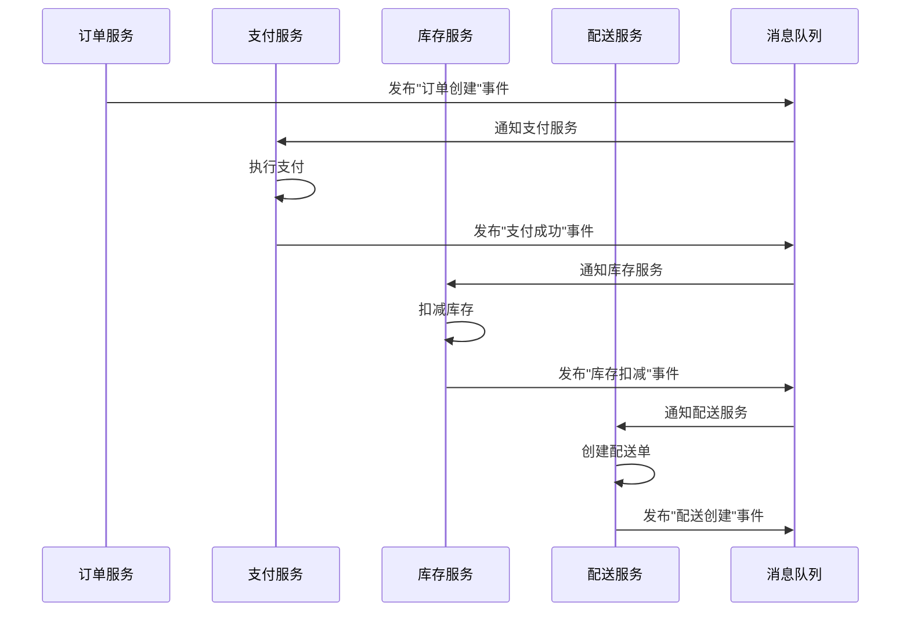

#### 示例：电商订单

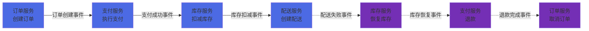

#### 优点
- ✅ **简单易实现** - 不需要中央协调器
- ✅ **松耦合** - 服务之间通过事件通信
- ✅ **高可用** - 没有单点故障

#### 缺点
- ❌ **难以理解** - 业务流程分散在各个服务
- ❌ **难以追踪** - 需要额外的监控和日志
- ❌ **循环依赖风险** - 事件链可能形成环

### 2. 协调模式（Orchestration）

**特点**：中心化，由一个协调器（Orchestrator）负责管理整个Saga流程。

#### 架构图

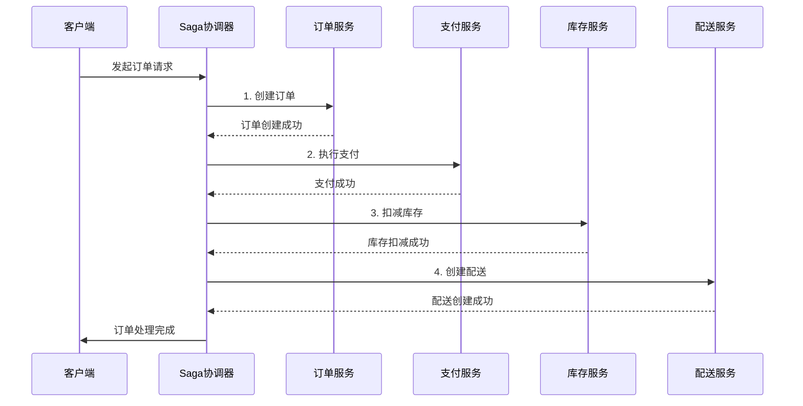

#### 失败场景示例

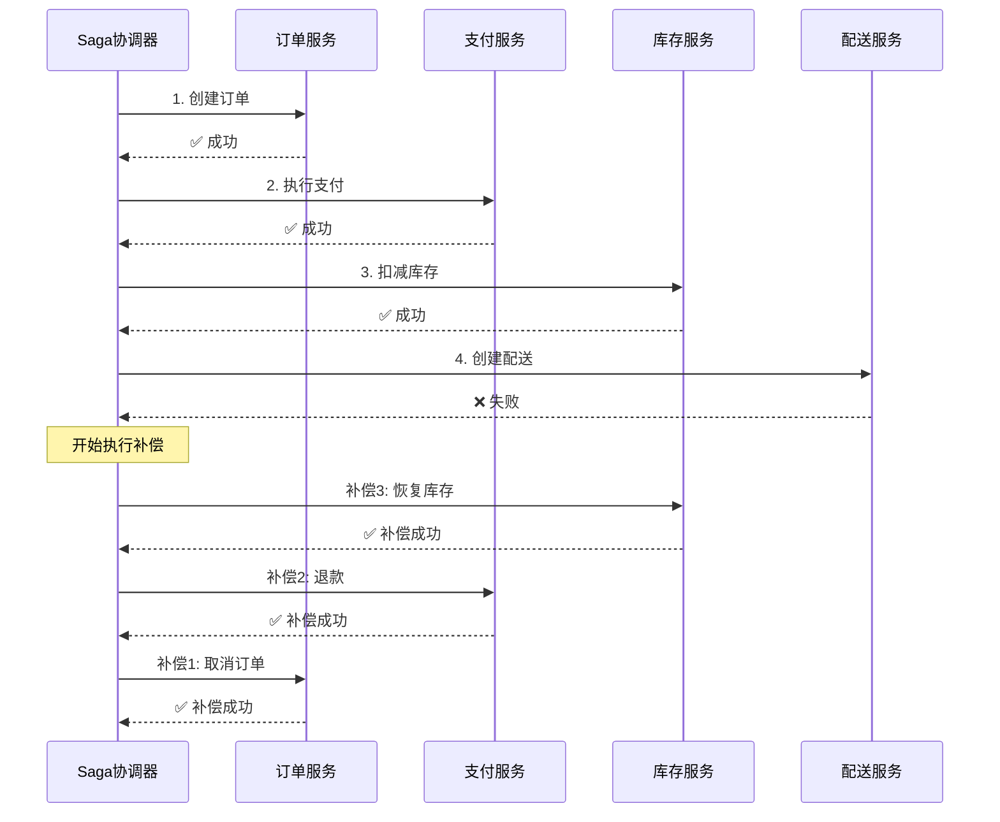

#### 优点
- ✅ **集中管理** - 流程清晰，易于理解
- ✅ **易于追踪** - 可以看到整个事务状态
- ✅ **易于测试** - 可以模拟各种失败场景

#### 缺点
- ❌ **单点故障** - 协调器故障影响整个系统
- ❌ **耦合度高** - 协调器需要了解所有服务
- ❌ **性能瓶颈** - 所有请求都经过协调器

### 两种模式对比

| 特性 | 编排模式 (Choreography) | 编配模式 (Orchestration) |
|------|------------------------|-------------------------|
| **协调方式** | 去中心化，事件驱动 | 中心化，协调器管理 |
| **复杂度** | 简单场景简单，复杂场景复杂 | 一致的复杂度 |
| **可维护性** | 难以追踪和调试 | 易于追踪和调试 |
| **耦合度** | 低耦合 | 中等耦合 |
| **单点故障** | 无 | 协调器可能成为单点 |
| **适用场景** | 简单的线性流程 | 复杂的业务流程 |

## Saga的执行流程

### 正向执行流程

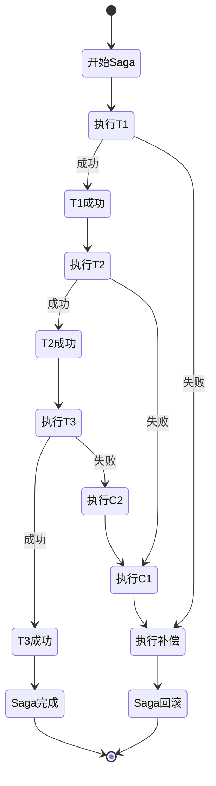

### 详细执行步骤

#### 阶段1：初始化
1. 客户端发起请求
2. Saga协调器（或首个服务）创建Saga实例
3. 记录Saga状态（日志持久化）

#### 阶段2：正向执行
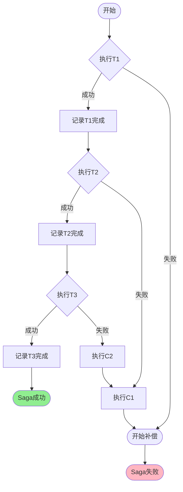

#### 阶段3：补偿执行（失败时）
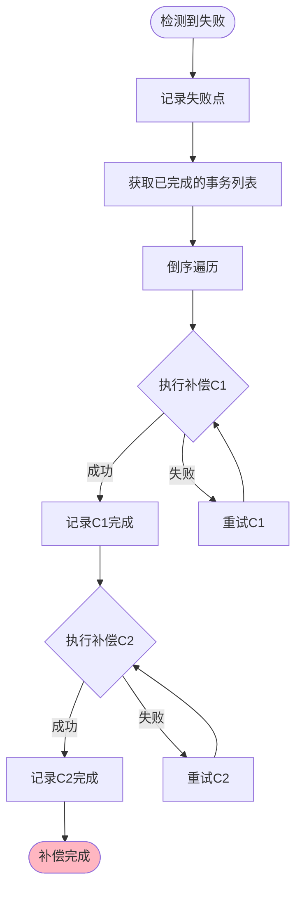

### 状态机模型

Saga的状态转换：

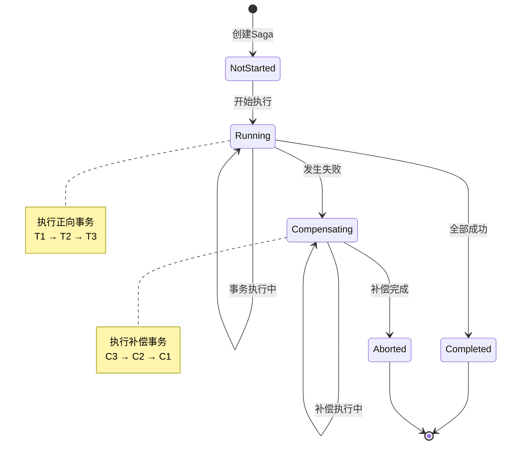

## Saga的补偿机制

### 补偿的设计原则

#### 1. 幂等性
补偿操作必须是幂等的，可以重复执行而不产生副作用。

```java
// ❌ 错误示例：非幂等
public void compensateDeductInventory(int productId, int quantity) {
    int current = inventory.get(productId);
    inventory.put(productId, current + quantity); // 多次执行会累加
}

// ✅ 正确示例：幂等
public void compensateDeductInventory(String transactionId, int productId, int quantity) {
    if (!isCompensated(transactionId)) {
        int current = inventory.get(productId);
        inventory.put(productId, current + quantity);
        markAsCompensated(transactionId);
    }
}
```

#### 2. 可重试性
补偿操作可能失败，必须支持重试。

```java
@Retryable(maxAttempts = 3, backoff = @Backoff(delay = 1000))
public void compensatePayment(String orderId) {
    // 退款逻辑
    paymentService.refund(orderId);
}
```

#### 3. 语义补偿
补偿不一定是完全的"撤销"，而是在业务语义上的补偿。

| 操作 | 技术回滚 | 语义补偿 |
|------|---------|---------|
| **扣款** | 删除扣款记录 | 创建退款记录 |
| **发货** | 删除发货记录 | 创建退货单 |
| **发送邮件** | ❌ 无法撤销 | 发送取消邮件 |

### 补偿类型

#### 1. 完美补偿（Perfect Compensation）
完全撤销原操作的影响。

```java
// 原操作：预订座位
public void reserveSeat(String seatId) {
    seat.setStatus(RESERVED);
    seat.setReservedBy(userId);
}

// 完美补偿：释放座位
public void cancelReservation(String seatId) {
    seat.setStatus(AVAILABLE);
    seat.setReservedBy(null);
}
```

#### 2. 不完美补偿（Imperfect Compensation）
无法完全撤销，但在业务上可接受。

```java
// 原操作：发送促销短信
public void sendPromotionSMS(String phone, String message) {
    smsService.send(phone, message);
    // 短信已发送，无法撤回
}

// 不完美补偿：发送道歉短信
public void compensateSendSMS(String phone) {
    String apologyMsg = "抱歉，之前的活动已取消";
    smsService.send(phone, apologyMsg);
}
```

#### 3. 不可补偿（Non-compensatable）
某些操作无法补偿，应该放在最后执行。

```java
// 不可补偿的操作
public void fireEmployee(String employeeId) {
    // 一旦执行，无法真正撤销
    employee.setStatus(FIRED);
    employee.setFiredDate(new Date());
    notifyHR(employeeId);
}
```

### 补偿顺序

补偿必须按照**逆序**执行：

```
正向：T1 → T2 → T3 → [T4失败]
补偿：C3 → C2 → C1
```

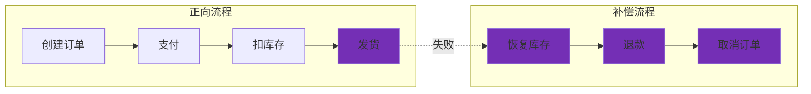

## Saga vs 其他分布式事务方案

### 方案对比

| 特性 | Saga | 2PC/3PC | TCC | 本地消息表 | 最大努力通知 |
|------|------|---------|-----|-----------|------------|
| **一致性** | 最终一致 | 强一致 | 最终一致 | 最终一致 | 最终一致 |
| **性能** | 高 | 低 | 中 | 高 | 高 |
| **复杂度** | 中 | 高 | 高 | 中 | 低 |
| **隔离性** | 低 | 高 | 中 | 低 | 低 |
| **可用性** | 高 | 低 | 中 | 高 | 高 |
| **适用场景** | 长事务 | 短事务 | 金融场景 | 异步场景 | 通知场景 |

### 详细对比

#### 1. Saga vs 2PC（两阶段提交）

**2PC的问题**：

- ❌ **同步阻塞**：所有参与者在准备阶段需要等待
- ❌ **单点故障**：协调者故障导致全局锁定
- ❌ **数据不一致**：网络分区可能导致数据不一致

**Saga的优势**：

- ✅ **异步非阻塞**：不需要等待所有服务
- ✅ **无单点故障**：每个服务独立决策
- ✅ **最终一致性**：通过补偿保证一致性

#### 2. Saga vs TCC（Try-Confirm-Cancel）

**TCC特点**：
- 两阶段：Try（预留资源）→ Confirm（确认）或 Cancel（取消）
- 需要业务实现Try、Confirm、Cancel三个接口

**对比**：
```
Saga:    T1 → T2 → T3 → [失败] → C3 → C2 → C1
TCC:     Try1 → Try2 → Try3 → Confirm1 → Confirm2 → Confirm3
         或
         Try1 → Try2 → [失败] → Cancel2 → Cancel1
```

| 特性 | Saga | TCC |
|------|------|-----|
| **业务侵入** | 中（需实现补偿） | 高（需实现Try/Confirm/Cancel） |
| **资源锁定** | 无 | 有（Try阶段预留） |
| **隔离性** | 低 | 高 |
| **性能** | 高 | 中 |

### 选择建议

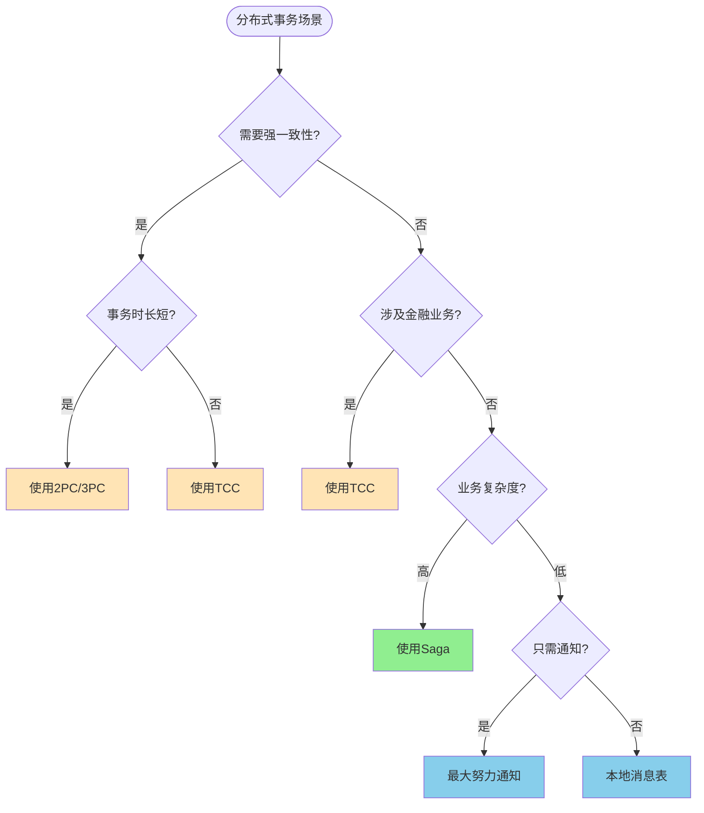

## Saga的实现框架

### 1. Apache ServiceComb Pack (Saga)

**特点**：
- 华为开源的Saga实现
- 支持Saga和TCC模式
- 基于事件溯源

**示例代码**：

```java
@SagaStart
@Transactional
public void placeOrder(Order order) {
    orderRepository.save(order);
}

@Compensable(compensationMethod = "cancelPayment")
public void makePayment(String orderId, BigDecimal amount) {
    paymentService.pay(orderId, amount);
}

public void cancelPayment(String orderId, BigDecimal amount) {
    paymentService.refund(orderId, amount);
}
```

### 2. Seata Saga

**特点**：
- 阿里巴巴开源
- 基于状态机引擎
- 支持JSON/YAML定义流程

**状态机定义**：

```json
{
  "Name": "OrderSaga",
  "Comment": "订单处理Saga",
  "StartState": "CreateOrder",
  "States": {
    "CreateOrder": {
      "Type": "ServiceTask",
      "ServiceName": "orderService",
      "ServiceMethod": "createOrder",
      "CompensateState": "CancelOrder",
      "Next": "MakePayment"
    },
    "MakePayment": {
      "Type": "ServiceTask",
      "ServiceName": "paymentService",
      "ServiceMethod": "pay",
      "CompensateState": "RefundPayment",
      "Next": "DeductInventory"
    },
    "DeductInventory": {
      "Type": "ServiceTask",
      "ServiceName": "inventoryService",
      "ServiceMethod": "deduct",
      "CompensateState": "RestoreInventory",
      "Next": "Succeed"
    },
    "Succeed": {
      "Type": "Succeed"
    },
    "CancelOrder": {
      "Type": "ServiceTask",
      "ServiceName": "orderService",
      "ServiceMethod": "cancel"
    },
    "RefundPayment": {
      "Type": "ServiceTask",
      "ServiceName": "paymentService",
      "ServiceMethod": "refund"
    },
    "RestoreInventory": {
      "Type": "ServiceTask",
      "ServiceName": "inventoryService",
      "ServiceMethod": "restore"
    }
  }
}
```

### 3. Axon Framework

**特点**：
- 基于事件溯源和CQRS
- 支持Saga模式
- Java生态

**示例代码**：

```java
@Saga
public class OrderManagementSaga {
    
    @StartSaga
    @SagaEventHandler(associationProperty = "orderId")
    public void on(OrderCreatedEvent event) {
        // 发起支付
        commandGateway.send(new MakePaymentCommand(
            event.getOrderId(), 
            event.getAmount()
        ));
    }
    
    @SagaEventHandler(associationProperty = "orderId")
    public void on(PaymentSuccessEvent event) {
        // 扣减库存
        commandGateway.send(new DeductInventoryCommand(
            event.getOrderId(), 
            event.getProductId()
        ));
    }
    
    @SagaEventHandler(associationProperty = "orderId")
    public void on(PaymentFailedEvent event) {
        // 取消订单
        commandGateway.send(new CancelOrderCommand(event.getOrderId()));
    }
    
    @EndSaga
    @SagaEventHandler(associationProperty = "orderId")
    public void on(OrderCompletedEvent event) {
        // Saga结束
    }
}
```

### 4. Eventuate Tram Saga

**特点**：
- 轻量级Saga框架
- 基于事件驱动
- 支持编排和编配模式

**示例代码**：

```java
// 定义一个 Saga 类，用于处理“创建订单”这一业务流程的分布式事务
public class CreateOrderSaga implements SimpleSaga<CreateOrderSagaData> {

    // SagaDefinition 是 Saga 流程的定义对象，包含所有步骤及补偿逻辑
    private SagaDefinition<CreateOrderSagaData> sagaDefinition;

    // 构造函数中定义 Saga 的执行步骤和对应的补偿操作
    public CreateOrderSaga() {
        this.sagaDefinition = 
            step() // 第一步：创建订单
                .invokeParticipant(this::createOrder)         // 正向操作：调用创建订单服务
                .withCompensation(this::cancelOrder)         // 补偿操作：如果失败则取消订单
            .step() // 第二步：支付订单
                .invokeParticipant(this::makePayment)         // 正向操作：调用支付服务
                .withCompensation(this::refundPayment)        // 补偿操作：如果失败则退款
            .step() // 第三步：扣减库存
                .invokeParticipant(this::deductInventory)     // 正向操作：调用库存服务扣减库存
                .withCompensation(this::restoreInventory)     // 补偿操作：如果失败则恢复库存
            .build(); // 构建完整的 Saga 流程定义
    }

    // 实现 SimpleSaga 接口，返回当前 Saga 的定义
    @Override
    public SagaDefinition<CreateOrderSagaData> getSagaDefinition() {
        return sagaDefinition;
    }

    // 正向操作：创建订单，发送 CreateOrderCommand 到 orderService
    private CommandWithDestination createOrder(CreateOrderSagaData data) {
        return send(new CreateOrderCommand(data.getOrderDetails())) // 构造命令对象，包含订单详情
            .to("orderService")                                     // 指定目标服务为 orderService
            .build();                                               // 构建命令发送对象
    }

    // 补偿操作：取消订单，发送 CancelOrderCommand 到 orderService
    private CommandWithDestination cancelOrder(CreateOrderSagaData data) {
        return send(new CancelOrderCommand(data.getOrderId())) // 构造取消命令，包含订单 ID
            .to("orderService")                                // 指定目标服务为 orderService
            .build();                                          // 构建命令发送对象
    }
}

```

### 框架对比

| 框架 | 公司 | 模式支持 | 学习曲线 | 社区活跃度 | 推荐度 |
|------|------|---------|---------|-----------|--------|
| **Seata Saga** | 阿里巴巴 | 编配 | 中 | ⭐⭐⭐⭐⭐ | ⭐⭐⭐⭐⭐ |
| **ServiceComb Pack** | 华为 | 编排 | 低 | ⭐⭐⭐ | ⭐⭐⭐⭐ |
| **Axon Framework** | AxonIQ | 编排 | 高 | ⭐⭐⭐⭐ | ⭐⭐⭐⭐ |
| **Eventuate Tram** | Eventuate | 两者 | 中 | ⭐⭐⭐ | ⭐⭐⭐ |

## 实际应用场景

### 场景1：电商订单处理

**业务流程**：
1. 创建订单
2. 扣减库存
3. 执行支付
4. 创建配送单
5. 发送通知

**Saga设计**：

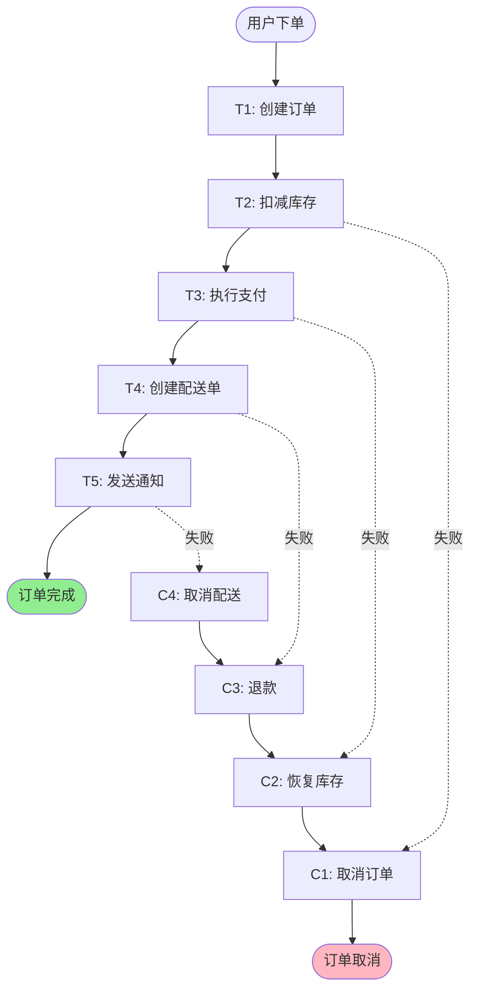

**代码实现（Seata Saga）**：

```json
{
  "Name": "OrderProcessSaga",
  "Comment": "电商订单处理流程",
  "StartState": "CreateOrder",
  "States": {
    "CreateOrder": {
      "Type": "ServiceTask",
      "ServiceName": "orderService",
      "ServiceMethod": "create",
      "CompensateState": "CancelOrder",
      "Input": {
        "userId": "$.userId",
        "products": "$.products",
        "totalAmount": "$.totalAmount"
      },
      "Output": {
        "orderId": "$.orderId"
      },
      "Status": {
        "#root['orderId'] != null": "SU",
        "#root['orderId'] == null": "FA"
      },
      "Next": "DeductInventory"
    },
    "DeductInventory": {
      "Type": "ServiceTask",
      "ServiceName": "inventoryService",
      "ServiceMethod": "deduct",
      "CompensateState": "RestoreInventory",
      "Input": {
        "orderId": "$.orderId",
        "products": "$.products"
      },
      "Next": "MakePayment"
    },
    "MakePayment": {
      "Type": "ServiceTask",
      "ServiceName": "paymentService",
      "ServiceMethod": "pay",
      "CompensateState": "RefundPayment",
      "Input": {
        "orderId": "$.orderId",
        "amount": "$.totalAmount"
      },
      "Next": "CreateShipment"
    },
    "CreateShipment": {
      "Type": "ServiceTask",
      "ServiceName": "shipmentService",
      "ServiceMethod": "create",
      "CompensateState": "CancelShipment",
      "Input": {
        "orderId": "$.orderId",
        "address": "$.address"
      },
      "Next": "SendNotification"
    },
    "SendNotification": {
      "Type": "ServiceTask",
      "ServiceName": "notificationService",
      "ServiceMethod": "send",
      "Input": {
        "orderId": "$.orderId",
        "userId": "$.userId"
      },
      "Next": "Succeed"
    },
    "Succeed": {
      "Type": "Succeed"
    }
  }
}
```

### 场景2：旅行预订系统

**业务流程**：
1. 预订机票
2. 预订酒店
3. 预订租车
4. 支付全款

**Saga设计**：

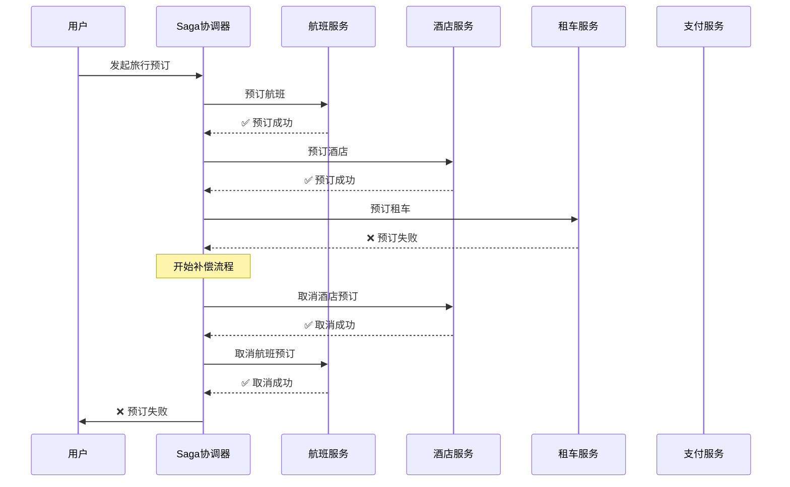

### 场景3：银行转账

**业务流程**：
1. 验证账户
2. 从A账户扣款
3. 向B账户转账
4. 记录交易日志

**特殊考虑**：
- 金额操作需要严格的幂等性
- 补偿操作必须可靠
- 需要详细的审计日志

```java
@Saga
public class MoneyTransferSaga {
    
    @StartSaga
    @SagaEventHandler(associationProperty = "transferId")
    public void on(TransferInitiatedEvent event) {
        // 1. 验证账户
        commandGateway.send(new ValidateAccountCommand(
            event.getTransferId(),
            event.getFromAccount(),
            event.getToAccount(),
            event.getAmount()
        ));
    }
    
    @SagaEventHandler(associationProperty = "transferId")
    public void on(AccountValidatedEvent event) {
        // 2. 扣款
        commandGateway.send(new DebitAccountCommand(
            event.getTransferId(),
            event.getFromAccount(),
            event.getAmount()
        ));
    }
    
    @SagaEventHandler(associationProperty = "transferId")
    public void on(AccountDebitedEvent event) {
        // 3. 转账
        commandGateway.send(new CreditAccountCommand(
            event.getTransferId(),
            event.getToAccount(),
            event.getAmount()
        ));
    }
    
    @SagaEventHandler(associationProperty = "transferId")
    public void on(AccountCreditedEvent event) {
        // 4. 记录日志
        commandGateway.send(new LogTransactionCommand(
            event.getTransferId(),
            TransactionStatus.SUCCESS
        ));
    }
    
    @SagaEventHandler(associationProperty = "transferId")
    public void on(AccountCreditFailedEvent event) {
        // 补偿：退款
        commandGateway.send(new CreditAccountCommand(
            event.getTransferId(),
            event.getFromAccount(),
            event.getAmount()
        ));
    }
    
    @EndSaga
    @SagaEventHandler(associationProperty = "transferId")
    public void on(TransferCompletedEvent event) {
        // Saga完成
    }
}
```

## 最佳实践

### 1. 设计原则

#### ✅ DO - 应该做的

1. **短事务优先**
   ```java
   // ✅ 好：每个事务快速完成
   public void createOrder(Order order) {
       orderRepository.save(order);  // 快速保存
   }
   ```

2. **补偿操作幂等**
   
   ```java
   // ✅ 好：使用事务ID防止重复补偿
   public void compensateDebit(String txId, String account, BigDecimal amount) {
       if (!isCompensated(txId)) {
           creditAccount(account, amount);
           markAsCompensated(txId);
       }
   }
   ```
   
3. **详细的日志记录**
   ```java
   // ✅ 好：记录每一步操作
   @Override
   public void execute() {
       log.info("Starting transaction: {}", transactionId);
       try {
           // 执行业务逻辑
           log.info("Transaction completed: {}", transactionId);
       } catch (Exception e) {
           log.error("Transaction failed: {}", transactionId, e);
           throw e;
       }
   }
   ```

4. **明确的超时设置**
   ```java
   // ✅ 好：设置合理的超时时间
   @HystrixCommand(
       commandProperties = {
           @HystrixProperty(name = "execution.isolation.thread.timeoutInMilliseconds", value = "3000")
       }
   )
   public void makePayment(String orderId) {
       // 支付逻辑
   }
   ```

#### ❌ DON'T - 不应该做的

1. **避免长事务**
   ```java
   // ❌ 坏：事务执行时间过长
   public void processOrder(Order order) {
       createOrder(order);
       Thread.sleep(60000);  // 等待1分钟
       sendEmail(order);
   }
   ```

2. **避免循环依赖**
   ```java
   // ❌ 坏：服务A调用服务B，服务B又调用服务A
   // Service A
   public void methodA() {
       serviceB.methodB();
   }
   
   // Service B
   public void methodB() {
       serviceA.anotherMethodA();  // 循环依赖
   }
   ```

3. **避免在补偿中抛出异常**
   ```java
   // ❌ 坏：补偿失败直接抛异常
   public void compensate() {
       if (!canCompensate()) {
           throw new RuntimeException("Cannot compensate");
       }
   }
   
   // ✅ 好：重试或记录日志
   @Retryable(maxAttempts = 3)
   public void compensate() {
       try {
           // 补偿逻辑
       } catch (Exception e) {
           log.error("Compensation failed", e);
           // 发送告警
       }
   }
   ```

### 2. 事务隔离问题

Saga的一个主要问题是**缺乏隔离性**，可能导致：

#### 问题1：脏读（Dirty Read）

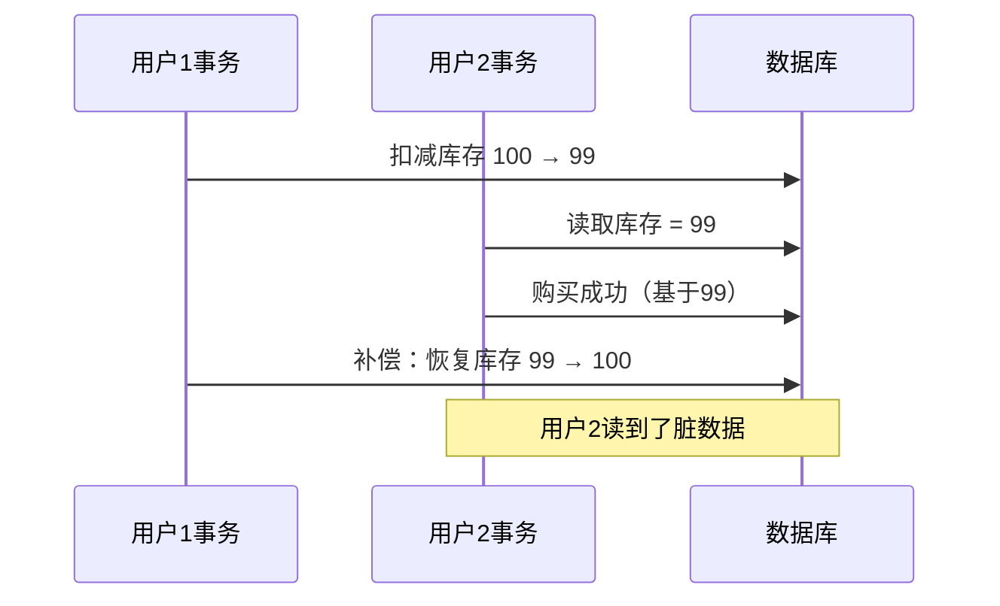

**解决方案**：语义锁（Semantic Lock）

```java
public class InventoryService {
    
    public void deductInventory(String productId, int quantity) {
        // 加锁标记
        inventoryRepository.markAsPending(productId, quantity);
        // 扣减库存
        inventoryRepository.deduct(productId, quantity);
    }
    
    public void confirmDeduction(String productId, int quantity) {
        // 确认扣减，释放锁
        inventoryRepository.unmarkPending(productId, quantity);
    }
    
    public void compensateDeduction(String productId, int quantity) {
        // 恢复库存，释放锁
        inventoryRepository.restore(productId, quantity);
        inventoryRepository.unmarkPending(productId, quantity);
    }
}
```

#### 问题2：不可重复读

**解决方案**：可交换更新（Commutative Updates）

```java
// ✅ 使用相对值而不是绝对值
public void updateBalance(String account, BigDecimal delta) {
    // UPDATE account SET balance = balance + delta
    accountRepository.incrementBalance(account, delta);
}

// ❌ 避免使用绝对值
public void updateBalance(String account, BigDecimal newBalance) {
    // UPDATE account SET balance = newBalance
    accountRepository.setBalance(account, newBalance);
}
```

### 3. 监控和告警

#### 关键指标

| 指标 | 说明 | 告警阈值 |
|------|------|---------|
| **Saga成功率** | 成功完成的Saga占比 | < 95% |
| **平均执行时间** | Saga的平均执行时长 | > 5s |
| **补偿执行率** | 触发补偿的Saga占比 | > 10% |
| **补偿失败率** | 补偿失败的占比 | > 1% |
| **超时率** | 超时的Saga占比 | > 5% |

#### 监控示例

```java
@Aspect
@Component
public class SagaMonitoringAspect {
    
    @Autowired
    private MeterRegistry meterRegistry;
    
    @Around("@annotation(SagaStart)")
    public Object monitorSaga(ProceedingJoinPoint pjp) throws Throwable {
        String sagaName = pjp.getSignature().getName();
        Timer.Sample sample = Timer.start(meterRegistry);
        
        try {
            Object result = pjp.proceed();
            
            // 记录成功
            meterRegistry.counter("saga.execution", 
                "saga", sagaName, 
                "status", "success"
            ).increment();
            
            return result;
        } catch (Exception e) {
            // 记录失败
            meterRegistry.counter("saga.execution", 
                "saga", sagaName, 
                "status", "failed"
            ).increment();
            
            throw e;
        } finally {
            // 记录执行时间
            sample.stop(Timer.builder("saga.duration")
                .tag("saga", sagaName)
                .register(meterRegistry));
        }
    }
}
```

### 4. 测试策略

#### 单元测试

```java
@Test
public void testSagaCompensation() {
    // Given
    CreateOrderSagaData data = new CreateOrderSagaData();
    data.setOrderId("order-123");
    data.setAmount(new BigDecimal("100.00"));
    
    // When: 支付失败
    when(paymentService.pay(any())).thenThrow(new PaymentException());
    
    // Then: 应该触发补偿
    sagaManager.execute(data);
    
    verify(orderService).cancel("order-123");
    verify(inventoryService).restore("order-123");
}
```

#### 集成测试

```java
@SpringBootTest
@AutoConfigureWireMock
public class SagaIntegrationTest {
    
    @Test
    public void testOrderSagaWithPaymentFailure() {
        // Mock 支付服务失败
        stubFor(post(urlEqualTo("/payment/pay"))
            .willReturn(aResponse()
                .withStatus(500)
                .withBody("{\"error\": \"Payment failed\"}")));
        
        // 执行Saga
        OrderResponse response = orderService.createOrder(orderRequest);
        
        // 验证补偿执行
        assertThat(response.getStatus()).isEqualTo("CANCELLED");
        
        // 验证库存已恢复
        int stock = inventoryService.getStock(productId);
        assertThat(stock).isEqualTo(originalStock);
    }
}
```

#### 混沌测试

```java
@ChaosMonkey
@Test
public void testSagaUnderChaos() {
    // 随机注入延迟
    chaosMonkey.injectLatency(
        service = "paymentService",
        probability = 0.3,
        latency = Duration.ofSeconds(2)
    );
    
    // 随机注入故障
    chaosMonkey.injectFailure(
        service = "inventoryService",
        probability = 0.1,
        exception = TimeoutException.class
    );
    
    // 执行多次Saga
    for (int i = 0; i < 100; i++) {
        sagaManager.execute(createOrderData());
    }
    
    // 验证最终一致性
    assertEventualConsistency();
}
```

### 5. 性能优化

#### 并行执行

```java
// 串行执行（慢）
public void processOrder(Order order) {
    createOrder(order);           // 100ms
    deductInventory(order);       // 100ms
    sendNotification(order);      // 100ms
    // 总计: 300ms
}

// 并行执行（快）
public void processOrderParallel(Order order) {
    CompletableFuture<Void> inventory = CompletableFuture.runAsync(
        () -> deductInventory(order)
    );
    
    CompletableFuture<Void> notification = CompletableFuture.runAsync(
        () -> sendNotification(order)
    );
    
    createOrder(order);  // 100ms
    
    CompletableFuture.allOf(inventory, notification).join();
    // 总计: ~100ms
}
```

#### 批量处理

```java
// 逐个处理（慢）
public void processBatch(List<Order> orders) {
    for (Order order : orders) {
        sagaManager.execute(order);  // 每个100ms
    }
    // 1000个订单 = 100秒
}

// 批量处理（快）
public void processBatchOptimized(List<Order> orders) {
    // 批量创建订单
    orderService.batchCreate(orders);
    
    // 批量扣库存
    inventoryService.batchDeduct(orders);
    
    // 1000个订单 = 5秒
}
```

## 总结

### Saga的核心要点

1. **最终一致性** - 通过补偿机制保证数据最终一致
2. **长事务分解** - 将长事务拆分为多个短事务
3. **补偿操作** - 每个事务都有对应的补偿操作
4. **两种模式** - 编排模式（去中心化）和编配模式（中心化）
5. **隔离性问题** - 需要额外机制处理并发问题

### 使用场景

✅ **适合使用Saga**：
- 微服务架构
- 长业务流程
- 可接受最终一致性
- 需要高可用性

❌ **不适合使用Saga**：
- 需要强一致性
- 无法定义补偿操作
- 短事务链
- 隔离性要求高

### 实施检查清单

- [ ] 定义清晰的事务边界
- [ ] 设计幂等的补偿操作
- [ ] 实现详细的日志记录
- [ ] 处理并发和隔离问题
- [ ] 设置合理的超时时间
- [ ] 建立监控和告警机制
- [ ] 编写完善的测试用例
- [ ] 准备故障恢复方案

### 进一步学习

1. **论文**：
   - "Sagas" by Hector Garcia-Molina and Kenneth Salem (1987)
   - "Life beyond Distributed Transactions" by Pat Helland (2007)

2. **书籍**：
   - 《微服务架构设计模式》- Chris Richardson
   - 《分布式系统原理与范型》- Andrew S. Tanenbaum

3. **开源项目**：
   - Seata: https://github.com/seata/seata
   - Axon Framework: https://github.com/AxonFramework/AxonFramework
   - Eventuate Tram: https://github.com/eventuate-tram/eventuate-tram-core

通过掌握Saga模式，您将能够在微服务架构中优雅地处理分布式事务问题！
