# MVCC 机制详解

> **学习目标**：深入理解 MySQL InnoDB 的 MVCC 多版本并发控制机制
> 
> **难度**：⭐⭐⭐⭐（进阶）
> 
> **适合人群**：有数据库基础，想深入理解并发控制的开发者
> 
> **面试重要性**：⭐⭐⭐⭐⭐（面试高频考点）

---

## 📚 目录

1. [什么是 MVCC](#什么是-mvcc)
2. [为什么需要 MVCC](#为什么需要-mvcc)
3. [MVCC 的核心概念](#mvcc-的核心概念)
4. [MVCC 的工作原理](#mvcc-的工作原理)
5. [MVCC 在不同隔离级别下的表现](#mvcc-在不同隔离级别下的表现)
6. [MVCC 与锁机制的结合](#mvcc-与锁机制的结合)
7. [实战案例](#实战案例)
8. [常见问题](#常见问题)
9. [面试题](#面试题)

---

## 什么是 MVCC

### 定义

**MVCC（Multi-Version Concurrency Control）** = 多版本并发控制

**核心思想**：
- 为每一行数据保存**多个版本**
- 读操作读取对自己**可见的版本**
- 写操作创建新版本
- 通过版本链实现**读写不冲突**

**通俗理解**：
> 就像 Git 的版本控制一样，每次修改都创建新版本，不同的人可以看到不同的版本。

---

### MVCC 的本质

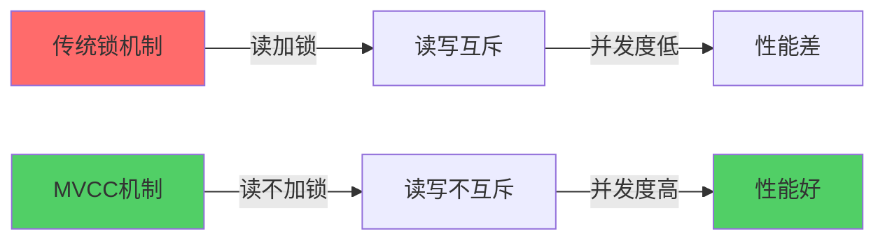

**关键特性**：
- ✅ **读不加锁**：查询操作不需要获取锁
- ✅ **读写不冲突**：读操作和写操作可以并发执行
- ✅ **高并发**：大幅提升数据库并发处理能力
- ✅ **一致性读**：保证事务看到一致的数据视图

---

## 为什么需要 MVCC

### 问题场景

**传统锁机制的问题**：

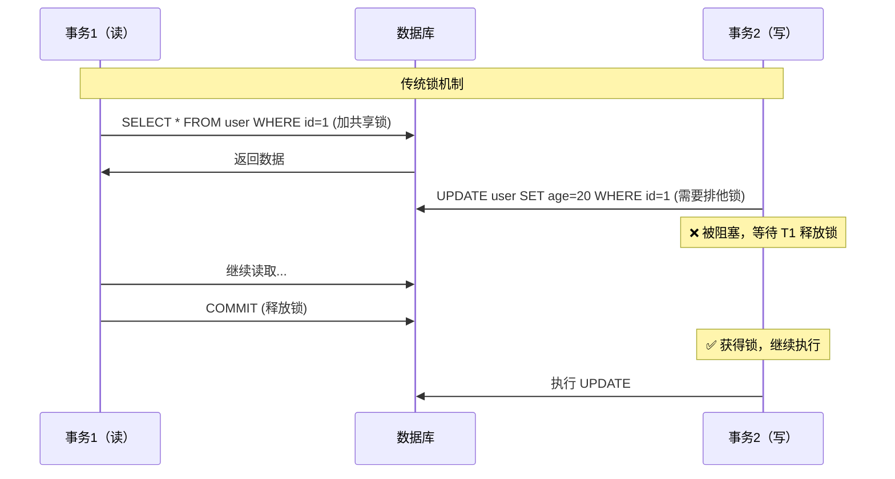

**问题**：
- ❌ 读操作会阻塞写操作
- ❌ 写操作会阻塞读操作
- ❌ 并发度极低
- ❌ 性能差

---

**MVCC 的解决方案**：

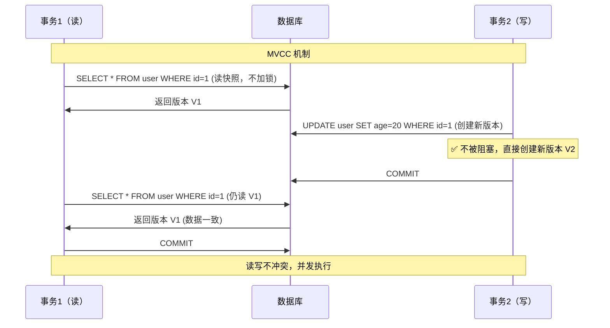

**优势**：
- ✅ 读操作不阻塞写操作
- ✅ 写操作不阻塞读操作
- ✅ 并发度高
- ✅ 性能好

---

### MVCC 适用的隔离级别

| 隔离级别 | 是否使用 MVCC | 说明 |
|---------|-------------|------|
| READ_UNCOMMITTED | ❌ 否 | 直接读取最新数据，不用版本控制 |
| READ_COMMITTED | ✅ 是 | 每次读取创建新快照 |
| REPEATABLE_READ | ✅ 是 | 事务开始时创建快照，之后一直用 |
| SERIALIZABLE | ❌ 否 | 使用锁机制，不用 MVCC |

---

## MVCC 的核心概念

### 1. 隐藏字段

InnoDB 为每一行数据添加了 **3 个隐藏字段**：

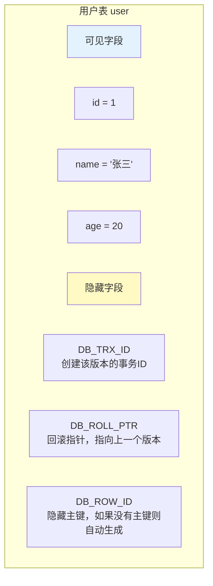

**字段详解**：

**1. DB_TRX_ID（事务 ID，6 字节）**
- 记录**创建或修改**该版本的事务 ID
- 事务 ID 递增，全局唯一
- 用于判断版本的可见性

**2. DB_ROLL_PTR（回滚指针，7 字节）**
- 指向该行记录的**上一个版本**
- 存储在 undo log 中
- 形成版本链

**3. DB_ROW_ID（隐藏主键，6 字节）**
- 如果表没有定义主键，InnoDB 会自动生成
- 如果有主键，则不需要此字段

---

### 2. 版本链

**版本链** = 通过回滚指针将同一行数据的多个版本串联起来

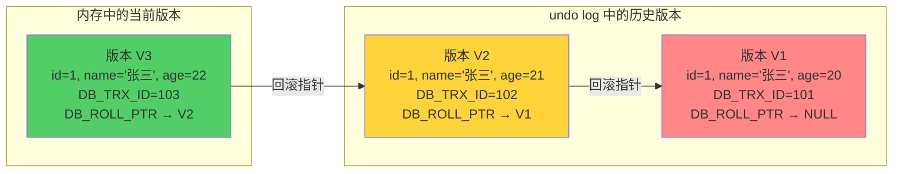

**示例**：

```sql
-- 事务 101：插入数据
INSERT INTO user (id, name, age) VALUES (1, '张三', 20);
-- 创建版本 V1：age=20, DB_TRX_ID=101

-- 事务 102：更新数据
UPDATE user SET age = 21 WHERE id = 1;
-- 创建版本 V2：age=21, DB_TRX_ID=102, DB_ROLL_PTR → V1

-- 事务 103：再次更新
UPDATE user SET age = 22 WHERE id = 1;
-- 创建版本 V3：age=22, DB_TRX_ID=103, DB_ROLL_PTR → V2
```

**版本链的作用**：
- 通过版本链，可以找到该行数据的**历史版本**
- 不同事务可以读取**不同版本**的数据
- 实现**一致性读**（Consistent Read）

---

### 3. ReadView（读视图）

**ReadView** = 事务在执行快照读时，记录的**当前活跃事务列表**

**核心字段**：

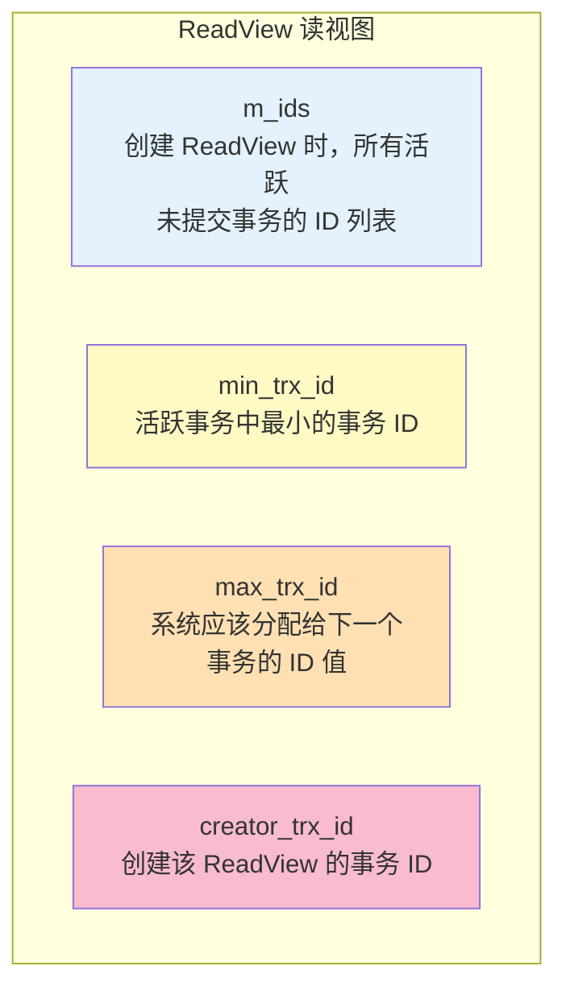

**字段详解**：

| 字段 | 说明 | 示例 |
|------|------|------|
| **m_ids** | 创建 ReadView 时，所有**活跃（未提交）事务**的 ID 列表 | `[102, 105, 108]` |
| **min_trx_id** | `m_ids` 中的**最小值** | `102` |
| **max_trx_id** | 系统即将分配给**下一个事务**的 ID（不是 m_ids 的最大值+1） | `110` |
| **creator_trx_id** | 创建该 ReadView 的**事务 ID** | `106` |

**示例**：

```
时刻 T1：
- 事务 100：已提交
- 事务 101：已提交
- 事务 102：活跃（未提交）
- 事务 105：活跃（未提交）
- 事务 106：当前事务（执行查询，创建 ReadView）
- 事务 108：活跃（未提交）
- 下一个事务 ID：110

ReadView：
{
  m_ids: [102, 105, 108],
  min_trx_id: 102,
  max_trx_id: 110,
  creator_trx_id: 106
}
```

---

### 4. 版本可见性判断规则

**核心问题**：事务读取某一行数据时，应该读取哪个版本？

**判断规则**：

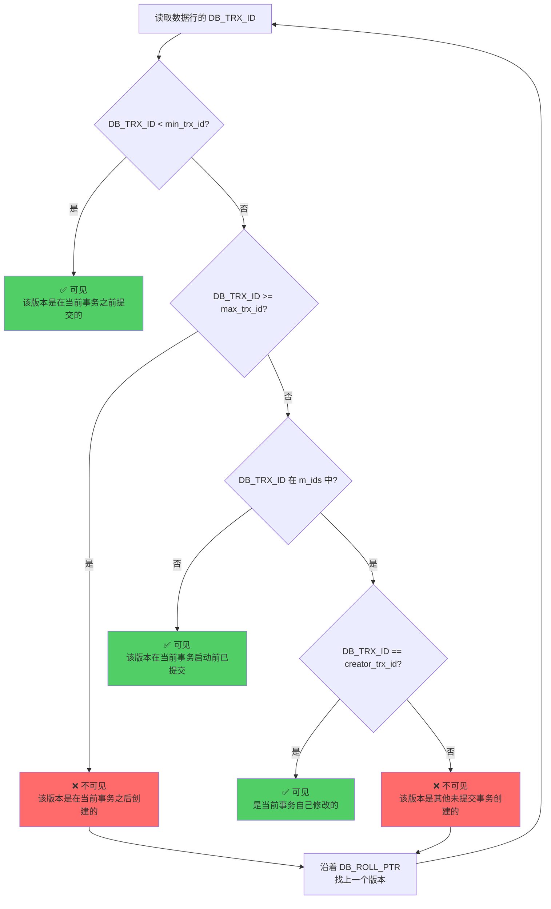

**规则详解**：

**规则 1**：`DB_TRX_ID < min_trx_id`
```
说明：该版本是在当前事务之前提交的事务创建的
结论：✅ 可见
```

**规则 2**：`DB_TRX_ID >= max_trx_id`
```
说明：该版本是在当前事务之后开始的事务创建的
结论：❌ 不可见（还没发生）
```

**规则 3**：`min_trx_id <= DB_TRX_ID < max_trx_id`
- **情况 3.1**：`DB_TRX_ID` 在 `m_ids` 中
  ```
  说明：该版本是由未提交的事务创建的
  
  - 如果 DB_TRX_ID == creator_trx_id
    说明：是当前事务自己修改的
    结论：✅ 可见
  
  - 如果 DB_TRX_ID != creator_trx_id
    说明：是其他未提交事务修改的
    结论：❌ 不可见
  ```

- **情况 3.2**：`DB_TRX_ID` 不在 `m_ids` 中
  ```
  说明：该版本是在当前事务启动前已经提交的事务创建的
  结论：✅ 可见
  ```

**如果不可见**：
```
沿着 DB_ROLL_PTR（回滚指针）找到上一个版本，继续判断
直到找到可见的版本，或者没有更早的版本
```

---

## MVCC 的工作原理

### 完整流程图

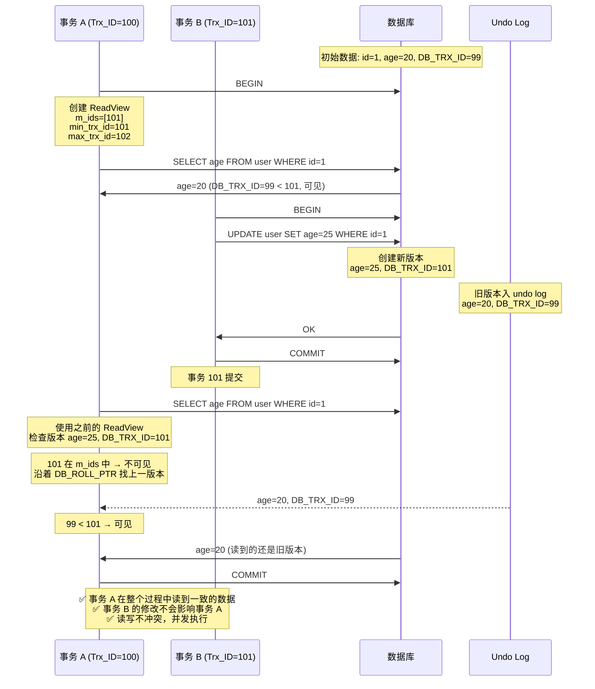

---

### 详细步骤解析

**初始状态**：
```sql
-- 数据库中有一条记录
id=1, name='张三', age=20, DB_TRX_ID=99, DB_ROLL_PTR=NULL
```

---

**步骤 1：事务 A 开始，创建 ReadView**

```sql
-- 事务 A (Trx_ID=100)
BEGIN;

-- 执行第一次查询（快照读）
SELECT age FROM user WHERE id = 1;
```

**创建 ReadView**：
```
m_ids: [101]           -- 事务 101 活跃
min_trx_id: 101
max_trx_id: 102
creator_trx_id: 100
```

**判断可见性**：
```
数据版本：DB_TRX_ID = 99
判断：99 < 101 (min_trx_id)
结论：✅ 可见
返回：age = 20
```

---

**步骤 2：事务 B 修改数据**

```sql
-- 事务 B (Trx_ID=101)
BEGIN;

UPDATE user SET age = 25 WHERE id = 1;
```

**数据库操作**：
```
1. 将旧版本写入 undo log：
   age=20, DB_TRX_ID=99, DB_ROLL_PTR=NULL

2. 创建新版本（内存中）：
   age=25, DB_TRX_ID=101, DB_ROLL_PTR → 指向 undo log 中的旧版本
```

**版本链**：
```
当前版本: age=25, DB_TRX_ID=101
    ↓
旧版本: age=20, DB_TRX_ID=99
```

```sql
COMMIT;  -- 事务 B 提交
```

---

**步骤 3：事务 A 再次查询**

```sql
-- 事务 A (仍在进行中)
SELECT age FROM user WHERE id = 1;
```

**使用之前的 ReadView**（REPEATABLE_READ 隔离级别）：
```
ReadView:
m_ids: [101]
min_trx_id: 101
max_trx_id: 102
creator_trx_id: 100
```

**判断当前版本的可见性**：
```
当前版本：age=25, DB_TRX_ID=101

判断：
1. 101 < 101? → 否
2. 101 >= 102? → 否
3. 101 在 m_ids 中? → 是
4. 101 == 100? → 否
结论：❌ 不可见（是其他未提交事务创建的）

动作：沿着 DB_ROLL_PTR 找上一个版本
```

**判断旧版本的可见性**：
```
旧版本：age=20, DB_TRX_ID=99

判断：
1. 99 < 101? → 是
结论：✅ 可见

返回：age = 20
```

---

**步骤 4：事务 A 提交**

```sql
COMMIT;  -- 事务 A 提交
```

**总结**：
- ✅ 事务 A 在整个过程中读到的 age 都是 20
- ✅ 事务 B 的修改不会影响事务 A
- ✅ 读写不冲突，两个事务并发执行
- ✅ 实现了 **REPEATABLE_READ** 隔离级别

---

### 快照读 vs 当前读

**快照读（Snapshot Read）**：
- 读取的是**快照版本**，不是最新版本
- **不加锁**
- 使用 **MVCC** 机制

**示例**：
```sql
SELECT * FROM user WHERE id = 1;
SELECT * FROM user WHERE name = '张三';
```

---

**当前读（Current Read）**：
- 读取的是**最新版本**
- **加锁**（共享锁或排他锁）
- 不使用 MVCC，使用**锁机制**

**示例**：
```sql
-- 加共享锁（S 锁）
SELECT * FROM user WHERE id = 1 LOCK IN SHARE MODE;

-- 加排他锁（X 锁）
SELECT * FROM user WHERE id = 1 FOR UPDATE;

-- 所有的 DML 操作都是当前读
UPDATE user SET age = 20 WHERE id = 1;
DELETE FROM user WHERE id = 1;
INSERT INTO user VALUES (1, '张三', 20);
```

**对比**：

| 特性 | 快照读 | 当前读 |
|------|-------|-------|
| 读取版本 | 历史快照版本 | 最新版本 |
| 是否加锁 | ❌ 不加锁 | ✅ 加锁 |
| 使用机制 | MVCC | 锁机制 |
| 并发度 | 高 | 低 |
| 语句 | 普通 SELECT | SELECT ... FOR UPDATE<br/>UPDATE/DELETE/INSERT |

---

## MVCC 在不同隔离级别下的表现

### READ_COMMITTED（读已提交）

**特点**：**每次查询**都创建新的 ReadView

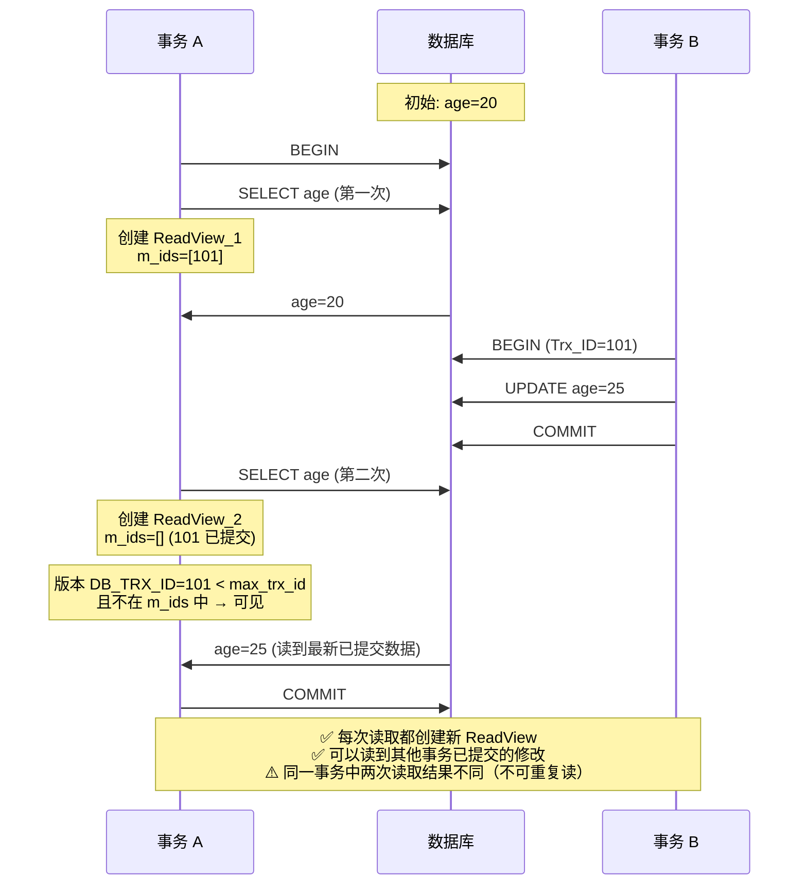

**代码示例**：

```java
@Transactional(isolation = Isolation.READ_COMMITTED)
public void readCommittedExample() {
    // 第一次查询
    User user1 = userMapper.selectById(1L);
    System.out.println("第一次查询：age = " + user1.getAge());  // 20
    
    // 此时其他事务修改并提交了数据...
    
    // 第二次查询（创建新的 ReadView）
    User user2 = userMapper.selectById(1L);
    System.out.println("第二次查询：age = " + user2.getAge());  // 25
    
    // 结论：两次查询结果不同（不可重复读）
}
```

**ReadView 创建时机**：
```
✅ 每次执行 SELECT 都创建新的 ReadView
✅ 可以读到其他事务已提交的最新数据
⚠️ 同一事务中，多次查询可能结果不同
```

---

### REPEATABLE_READ（可重复读）

**特点**：**事务开始时**创建 ReadView，之后一直使用同一个

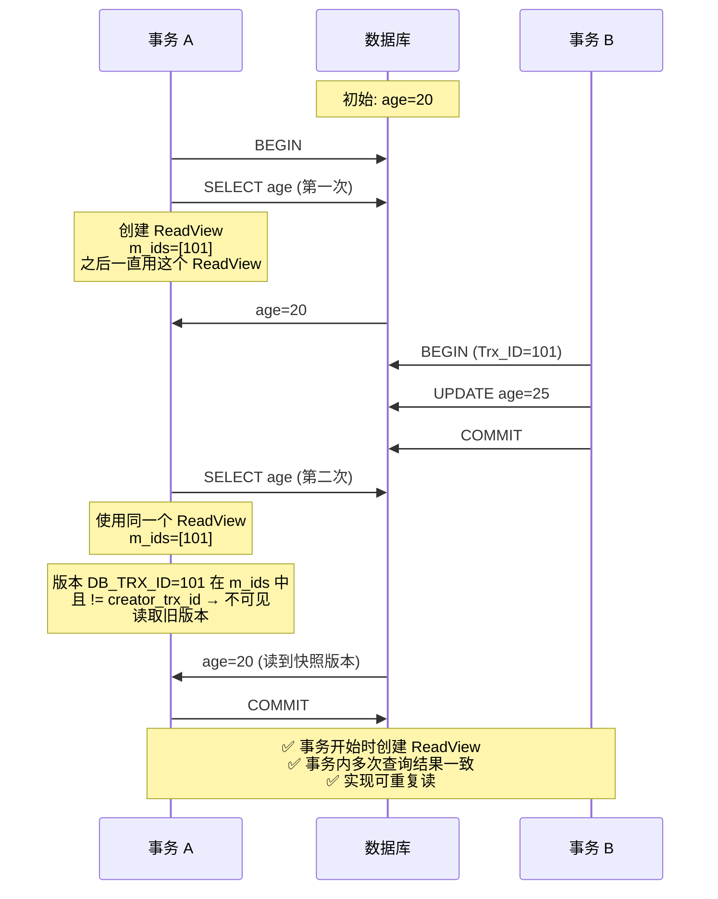

**代码示例**：

```java
@Transactional(isolation = Isolation.REPEATABLE_READ)
public void repeatableReadExample() {
    // 第一次查询（创建 ReadView，之后一直用）
    User user1 = userMapper.selectById(1L);
    System.out.println("第一次查询：age = " + user1.getAge());  // 20
    
    // 此时其他事务修改并提交了数据...
    
    // 第二次查询（使用同一个 ReadView）
    User user2 = userMapper.selectById(1L);
    System.out.println("第二次查询：age = " + user2.getAge());  // 20
    
    // 结论：两次查询结果相同（可重复读）
}
```

**ReadView 创建时机**：
```
✅ 事务第一次执行 SELECT 时创建 ReadView
✅ 之后的所有 SELECT 都使用同一个 ReadView
✅ 同一事务中，多次查询结果一致
```

---

### 两种隔离级别的对比

**核心区别**：

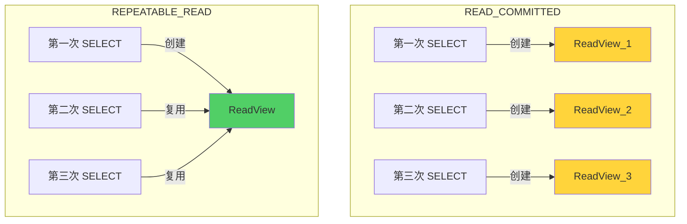

| 特性 | READ_COMMITTED | REPEATABLE_READ |
|------|---------------|-----------------|
| ReadView 创建时机 | 每次 SELECT | 事务开始时 |
| ReadView 数量 | 多个 | 一个 |
| 能否读到其他事务的提交 | ✅ 可以 | ❌ 不可以 |
| 可重复读 | ❌ 否 | ✅ 是 |
| 幻读 | ✅ 可能 | ⚠️ 快照读不会，当前读可能 |

---

## MVCC 与锁机制的结合

### MVCC + Next-Key Lock

MySQL InnoDB 通过 **MVCC + Next-Key Lock** 解决幻读问题。

**Next-Key Lock** = **行锁（Record Lock）** + **间隙锁（Gap Lock）**

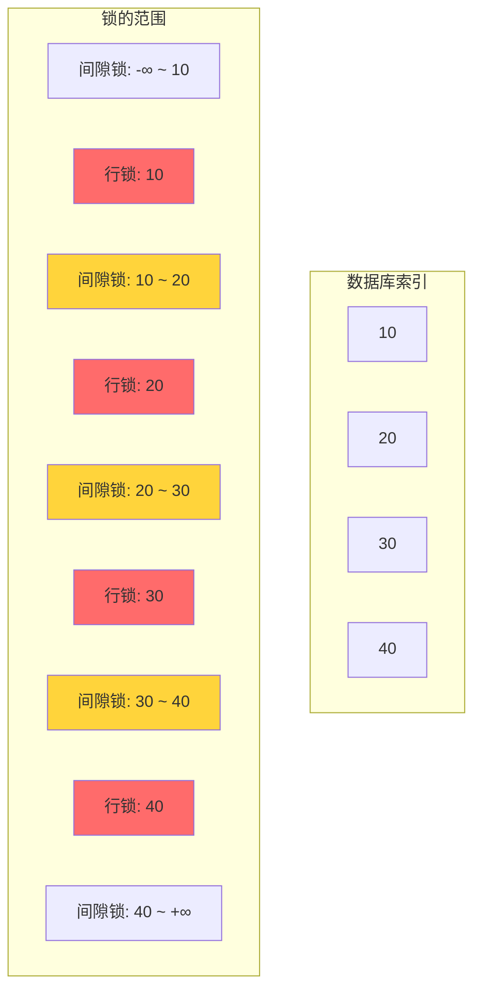

**示例**：

```sql
-- 事务 A
BEGIN;

-- 当前读，加 Next-Key Lock
SELECT * FROM user WHERE age >= 20 AND age < 30 FOR UPDATE;
-- 锁住：
-- 1. 行锁：age=20, age=25
-- 2. 间隙锁：(10, 20), (20, 25), (25, 30)

-- 事务 B（会被阻塞）
INSERT INTO user (id, name, age) VALUES (5, '王五', 22);  -- 被阻塞（在间隙内）
UPDATE user SET name = '李四' WHERE age = 20;  -- 被阻塞（行锁）

-- 事务 B（不会被阻塞）
INSERT INTO user (id, name, age) VALUES (6, '赵六', 35);  -- ✅ OK（不在间隙内）

COMMIT;
```

---

### 快照读与当前读的切换

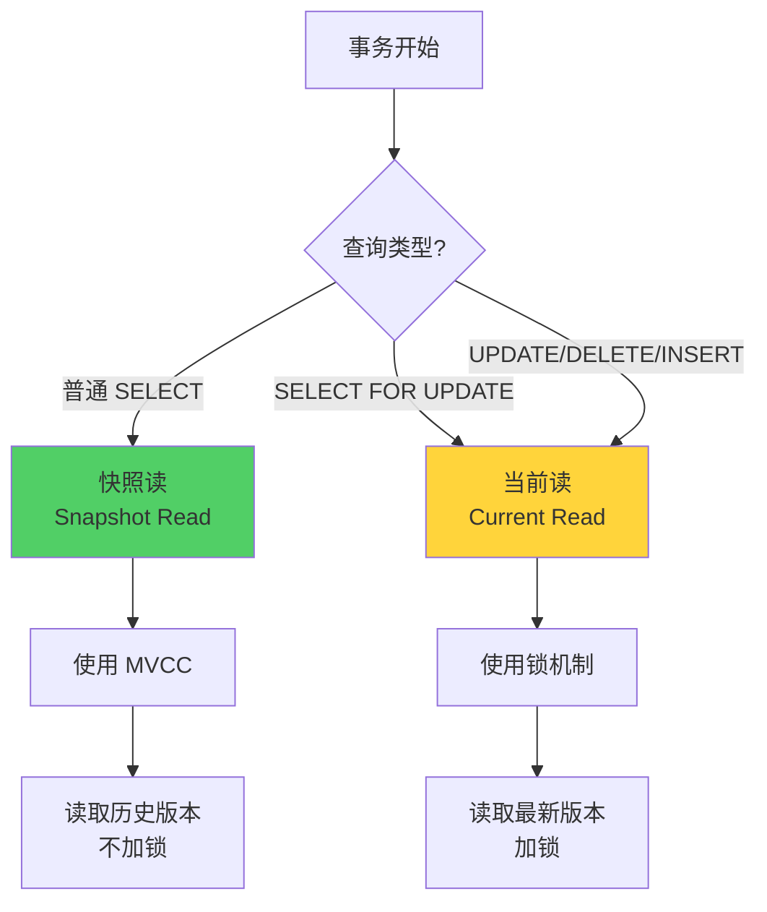

**示例**：

```sql
BEGIN;

-- 快照读（使用 MVCC）
SELECT * FROM user WHERE id = 1;
-- 读到：age = 20（历史版本）

-- 当前读（使用锁）
SELECT * FROM user WHERE id = 1 FOR UPDATE;
-- 读到：age = 25（最新版本）

-- 更新（当前读）
UPDATE user SET age = 30 WHERE id = 1;
-- 基于最新版本更新

-- 快照读
SELECT * FROM user WHERE id = 1;
-- 读到：age = 30（自己修改的，可见）

COMMIT;
```

---

## 实战案例

### 案例 1：订单统计报表

**场景**：生成昨天的订单统计报表，要求数据一致。

**问题**：
- 统计过程中，可能有其他事务在修改订单数据
- 需要保证报表数据的一致性

**解决方案**：使用 REPEATABLE_READ + 快照读

```java
@Transactional(isolation = Isolation.REPEATABLE_READ, readOnly = true)
public OrderReport generateReport(LocalDate date) {
    // 第一次查询：订单总数
    Long totalCount = orderMapper.countByDate(date);
    
    // 中间可能有其他事务修改订单...
    
    // 第二次查询：订单总额
    BigDecimal totalAmount = orderMapper.sumAmountByDate(date);
    
    // 第三次查询：订单明细
    List<Order> orders = orderMapper.selectByDate(date);
    
    // ✅ 三次查询都基于同一个 ReadView
    // ✅ 数据一致，不会受其他事务影响
    
    return new OrderReport(totalCount, totalAmount, orders);
}
```

**原理**：
1. 事务开始时创建 ReadView
2. 三次查询都使用同一个 ReadView
3. 即使其他事务修改了订单，也读不到
4. 保证报表数据的一致性

---

### 案例 2：秒杀库存扣减

**场景**：高并发秒杀，扣减库存。

**问题**：
- 需要读取最新的库存
- 需要防止超卖

**解决方案**：使用当前读 + 行锁

```java
@Transactional(isolation = Isolation.REPEATABLE_READ)
public boolean decreaseStock(Long productId, Integer quantity) {
    // 当前读，加排他锁
    Product product = productMapper.selectByIdForUpdate(productId);
    
    // 检查库存
    if (product.getStock() < quantity) {
        return false;  // 库存不足
    }
    
    // 扣减库存
    product.setStock(product.getStock() - quantity);
    productMapper.updateById(product);
    
    return true;
}
```

**Mapper XML**：
```xml
<select id="selectByIdForUpdate" resultType="Product">
    SELECT * FROM product WHERE id = #{id} FOR UPDATE
</select>
```

**原理**：
1. `FOR UPDATE` 触发当前读，加排他锁
2. 读取到最新的库存数据
3. 其他事务必须等待锁释放
4. 防止超卖

---

### 案例 3：防止幻读

**场景**：查询某个时间段的订单，统计数量。

**问题**：
- 统计过程中，可能有新订单插入
- 两次查询的结果不一致（幻读）

**解决方案 1**：使用快照读（REPEATABLE_READ）

```java
@Transactional(isolation = Isolation.REPEATABLE_READ)
public void processOrders(LocalDate date) {
    // 第一次查询（创建 ReadView）
    List<Order> orders1 = orderMapper.selectByDate(date);
    System.out.println("第一次：" + orders1.size());  // 10
    
    // 其他事务插入了新订单...
    
    // 第二次查询（使用同一个 ReadView）
    List<Order> orders2 = orderMapper.selectByDate(date);
    System.out.println("第二次：" + orders2.size());  // 10（不会读到新插入的）
    
    // ✅ 快照读，不会出现幻读
}
```

**解决方案 2**：使用当前读 + 间隙锁

```java
@Transactional(isolation = Isolation.REPEATABLE_READ)
public void processOrdersWithLock(LocalDate date) {
    // 当前读，加 Next-Key Lock
    List<Order> orders = orderMapper.selectByDateForUpdate(date);
    
    // 其他事务尝试插入新订单...（会被阻塞）
    
    // 处理订单...
    for (Order order : orders) {
        // ...
    }
    
    // ✅ 间隙锁防止了新订单的插入
}
```

**Mapper XML**：
```xml
<select id="selectByDateForUpdate" resultType="Order">
    SELECT * FROM `order` 
    WHERE order_date = #{date} 
    FOR UPDATE
</select>
```

---

## 常见问题

### Q1: MVCC 如何节省空间？

**A**：

**1. Undo Log 自动清理**
```
- 当没有事务需要读取某个版本时，该版本会被清理
- InnoDB 有专门的 purge 线程负责清理
```

**2. 版本链的长度有限**
```
- 只保留必要的历史版本
- 已提交且没有事务引用的版本会被清理
```

**3. 示例**：
```
时刻 T1：
事务 100：活跃，ReadView 引用版本 V1
版本链：V3 → V2 → V1

时刻 T2：
事务 100 提交，不再引用 V1
版本链：V3 → V2（V1 被清理）
```

---

### Q2: MVCC 在 UPDATE 时如何工作？

**A**：

**UPDATE 是当前读，不使用 MVCC，而是使用锁机制**。

```sql
-- 事务 A
BEGIN;

UPDATE user SET age = 30 WHERE id = 1;
-- 步骤：
-- 1. 当前读：SELECT * FROM user WHERE id = 1 FOR UPDATE（加排他锁）
-- 2. 读取最新版本
-- 3. 将旧版本写入 undo log
-- 4. 创建新版本
-- 5. 提交时释放锁

COMMIT;
```

**流程**：

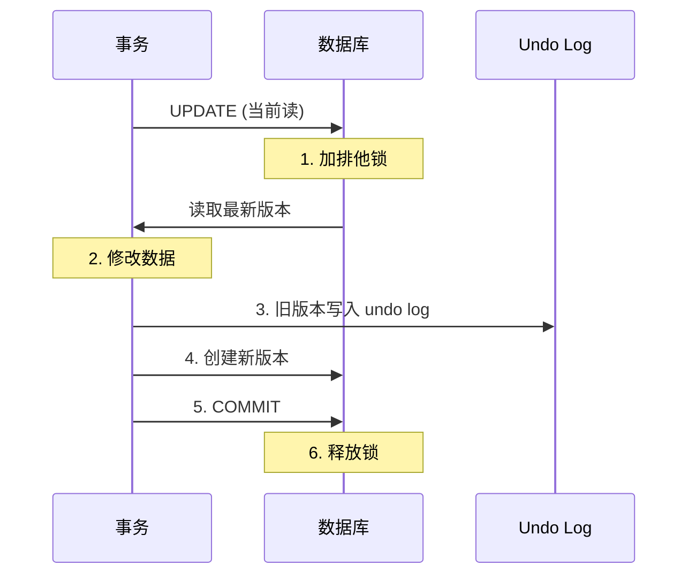

---

### Q3: MVCC 能完全避免幻读吗？

**A**：

**取决于使用快照读还是当前读**。

**快照读**：✅ 避免幻读
```java
@Transactional(isolation = Isolation.REPEATABLE_READ)
public void test1() {
    // 使用同一个 ReadView
    List<User> users1 = userMapper.selectAll();  // 10 条
    // 其他事务插入数据...
    List<User> users2 = userMapper.selectAll();  // 10 条（不会读到新数据）
    // ✅ 不会出现幻读
}
```

**当前读**：⚠️ 可能出现幻读（如果没有用索引）
```java
@Transactional(isolation = Isolation.REPEATABLE_READ)
public void test2() {
    List<User> users1 = userMapper.selectAllForUpdate();  // 10 条
    // 其他事务插入数据...
    List<User> users2 = userMapper.selectAllForUpdate();  // 11 条
    // ⚠️ 可能出现幻读（取决于是否加了间隙锁）
}
```

**总结**：
- 快照读：通过 MVCC 避免幻读
- 当前读：通过 Next-Key Lock 避免幻读（如果有索引）

---

### Q4: ReadView 什么时候创建？

**A**：

| 隔离级别 | ReadView 创建时机 |
|---------|-----------------|
| READ_UNCOMMITTED | ❌ 不创建（直接读最新数据） |
| READ_COMMITTED | ✅ 每次 SELECT 创建新的 |
| REPEATABLE_READ | ✅ 事务第一次 SELECT 时创建 |
| SERIALIZABLE | ❌ 不创建（使用锁机制） |

---

### Q5: 为什么 MVCC 只在 RC 和 RR 隔离级别下工作？

**A**：

**READ_UNCOMMITTED**：
```
不需要版本控制，直接读最新数据
甚至可以读到未提交的数据
```

**READ_COMMITTED 和 REPEATABLE_READ**：
```
需要保证读到已提交的数据
使用 MVCC 实现一致性读
```

**SERIALIZABLE**：
```
最高隔离级别，使用锁机制
读加共享锁，写加排他锁
不需要 MVCC
```

---

## 面试题

### 1. 什么是 MVCC？它解决了什么问题？

**答案**：

**MVCC（Multi-Version Concurrency Control）** = 多版本并发控制

**核心思想**：
- 为每一行数据保存多个版本
- 读操作读取对自己可见的版本
- 写操作创建新版本
- 通过版本链实现读写不冲突

**解决的问题**：
1. ✅ **读写不冲突**：读操作不阻塞写操作，写操作不阻塞读操作
2. ✅ **提高并发**：大幅提升数据库并发处理能力
3. ✅ **一致性读**：保证事务看到一致的数据视图
4. ✅ **实现隔离级别**：支持 READ_COMMITTED 和 REPEATABLE_READ

---

### 2. MVCC 的实现原理是什么？

**答案**：

**核心组件**：

**1. 隐藏字段**
```
DB_TRX_ID：创建该版本的事务 ID
DB_ROLL_PTR：回滚指针，指向上一个版本
DB_ROW_ID：隐藏主键
```

**2. 版本链**
```
通过 DB_ROLL_PTR 将同一行数据的多个版本串联起来
当前版本 → 旧版本 V2 → 旧版本 V1 → NULL
```

**3. ReadView（读视图）**
```
记录事务开始时的活跃事务列表
m_ids：活跃事务 ID 列表
min_trx_id：最小事务 ID
max_trx_id：下一个事务 ID
creator_trx_id：创建该 ReadView 的事务 ID
```

**4. 可见性判断规则**
```
根据 DB_TRX_ID 和 ReadView 判断版本是否可见
如果不可见，沿着版本链找上一个版本
直到找到可见的版本
```

---

### 3. MVCC 在 READ_COMMITTED 和 REPEATABLE_READ 下有什么区别？

**答案**：

**核心区别**：**ReadView 创建时机不同**

| 隔离级别 | ReadView 创建时机 | 效果 |
|---------|-----------------|------|
| READ_COMMITTED | 每次 SELECT 创建新的 | 可以读到其他事务已提交的修改 |
| REPEATABLE_READ | 事务开始时创建一次 | 事务内多次查询结果一致 |

**示例**：
```java
// READ_COMMITTED
@Transactional(isolation = Isolation.READ_COMMITTED)
public void rc() {
    User u1 = userMapper.selectById(1);  // age = 20
    // 其他事务修改并提交...
    User u2 = userMapper.selectById(1);  // age = 25（不同）
}

// REPEATABLE_READ
@Transactional(isolation = Isolation.REPEATABLE_READ)
public void rr() {
    User u1 = userMapper.selectById(1);  // age = 20
    // 其他事务修改并提交...
    User u2 = userMapper.selectById(1);  // age = 20（相同）
}
```

---

### 4. 什么是快照读和当前读？

**答案**：

**快照读（Snapshot Read）**：
- 读取历史快照版本
- 不加锁
- 使用 MVCC
- 示例：`SELECT * FROM user WHERE id = 1`

**当前读（Current Read）**：
- 读取最新版本
- 加锁（共享锁或排他锁）
- 不使用 MVCC
- 示例：
  ```sql
  SELECT * FROM user WHERE id = 1 FOR UPDATE;
  SELECT * FROM user WHERE id = 1 LOCK IN SHARE MODE;
  UPDATE user SET age = 20 WHERE id = 1;
  ```

**对比**：

| 特性 | 快照读 | 当前读 |
|------|-------|-------|
| 读取版本 | 历史快照 | 最新版本 |
| 加锁 | ❌ | ✅ |
| 机制 | MVCC | 锁 |
| 并发度 | 高 | 低 |

---

### 5. MVCC 能完全解决幻读吗？

**答案**：

**取决于是快照读还是当前读**。

**快照读**：✅ 解决幻读
```
REPEATABLE_READ 隔离级别下
使用同一个 ReadView
不会读到新插入的数据
```

**当前读**：⚠️ 可能出现幻读
```
但 MySQL InnoDB 通过 Next-Key Lock（间隙锁）解决了
前提是查询条件有索引
```

**总结**：
- 普通 SELECT（快照读）：不会出现幻读
- SELECT FOR UPDATE（当前读）：通过间隙锁防止幻读

---

### 6. MVCC 的版本链会无限增长吗？

**答案**：

**不会，InnoDB 有 Purge 机制**。

**清理条件**：
1. 版本已提交
2. 没有事务引用该版本（ReadView 不再需要）

**Purge 线程**：
```
InnoDB 有专门的 purge 线程负责清理 undo log
定期扫描，删除不再需要的历史版本
```

**示例**：
```
时刻 T1：
事务 100：活跃，ReadView 引用版本 V1
版本链：V3 → V2 → V1

时刻 T2：
事务 100 提交
版本链：V3 → V2（V1 被清理）
```

---

### 7. MVCC 和锁的区别是什么？

**答案**：

| 特性 | MVCC | 锁机制 |
|------|------|-------|
| 读写冲突 | 不冲突 | 冲突 |
| 并发度 | 高 | 低 |
| 实现方式 | 版本链 | 加锁 |
| 适用场景 | 快照读 | 当前读 |
| 隔离级别 | RC、RR | SERIALIZABLE |

**结合使用**：
```
MySQL InnoDB = MVCC + Next-Key Lock
- 快照读：使用 MVCC
- 当前读：使用锁机制
- 防止幻读：使用 Next-Key Lock（行锁 + 间隙锁）
```

---

### 8. 如何判断一个版本是否可见？

**答案**：

**判断规则**：

**规则 1**：`DB_TRX_ID < min_trx_id`
```
→ ✅ 可见（该版本是在当前事务之前提交的）
```

**规则 2**：`DB_TRX_ID >= max_trx_id`
```
→ ❌ 不可见（该版本是在当前事务之后创建的）
```

**规则 3**：`min_trx_id <= DB_TRX_ID < max_trx_id`
- **DB_TRX_ID 在 m_ids 中**：
  - `DB_TRX_ID == creator_trx_id` → ✅ 可见（是自己修改的）
  - `DB_TRX_ID != creator_trx_id` → ❌ 不可见（是其他未提交事务修改的）
- **DB_TRX_ID 不在 m_ids 中**：
  - → ✅ 可见（是已提交事务修改的）

**如果不可见**：
```
沿着 DB_ROLL_PTR 找上一个版本，继续判断
```

---

### 9. MVCC 在 UPDATE 时如何工作？

**答案**：

**UPDATE 是当前读，不使用 MVCC，使用锁机制**。

**执行流程**：
```
1. 当前读：SELECT ... FOR UPDATE（加排他锁）
2. 读取最新版本
3. 将旧版本写入 undo log
4. 创建新版本（DB_TRX_ID = 当前事务 ID）
5. 提交时释放锁
```

**示例**：
```sql
UPDATE user SET age = 30 WHERE id = 1;

-- 等价于：
SELECT * FROM user WHERE id = 1 FOR UPDATE;  -- 当前读，加锁
-- 旧版本 → undo log
-- 创建新版本
COMMIT;  -- 释放锁
```

---

### 10. 为什么 MVCC 只在 RC 和 RR 隔离级别下工作？

**答案**：

**READ_UNCOMMITTED（读未提交）**：
```
不需要版本控制
直接读最新数据，甚至未提交的数据
```

**READ_COMMITTED 和 REPEATABLE_READ**：
```
需要保证读到已提交的数据
使用 MVCC 实现一致性读
```

**SERIALIZABLE（串行化）**：
```
最高隔离级别
读加共享锁，写加排他锁
使用锁机制，不需要 MVCC
```

**总结**：
- RU：不需要版本控制
- RC、RR：使用 MVCC
- SERIALIZABLE：使用锁机制

---

## 📚 推荐资源

### 官方文档
- MySQL InnoDB 存储引擎：https://dev.mysql.com/doc/refman/8.0/en/innodb-storage-engine.html
- MySQL 事务模型：https://dev.mysql.com/doc/refman/8.0/en/innodb-transaction-model.html

### 书籍
- 《MySQL 技术内幕：InnoDB 存储引擎》
- 《高性能 MySQL》

### 博客
- 掘金：搜索"MVCC"相关文章
- 美团技术团队博客

---

## ✅ 学习检查清单

- [ ] 理解 MVCC 的核心思想
- [ ] 掌握 MVCC 的三个核心组件（隐藏字段、版本链、ReadView）
- [ ] 理解版本可见性判断规则
- [ ] 掌握 RC 和 RR 隔离级别下 MVCC 的区别
- [ ] 理解快照读和当前读的区别
- [ ] 掌握 MVCC 与锁机制的结合
- [ ] 能够回答所有面试题
- [ ] 能够在实际项目中应用 MVCC 知识

---

## 🎯 学习建议

### 1. 循序渐进
```
第一遍：理解核心概念（隐藏字段、版本链、ReadView）
第二遍：理解可见性判断规则
第三遍：理解 RC 和 RR 的区别
第四遍：掌握实战案例
```

### 2. 画图理解
```
- 画版本链
- 画 ReadView 的结构
- 画可见性判断流程
- 画 MVCC 与锁的结合
```

### 3. 代码实践
```java
// 在项目中尝试不同的隔离级别
@Transactional(isolation = Isolation.READ_COMMITTED)
public void testRC() { ... }

@Transactional(isolation = Isolation.REPEATABLE_READ)
public void testRR() { ... }

// 观察快照读和当前读的区别
```

### 4. 面试准备
```
- 能用自己的话解释 MVCC
- 能画出版本链和 ReadView
- 能说出 RC 和 RR 的区别
- 能回答所有面试题
```

---

## 🔚 总结

**MVCC 的核心价值**：

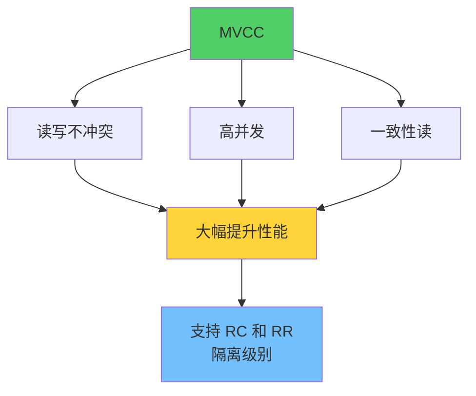

**记住**：
> MVCC 是 MySQL InnoDB 高并发的核心机制
> 
> 通过版本链和 ReadView 实现读写不冲突
> 
> 深入理解 MVCC，面试加分！

---

**有问题随时问我！我会一直陪伴你的学习之旅！🚀**

