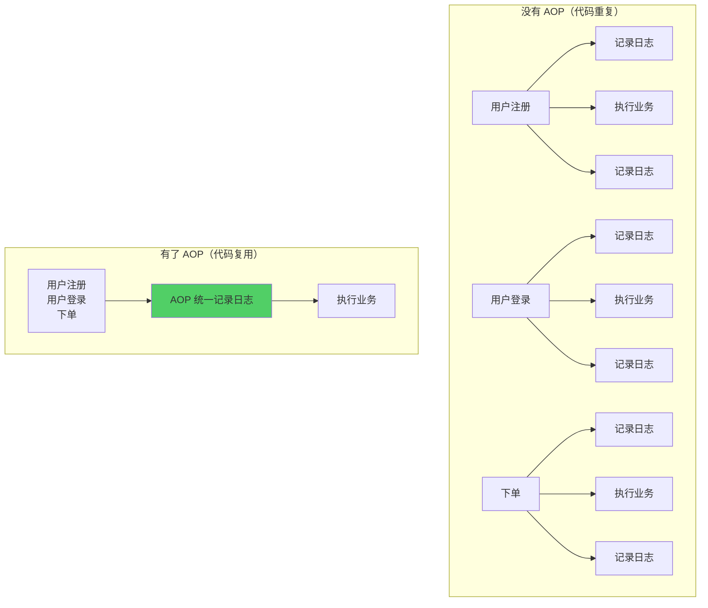
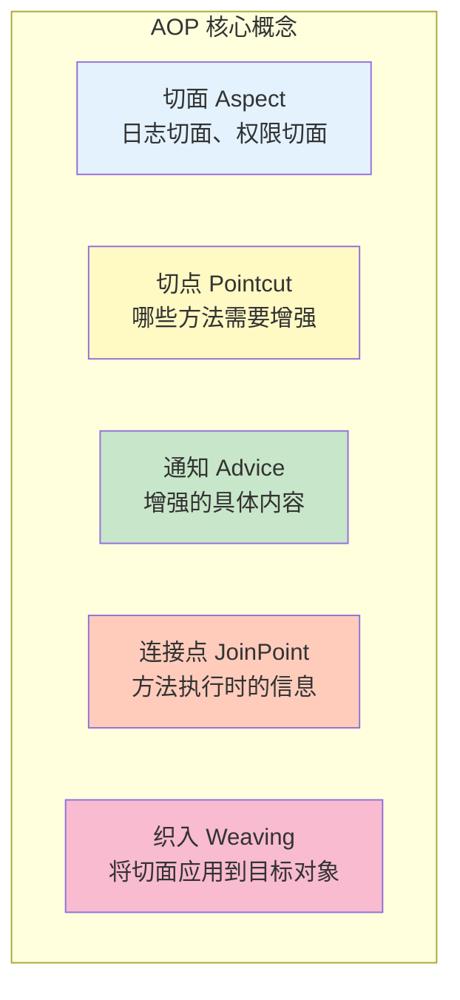
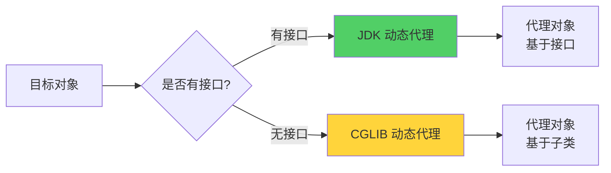
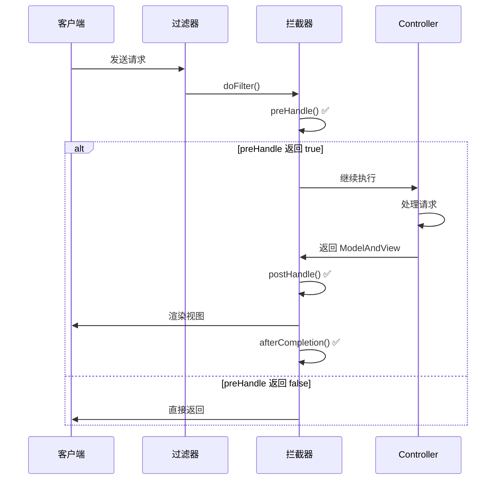
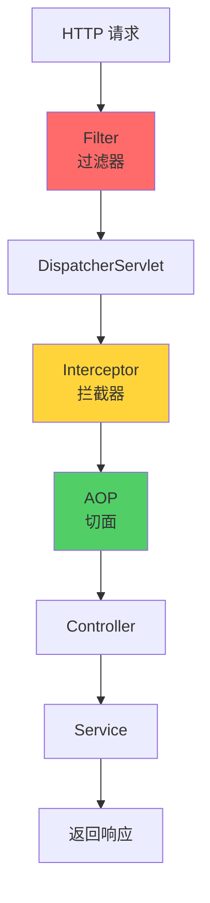
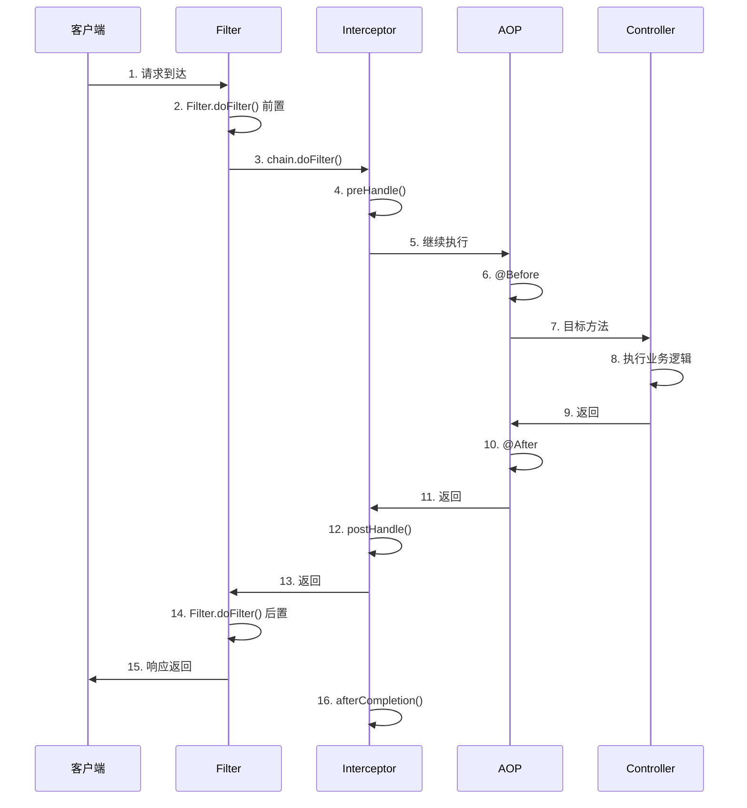

# Week 2 - Day 1-2: AOP 与拦截器

> **学习目标**：掌握 AOP、拦截器、过滤器的使用和原理
> 
> **预计时间**：2天（每天3小时）
> 
> **学习方式**：理论 + 实战
> 
> **适合人群**：已完成 Week 1 学习的开发者

---

## 📚 学习内容

### 1. AOP 面向切面编程
### 2. 拦截器（Interceptor）
### 3. 过滤器（Filter）
### 4. 三者的区别与执行顺序
### 5. 实战案例

---

## 🔰 前置知识：核心概念扫盲

### 什么是 AOP？

**AOP（Aspect Oriented Programming）** = 面向切面编程

**一句话理解**：

AOP = 不修改业务代码的前提下，在方法前后插入你想要的逻辑（比如日志、权限、事务、监控）。

**通俗理解**：

- AOP 是一种编程思想，不是具体的技术
- 将"横切关注点"从业务逻辑中分离出来
- 让你在不修改原代码的情况下，增强功能

**类比**：
> **没有 AOP**：就像做菜时，每道菜都要自己洗菜、切菜、炒菜、装盘
> 
> **有了 AOP**：把"洗菜"、"装盘"这些通用的步骤提取出来，所有菜都可以共用（日志、校验、权限等）

**横切关注点**：
```
横切关注点 = 多个业务逻辑都需要的通用功能

常见的横切关注点：
- 日志记录
- 权限检查
- 事务管理
- 性能监控
- 异常处理
```

**示例场景**：



---

### 什么是代理模式？

**代理模式** = 为对象提供一个代理，控制对这个对象的访问

**类比**：
> **明星（目标对象）** 和 **经纪人（代理对象）**
> - 你想见明星，必须通过经纪人
> - 经纪人可以在见面前做一些准备（检查身份）
> - 经纪人可以在见面后做一些处理（收费）
> - 但最终还是明星在演出

**两种代理方式**：

**1. 静态代理**：
```java
// 目标对象
public class RealStar {
    public void sing() {
        System.out.println("明星唱歌");
    }
}

// 代理对象
public class ProxyStar {
    private RealStar realStar;
    
    public void sing() {
        System.out.println("经纪人：检查场地");  // 前置处理
        realStar.sing();                      // 调用真实对象
        System.out.println("经纪人：收费");     // 后置处理
    }
}
```

**问题**：每个类都要写一个代理类，代码重复

---

**2. 动态代理**：
```java
// 运行时动态创建代理对象
Star proxyStar = (Star) Proxy.newProxyInstance(...);
proxyStar.sing();  // 自动增强
```

**优势**：不需要为每个类写代理类，运行时自动生成

---

### AOP 的核心概念



**概念详解**：

**Pointcut（切点）**：定义“哪些方法要被增强”

**Advice（通知）**：定义“增强逻辑”（前置、后置、环绕等）

**Aspect（切面）**：切点 + 通知

**1. 切面（Aspect）**
```java
@Aspect
@Component
public class LogAspect {
    // 这就是一个切面
}
```
- 切面 = 切点 + 通知
- 包含了"在哪里增强"和"增强什么"

**2. 切点（Pointcut）**

```java
@Pointcut("execution(* com.example.service.*.*(..))")
public void serviceLayer() {}
```
- 切点 = 表达式，定义哪些方法需要增强
- 就像"筛选条件"

**3. 通知（Advice）**

```java
@Before("serviceLayer()")
public void logBefore() {
    System.out.println("方法执行前记录日志");
}
```
- 通知 = 增强的具体内容
- 有 5 种通知类型

**4. 连接点（JoinPoint）**

```java
@Before("serviceLayer()")
public void logBefore(JoinPoint joinPoint) {
    String methodName = joinPoint.getSignature().getName();
    Object[] args = joinPoint.getArgs();
}
```
- 连接点 = 方法执行时的上下文信息
- 可以获取方法名、参数、返回值等

**5. 织入（Weaving）**
```
将切面应用到目标对象，创建代理对象的过程
Spring AOP 在运行时织入（动态代理）
```

---

### 什么是拦截器（Interceptor）？

**拦截器** = Spring MVC 提供的拦截请求的机制

**类比**：
> 就像地铁的安检
> - 进站前：安检（preHandle）
> - 出站时：检票（postHandle）
> - 离开后：清理（afterCompletion）

**特点**：

- 基于 Spring MVC
- **只拦截 Controller 请求**
- 可以获取 Handler 信息

---

### 什么是过滤器（Filter）？

**过滤器** = Servlet 规范提供的组件

**类比**：
> 就像小区门口的保安
> - 检查身份
> - 登记信息
> - 放行或拦截

**特点**：
- 基于 Servlet 规范
- 拦截**所有请求（包括静态资源）**
- 比拦截器更底层

---

## 🚀 第一部分：AOP 面向切面编程

### 1.1 Spring AOP 的实现原理

**Spring AOP 使用动态代理**：



**1. JDK 动态代理**：
```
前提：目标对象必须实现接口
原理：基于接口创建代理对象
特点：只能代理接口方法
```

**2. CGLIB 动态代理**：
```
前提：目标对象是普通类
原理：基于继承创建代理对象（子类）
特点：可以代理普通方法
注意：final 类和 final 方法不能被代理
```

**示例**：

```java
// 有接口的情况（JDK 动态代理）
public interface UserService {
    void save(User user);
}

@Service
public class UserServiceImpl implements UserService {
    @Override
    public void save(User user) {
        System.out.println("保存用户");
    }
}

// 无接口的情况（CGLIB 动态代理）
@Service
public class OrderService {
    public void createOrder(Order order) {
        System.out.println("创建订单");
    }
}
```

---

### 1.2 添加 AOP 依赖

**pom.xml**：
```xml
<dependency>
    <groupId>org.springframework.boot</groupId>
    <artifactId>spring-boot-starter-aop</artifactId>
</dependency>
```

---

### 1.3 AOP 的 5 种通知类型

```mermaid
graph TB
    A[方法执行] --> B[@Before<br/>前置通知]
    B --> C[执行方法]
    C --> D{是否异常?}
    D -->|否| E[@AfterReturning<br/>返回通知]
    D -->|是| F[@AfterThrowing<br/>异常通知]
    E --> G[@After<br/>后置通知]
    F --> G
    
    H[@Around<br/>环绕通知] -.包围.-> A
    H -.包围.-> G
    
    style B fill:#e3f2fd
    style E fill:#c8e6c9
    style F fill:#ffccbc
    style G fill:#fff9c4
    style H fill:#ce93d8
```

**通知类型详解**：

| 通知类型 | 注解 | 执行时机 | 能否阻止方法执行 | 能否修改返回值 |
|---------|------|---------|---------------|-------------|
| **前置通知** | `@Before` | 方法执行前 | ❌ 否 | ❌ 否 |
| **返回通知** | `@AfterReturning` | 方法正常返回后 | ❌ 否 | ❌ 否* |
| **异常通知** | `@AfterThrowing` | 方法抛异常后 | ❌ 否 | ❌ 否 |
| **后置通知** | `@After` | 方法执行后（finally） | ❌ 否 | ❌ 否 |
| **环绕通知** | `@Around` | 方法执行前后 | ✅ 是 | ✅ 是 |

> **注**：`@AfterReturning` 可以获取返回值，但不能修改

---

### 1.4 切点表达式

**语法**：
```
execution(modifiers? return-type declaring-type?method-name(param-types) throws?)
```

**通配符**：
- `*`：匹配任意单个元素
- `..`：匹配任意多个元素（参数或包）
- `+`：匹配指定类及其子类

**示例**：

```java
// 1. 匹配所有 public 方法
@Pointcut("execution(public * *(..))")

// 2. 匹配指定包下的所有方法
@Pointcut("execution(* com.example.service.*.*(..))")

// 3. 匹配指定类的所有方法
@Pointcut("execution(* com.example.service.UserService.*(..))")

// 4. 匹配指定方法
@Pointcut("execution(* com.example.service.UserService.save(..))")

// 5. 匹配任意参数
@Pointcut("execution(* com.example.service.*.*(..))") // .. 表示任意参数

// 6. 匹配指定参数类型
@Pointcut("execution(* com.example.service.*.*(Long, String))")

// 7. 匹配指定返回类型
@Pointcut("execution(User com.example.service.*.*(..))")

// 8. 组合表达式
@Pointcut("execution(* com.example.service.*.*(..)) && @annotation(org.springframework.web.bind.annotation.PostMapping)")
```

**常用模式**：

```java
// Service 层
@Pointcut("execution(* com.example.service..*.*(..))")

// Controller 层
@Pointcut("execution(* com.example.controller..*.*(..))")

// 带 @Transactional （事务）注解的方法
@Pointcut("@annotation(org.springframework.transaction.annotation.Transactional)")

// 指定类的所有方法
@Pointcut("within(com.example.service.UserService)")

// 指定包及其子包的所有类
@Pointcut("within(com.example.service..*)")
```

---

### 1.5 完整的 AOP 示例

**场景**：为所有 Service 层方法添加日志记录

**LogAspect.java**：

```java
package com.example.demo.aspect;

import lombok.extern.slf4j.Slf4j;
import org.aspectj.lang.JoinPoint;
import org.aspectj.lang.ProceedingJoinPoint;
import org.aspectj.lang.annotation.*;
import org.springframework.stereotype.Component;
import org.springframework.web.context.request.RequestContextHolder;
import org.springframework.web.context.request.ServletRequestAttributes;

import javax.servlet.http.HttpServletRequest;
import java.util.Arrays;

@Slf4j
@Aspect
@Component
public class LogAspect {
    
    /**
     * 定义切点：Service 层的所有方法（定义切点前、后、异常时执行什么逻辑）
     */
    @Pointcut("execution(* com.example.demo.service..*.*(..))")
    public void serviceLayer() {
    }
    
    /**
     * 前置通知：方法执行前
     */
    @Before("serviceLayer()")
    public void logBefore(JoinPoint joinPoint) {
        // 获取方法信息
        String className = joinPoint.getTarget().getClass().getName();
        String methodName = joinPoint.getSignature().getName();
        Object[] args = joinPoint.getArgs();
        
        log.info("========== 方法开始执行 ==========");
        log.info("类名: {}", className);
        log.info("方法: {}", methodName);
        log.info("参数: {}", Arrays.toString(args));
    }
    
    /**
     * 返回通知：方法正常返回后
     */
    @AfterReturning(pointcut = "serviceLayer()", returning = "result")
    public void logAfterReturning(JoinPoint joinPoint, Object result) {
        String methodName = joinPoint.getSignature().getName();
        log.info("方法 {} 执行成功", methodName);
        log.info("返回值: {}", result);
    }
    
    /**
     * 异常通知：方法抛异常后
     */
    @AfterThrowing(pointcut = "serviceLayer()", throwing = "ex")
    public void logAfterThrowing(JoinPoint joinPoint, Exception ex) {
        String methodName = joinPoint.getSignature().getName();
        log.error("方法 {} 执行异常", methodName);
        log.error("异常信息: {}", ex.getMessage(), ex);
    }
    
    /**
     * 后置通知：方法执行后（无论成功还是失败）
     */
    @After("serviceLayer()")
    public void logAfter(JoinPoint joinPoint) {
        log.info("========== 方法执行结束 ==========");
    }
    
    /**
     * 环绕通知：最强大的通知类型
     */
    @Around("serviceLayer()")
    public Object logAround(ProceedingJoinPoint joinPoint) throws Throwable {
        String methodName = joinPoint.getSignature().getName();
        
        // 记录开始时间
        long startTime = System.currentTimeMillis();
        
        log.info("========== 环绕通知开始 ==========");
        log.info("方法: {}", methodName);
        
        try {
            // 执行目标方法
            Object result = joinPoint.proceed();
            
            // 记录结束时间
            long endTime = System.currentTimeMillis();
            long duration = endTime - startTime;
            
            log.info("方法执行成功，耗时: {} ms", duration);
            log.info("返回值: {}", result);
            
            return result;
            
        } catch (Exception e) {
            log.error("方法执行失败: {}", e.getMessage());
            throw e;
        } finally {
            log.info("========== 环绕通知结束 ==========");
        }
    }
}
```

**注意**：
- 如果同时定义了多个通知，推荐只使用 `@Around`
- `@Around` 最灵活，可以完全控制方法的执行

---

### 1.6 实战案例 1：接口性能监控

**场景**：监控所有 Controller 接口的性能，记录请求信息和耗时。

**PerformanceAspect.java**：

```java
package com.example.demo.aspect;

import com.fasterxml.jackson.databind.ObjectMapper;
import lombok.extern.slf4j.Slf4j;
import org.aspectj.lang.ProceedingJoinPoint;
import org.aspectj.lang.annotation.Around;
import org.aspectj.lang.annotation.Aspect;
import org.aspectj.lang.annotation.Pointcut;
import org.springframework.stereotype.Component;
import org.springframework.web.context.request.RequestContextHolder;
import org.springframework.web.context.request.ServletRequestAttributes;

import javax.servlet.http.HttpServletRequest;

@Slf4j
@Aspect
@Component
public class PerformanceAspect {
    
    private final ObjectMapper objectMapper = new ObjectMapper();
    
    /**
     * 切点：所有 Controller
     */
    @Pointcut("execution(* com.example.demo.controller..*.*(..))")
    public void controllerLayer() {
    }
    
    /**
     * 环绕通知：记录接口性能
     */
    @Around("controllerLayer()")
    public Object monitorPerformance(ProceedingJoinPoint joinPoint) throws Throwable {
        // 获取请求信息
        ServletRequestAttributes attributes = 
            (ServletRequestAttributes) RequestContextHolder.getRequestAttributes();
        HttpServletRequest request = attributes.getRequest();
        
        // 记录请求信息
        String url = request.getRequestURL().toString();
        String method = request.getMethod();
        String ip = getClientIp(request);
        String className = joinPoint.getTarget().getClass().getName();
        String methodName = joinPoint.getSignature().getName();
        Object[] args = joinPoint.getArgs();
        
        log.info("========== 接口请求开始 ==========");
        log.info("URL: {}", url);
        log.info("HTTP Method: {}", method);
        log.info("IP: {}", ip);
        log.info("Class: {}", className);
        log.info("Method: {}", methodName);
        log.info("Args: {}", objectMapper.writeValueAsString(args));
        
        // 记录开始时间
        long startTime = System.currentTimeMillis();
        
        try {
            // 执行目标方法
            Object result = joinPoint.proceed();
            
            // 记录结束时间
            long endTime = System.currentTimeMillis();
            long duration = endTime - startTime;
            
            log.info("Response: {}", objectMapper.writeValueAsString(result));
            log.info("耗时: {} ms", duration);
            log.info("========== 接口请求结束 ==========");
            
            // 如果耗时超过 3 秒，记录警告
            if (duration > 3000) {
                log.warn("⚠️ 接口响应缓慢！URL: {}, 耗时: {} ms", url, duration);
            }
            
            return result;
            
        } catch (Exception e) {
            log.error("接口执行异常: {}", e.getMessage(), e);
            log.info("========== 接口请求异常 ==========");
            throw e;
        }
    }
    
    /**
     * 获取客户端 IP
     */
    private String getClientIp(HttpServletRequest request) {
        String ip = request.getHeader("X-Forwarded-For");
        if (ip == null || ip.isEmpty() || "unknown".equalsIgnoreCase(ip)) {
            ip = request.getHeader("X-Real-IP");
        }
        if (ip == null || ip.isEmpty() || "unknown".equalsIgnoreCase(ip)) {
            ip = request.getRemoteAddr();
        }
        return ip;
    }
}
```

**输出示例**：
```
2024-01-01 10:00:00 INFO  ========== 接口请求开始 ==========
2024-01-01 10:00:00 INFO  URL: http://localhost:8080/api/v1/users/1
2024-01-01 10:00:00 INFO  HTTP Method: GET
2024-01-01 10:00:00 INFO  IP: 127.0.0.1
2024-01-01 10:00:00 INFO  Class: com.example.demo.controller.UserController
2024-01-01 10:00:00 INFO  Method: getUser
2024-01-01 10:00:00 INFO  Args: [1]
2024-01-01 10:00:00 INFO  Response: {"id":1,"username":"admin"}
2024-01-01 10:00:00 INFO  耗时: 150 ms
2024-01-01 10:00:00 INFO  ========== 接口请求结束 ==========
```

---

### 1.7 实战案例 2：权限校验

**场景**：通过自定义注解 `@RequirePermission` 实现权限校验。

**1. 定义注解**：

```java
package com.example.demo.annotation;

import java.lang.annotation.*;

@Target(ElementType.METHOD)
@Retention(RetentionPolicy.RUNTIME)
@Documented
public @interface RequirePermission {
    /**
     * 需要的权限
     */
    String value();
}
```

**2. 定义切面**：

```java
package com.example.demo.aspect;

import com.example.demo.annotation.RequirePermission;
import lombok.extern.slf4j.Slf4j;
import org.aspectj.lang.ProceedingJoinPoint;
import org.aspectj.lang.annotation.Around;
import org.aspectj.lang.annotation.Aspect;
import org.aspectj.lang.reflect.MethodSignature;
import org.springframework.stereotype.Component;
import org.springframework.web.context.request.RequestContextHolder;
import org.springframework.web.context.request.ServletRequestAttributes;

import javax.servlet.http.HttpServletRequest;
import java.lang.reflect.Method;

@Slf4j
@Aspect
@Component
public class PermissionAspect {
    
    /**
     * 切点：带 @RequirePermission 注解的方法
     */
    @Around("@annotation(com.example.demo.annotation.RequirePermission)")
    public Object checkPermission(ProceedingJoinPoint joinPoint) throws Throwable {
        // 获取方法签名
        MethodSignature signature = (MethodSignature) joinPoint.getSignature();
        Method method = signature.getMethod();
        
        // 获取注解
        RequirePermission annotation = method.getAnnotation(RequirePermission.class);
        String requiredPermission = annotation.value();
        
        log.info("权限校验开始，需要权限: {}", requiredPermission);
        
        // 获取当前用户
        String currentUser = getCurrentUser();
        
        // 校验权限
        if (!hasPermission(currentUser, requiredPermission)) {
            log.warn("用户 {} 没有权限 {}", currentUser, requiredPermission);
            throw new RuntimeException("无权限访问：" + requiredPermission);
        }
        
        log.info("权限校验通过");
        
        // 执行目标方法
        return joinPoint.proceed();
    }
    
    /**
     * 获取当前用户（从 Session 或 Token 中）
     */
    private String getCurrentUser() {
        ServletRequestAttributes attributes = 
            (ServletRequestAttributes) RequestContextHolder.getRequestAttributes();
        HttpServletRequest request = attributes.getRequest();
        
        // 从请求头中获取用户信息（实际项目中从 JWT 或 Session 中获取）
        String user = request.getHeader("X-User");
        return user != null ? user : "anonymous";
    }
    
    /**
     * 检查用户是否有权限（实际项目中查询数据库）
     */
    private boolean hasPermission(String user, String permission) {
        // 简化示例：admin 有所有权限
        if ("admin".equals(user)) {
            return true;
        }
        
        // 实际项目中应该查询数据库
        // return permissionService.hasPermission(user, permission);
        
        return false;
    }
}
```

**3. 使用注解**：

```java
@RestController
@RequestMapping("/api/v1/users")
public class UserController {
    
    /**
     * 普通接口，不需要权限
     */
    @GetMapping("/{id}")
    public Result<User> getUser(@PathVariable Long id) {
        // ...
    }
    
    /**
     * 需要 "user:create" 权限
     */
    @PostMapping
    @RequirePermission("user:create")
    public Result<User> createUser(@RequestBody User user) {
        // ...
    }
    
    /**
     * 需要 "user:delete" 权限
     */
    @DeleteMapping("/{id}")
    @RequirePermission("user:delete")
    public Result<Void> deleteUser(@PathVariable Long id) {
        // ...
    }
}
```

**测试**：
```bash
# 没有权限（匿名用户）
curl http://localhost:8080/api/v1/users/1 -X DELETE
# 返回：{"code": 500, "message": "无权限访问：user:delete"}

# 有权限（admin 用户）
curl http://localhost:8080/api/v1/users/1 -X DELETE -H "X-User: admin"
# 返回：{"code": 200, "message": "删除成功"}
```

---

### 1.8 实战案例 3：缓存切面

**场景**：为查询方法添加缓存，减少数据库查询。

**CacheAspect.java**：

```java
package com.example.demo.aspect;

import com.fasterxml.jackson.databind.ObjectMapper;
import lombok.extern.slf4j.Slf4j;
import org.aspectj.lang.ProceedingJoinPoint;
import org.aspectj.lang.annotation.Around;
import org.aspectj.lang.annotation.Aspect;
import org.aspectj.lang.annotation.Pointcut;
import org.springframework.beans.factory.annotation.Autowired;
import org.springframework.data.redis.core.RedisTemplate;
import org.springframework.stereotype.Component;

import java.util.concurrent.TimeUnit;

@Slf4j
@Aspect
@Component
public class CacheAspect {
    
    @Autowired
    private RedisTemplate<String, Object> redisTemplate;
    
    private final ObjectMapper objectMapper = new ObjectMapper();
    
    /**
     * 切点：所有 selectById 方法
     */
    @Pointcut("execution(* com.example.demo.service..*.selectById(..))")
    public void selectByIdMethods() {
    }
    
    /**
     * 环绕通知：添加缓存
     */
    @Around("selectByIdMethods()")
    public Object cache(ProceedingJoinPoint joinPoint) throws Throwable {
        // 获取方法信息
        String className = joinPoint.getTarget().getClass().getSimpleName();
        String methodName = joinPoint.getSignature().getName();
        Object[] args = joinPoint.getArgs();
        
        // 生成缓存 key
        String cacheKey = generateCacheKey(className, methodName, args);
        
        // 尝试从缓存中获取
        Object cachedValue = redisTemplate.opsForValue().get(cacheKey);
        
        if (cachedValue != null) {
            log.info("缓存命中: {}", cacheKey);
            return cachedValue;
        }
        
        log.info("缓存未命中: {}", cacheKey);
        
        // 执行目标方法
        Object result = joinPoint.proceed();
        
        // 将结果放入缓存（过期时间 10 分钟）
        if (result != null) {
            redisTemplate.opsForValue().set(cacheKey, result, 10, TimeUnit.MINUTES);
            log.info("结果已缓存: {}", cacheKey);
        }
        
        return result;
    }
    
    /**
     * 生成缓存 key
     */
    private String generateCacheKey(String className, String methodName, Object[] args) {
        StringBuilder sb = new StringBuilder();
        sb.append(className).append(":").append(methodName);
        
        for (Object arg : args) {
            sb.append(":").append(arg);
        }
        
        return sb.toString();
    }
}
```

**输出示例**：
```
// 第一次查询
2024-01-01 10:00:00 INFO  缓存未命中: UserService:selectById:1
2024-01-01 10:00:00 INFO  结果已缓存: UserService:selectById:1

// 第二次查询
2024-01-01 10:00:05 INFO  缓存命中: UserService:selectById:1
```

---

## 🔧 第二部分：拦截器（Interceptor）

### 2.1 什么是拦截器？

**拦截器（Interceptor）** = Spring MVC 提供的拦截请求的机制

**AOP 是“方法级别”的切面编程；** **Interceptor 是“请求级别”的 Web 过滤机制。**

**执行流程**：



**拦截器的三个方法**：

```java
public interface HandlerInterceptor {
    
    /**
     * 前置处理：在 Controller 方法执行之前
     * 返回值：true 继续执行，false 中断请求
     */
    default boolean preHandle(HttpServletRequest request, 
                              HttpServletResponse response, 
                              Object handler) throws Exception {
        return true;
    }
    
    /**
     * 后置处理：在 Controller 方法执行之后，视图渲染之前
     * 可以修改 ModelAndView
     */
    default void postHandle(HttpServletRequest request, 
                           HttpServletResponse response, 
                           Object handler, 
                           ModelAndView modelAndView) throws Exception {
    }
    
    /**
     * 完成处理：在视图渲染之后
     * 无论是否异常都会执行（类似 finally）
     */
    default void afterCompletion(HttpServletRequest request, 
                                 HttpServletResponse response, 
                                 Object handler, 
                                 Exception ex) throws Exception {
    }
}
```

---

### 2.2 创建拦截器

**1. 实现 HandlerInterceptor 接口**：

```java
package com.example.demo.interceptor;

import lombok.extern.slf4j.Slf4j;
import org.springframework.stereotype.Component;
import org.springframework.web.servlet.HandlerInterceptor;
import org.springframework.web.servlet.ModelAndView;

import javax.servlet.http.HttpServletRequest;
import javax.servlet.http.HttpServletResponse;

@Slf4j
@Component
public class LogInterceptor implements HandlerInterceptor {
    
    /**
     * 前置处理
     */
    @Override
    public boolean preHandle(HttpServletRequest request, 
                            HttpServletResponse response, 
                            Object handler) throws Exception {
        String url = request.getRequestURL().toString();
        String method = request.getMethod();
        
        log.info("========== 拦截器 preHandle ==========");
        log.info("请求 URL: {}", url);
        log.info("请求方法: {}", method);
        
        // 返回 true 继续执行，false 中断请求
        return true;
    }
    
    /**
     * 后置处理
     */
    @Override
    public void postHandle(HttpServletRequest request, 
                          HttpServletResponse response, 
                          Object handler, 
                          ModelAndView modelAndView) throws Exception {
        log.info("========== 拦截器 postHandle ==========");
    }
    
    /**
     * 完成处理
     */
    @Override
    public void afterCompletion(HttpServletRequest request, 
                               HttpServletResponse response, 
                               Object handler, 
                               Exception ex) throws Exception {
        log.info("========== 拦截器 afterCompletion ==========");
        
        if (ex != null) {
            log.error("请求异常: {}", ex.getMessage());
        }
    }
}
```

**2. 注册拦截器**：

```java
package com.example.demo.config;

import com.example.demo.interceptor.LogInterceptor;
import org.springframework.beans.factory.annotation.Autowired;
import org.springframework.context.annotation.Configuration;
import org.springframework.web.servlet.config.annotation.InterceptorRegistry;
import org.springframework.web.servlet.config.annotation.WebMvcConfigurer;

@Configuration
public class WebConfig implements WebMvcConfigurer {
    
    @Autowired
    private LogInterceptor logInterceptor;
    
    @Override
    public void addInterceptors(InterceptorRegistry registry) {
        registry.addInterceptor(logInterceptor)
                .addPathPatterns("/**")        // 拦截所有请求
                .excludePathPatterns(          // 排除的路径
                    "/login",
                    "/register",
                    "/static/**",
                    "/error"
                );
    }
}
```

---

### 2.3 实战案例 1：登录拦截器

**场景**：检查用户是否登录，未登录则跳转到登录页。

**LoginInterceptor.java**：

```java
package com.example.demo.interceptor;

import com.fasterxml.jackson.databind.ObjectMapper;
import com.example.demo.common.Result;
import lombok.extern.slf4j.Slf4j;
import org.springframework.stereotype.Component;
import org.springframework.web.servlet.HandlerInterceptor;

import javax.servlet.http.HttpServletRequest;
import javax.servlet.http.HttpServletResponse;
import javax.servlet.http.HttpSession;

@Slf4j
@Component
public class LoginInterceptor implements HandlerInterceptor {
    
    private final ObjectMapper objectMapper = new ObjectMapper();
    
    @Override
    public boolean preHandle(HttpServletRequest request, 
                            HttpServletResponse response, 
                            Object handler) throws Exception {
        String uri = request.getRequestURI();
        log.info("登录拦截器：检查 URI = {}", uri);
        
        // 从 Session 中获取用户信息
        HttpSession session = request.getSession(false);
        Object user = session != null ? session.getAttribute("user") : null;
        
        if (user == null) {
            log.warn("用户未登录，拒绝访问: {}", uri);
            
            // 返回 JSON（前后端分离）
            response.setStatus(HttpServletResponse.SC_UNAUTHORIZED);
            response.setContentType("application/json;charset=UTF-8");
            
            Result<?> result = Result.error(401, "请先登录");
            response.getWriter().write(objectMapper.writeValueAsString(result));
            
            return false;  // 中断请求
        }
        
        log.info("用户已登录: {}", user);
        return true;  // 继续执行
    }
}
```

**注册拦截器**：

```java
@Configuration
public class WebConfig implements WebMvcConfigurer {
    
    @Autowired
    private LoginInterceptor loginInterceptor;
    
    @Override
    public void addInterceptors(InterceptorRegistry registry) {
        registry.addInterceptor(loginInterceptor)
                .addPathPatterns("/api/**")       // 拦截所有 API 请求
                .excludePathPatterns(             // 排除登录、注册等接口
                    "/api/login",
                    "/api/register"
                );
    }
}
```

---

### 2.4 实战案例 2：接口限流拦截器

**场景**：限制单个用户的请求频率（每秒最多 10 次）。

**RateLimitInterceptor.java**：

```java
package com.example.demo.interceptor;

import com.google.common.util.concurrent.RateLimiter;
import lombok.extern.slf4j.Slf4j;
import org.springframework.stereotype.Component;
import org.springframework.web.servlet.HandlerInterceptor;

import javax.servlet.http.HttpServletRequest;
import javax.servlet.http.HttpServletResponse;
import java.util.Map;
import java.util.concurrent.ConcurrentHashMap;

@Slf4j
@Component
public class RateLimitInterceptor implements HandlerInterceptor {
    
    // 每个 IP 一个限流器
    private final Map<String, RateLimiter> limiters = new ConcurrentHashMap<>();
    
    // 每秒允许 10 个请求
    private static final double PERMITS_PER_SECOND = 10.0;
    
    @Override
    public boolean preHandle(HttpServletRequest request, 
                            HttpServletResponse response, 
                            Object handler) throws Exception {
        String ip = getClientIp(request);
        
        // 获取或创建限流器
        RateLimiter limiter = limiters.computeIfAbsent(ip, 
            k -> RateLimiter.create(PERMITS_PER_SECOND));
        
        // 尝试获取令牌
        if (!limiter.tryAcquire()) {
            log.warn("请求被限流，IP: {}", ip);
            
            response.setStatus(429);  // Too Many Requests
            response.setContentType("application/json;charset=UTF-8");
            response.getWriter().write("{\"code\": 429, \"message\": \"请求过于频繁，请稍后再试\"}");
            
            return false;  // 中断请求
        }
        
        return true;
    }
    
    /**
     * 获取客户端 IP
     */
    private String getClientIp(HttpServletRequest request) {
        String ip = request.getHeader("X-Forwarded-For");
        if (ip == null || ip.isEmpty()) {
            ip = request.getRemoteAddr();
        }
        return ip;
    }
}
```

**添加依赖**：
```xml
<dependency>
    <groupId>com.google.guava</groupId>
    <artifactId>guava</artifactId>
    <version>31.1-jre</version>
</dependency>
```

---

## 🛡️ 第三部分：过滤器（Filter）

### 3.1 什么是过滤器？

**过滤器（Filter）** = Servlet 规范提供的组件

@WebFilter 是 **Servlet 容器（Tomcat、Jetty、Undertow）内部的机制**。请求的执行顺序是：

```markdown
请求 → 操作系统 → TCP/IP → 防火墙 → Nginx → Tomcat → Filter → Interceptor → Controller
```

**过滤器是在 Tomcat 里执行的。** **也就是说，攻击流量已经成功打到你的服务器了。**

泛洪攻击（Flood Attack）的本质是：

- 占满你的带宽
- 占满你的 TCP 连接
- 占满你的服务器线程
- 让你的服务根本无法响应正常请求

这些事情发生在 **过滤器之前**。

所以过滤器根本来不及出手。

过滤器能做的是：

- 登录校验
- 参数校验
- XSS 过滤
- SQL 注入过滤
- 请求日志
- 权限控制
- CORS
- 限流（轻量级）

这些都是 **应用层安全**。

但它不能做：

- DDoS 防御
- SYN Flood 防御
- UDP Flood 防御
- CC 攻击防御（高并发恶意请求）
- 带宽耗尽攻击
- 网络层攻击

这些属于 **网络层 / 传输层安全**。

**特点**：

- 基于 Servlet 规范，不依赖 Spring
- 拦截所有请求（包括静态资源、JSP）
- 在拦截器之前执行

**执行流程**：

```java
public void doFilter(ServletRequest request, 
                    ServletResponse response, 
                    FilterChain chain) throws IOException, ServletException {
    // 前置处理
    System.out.println("请求进入过滤器");
    
    // 放行（执行下一个过滤器或目标资源）
    chain.doFilter(request, response);
    
    // 后置处理
    System.out.println("响应离开过滤器");
}
```

---

### 3.2 创建过滤器

**方式 1：使用 @WebFilter 注解**：

```java
package com.example.demo.filter;

import lombok.extern.slf4j.Slf4j;

import javax.servlet.*;
import javax.servlet.annotation.WebFilter;
import javax.servlet.http.HttpServletRequest;
import java.io.IOException;

@Slf4j
@WebFilter(urlPatterns = "/*")  // 拦截所有请求
public class LogFilter implements Filter {
    
    @Override
    public void init(FilterConfig filterConfig) throws ServletException {
        log.info("LogFilter 初始化");
    }
    
    @Override
    public void doFilter(ServletRequest request, 
                        ServletResponse response, 
                        FilterChain chain) throws IOException, ServletException {
        HttpServletRequest httpRequest = (HttpServletRequest) request;
        String uri = httpRequest.getRequestURI();
        
        log.info("========== 过滤器开始 ==========");
        log.info("请求 URI: {}", uri);
        
        // 放行
        chain.doFilter(request, response);
        
        log.info("========== 过滤器结束 ==========");
    }
    
    @Override
    public void destroy() {
        log.info("LogFilter 销毁");
    }
}
```

**启动类添加注解**：
```java
@SpringBootApplication
@ServletComponentScan  // 扫描 @WebFilter
public class DemoApplication {
    public static void main(String[] args) {
        SpringApplication.run(DemoApplication.class, args);
    }
}
```

---

**方式 2：使用 @Component + FilterRegistrationBean**：

```java
package com.example.demo.filter;

import lombok.extern.slf4j.Slf4j;
import org.springframework.stereotype.Component;

import javax.servlet.*;
import javax.servlet.http.HttpServletRequest;
import java.io.IOException;

@Slf4j
@Component
public class LogFilter implements Filter {
    
    @Override
    public void doFilter(ServletRequest request, 
                        ServletResponse response, 
                        FilterChain chain) throws IOException, ServletException {
        HttpServletRequest httpRequest = (HttpServletRequest) request;
        String uri = httpRequest.getRequestURI();
        
        log.info("过滤器：{}", uri);
        
        chain.doFilter(request, response);
    }
}
```

**配置过滤器**：
```java
@Configuration
public class FilterConfig {
    
    @Bean
    public FilterRegistrationBean<LogFilter> logFilter(LogFilter filter) {
        FilterRegistrationBean<LogFilter> registration = new FilterRegistrationBean<>();
        registration.setFilter(filter);
        registration.addUrlPatterns("/*");      // 拦截路径
        registration.setOrder(1);               // 执行顺序
        return registration;
    }
}
```

---

### 3.3 实战案例 1：CORS 跨域过滤器

**场景**：处理跨域请求。

**CorsFilter.java**：

```java
package com.example.demo.filter;

import org.springframework.stereotype.Component;

import javax.servlet.*;
import javax.servlet.http.HttpServletRequest;
import javax.servlet.http.HttpServletResponse;
import java.io.IOException;

@Component
public class CorsFilter implements Filter {
    
    @Override
    public void doFilter(ServletRequest request, 
                        ServletResponse response, 
                        FilterChain chain) throws IOException, ServletException {
        HttpServletRequest httpRequest = (HttpServletRequest) request;
        HttpServletResponse httpResponse = (HttpServletResponse) response;
        
        // 允许的域名
        httpResponse.setHeader("Access-Control-Allow-Origin", "http://localhost:3000");
        // 允许的方法
        httpResponse.setHeader("Access-Control-Allow-Methods", "GET, POST, PUT, DELETE, OPTIONS");
        // 允许的请求头
        httpResponse.setHeader("Access-Control-Allow-Headers", "Content-Type, Authorization");
        // 允许携带 Cookie
        httpResponse.setHeader("Access-Control-Allow-Credentials", "true");
        // 预检请求的有效期（秒）
        httpResponse.setHeader("Access-Control-Max-Age", "3600");
        
        // 处理预检请求
        if ("OPTIONS".equalsIgnoreCase(httpRequest.getMethod())) {
            httpResponse.setStatus(HttpServletResponse.SC_OK);
            return;
        }
        
        chain.doFilter(request, response);
    }
}
```

---

### 3.4 实战案例 2：请求日志过滤器

**场景**：记录所有请求的详细信息。

**RequestLogFilter.java**：

```java
package com.example.demo.filter;

import lombok.extern.slf4j.Slf4j;
import org.springframework.stereotype.Component;
import org.springframework.web.util.ContentCachingRequestWrapper;
import org.springframework.web.util.ContentCachingResponseWrapper;

import javax.servlet.*;
import javax.servlet.http.HttpServletRequest;
import javax.servlet.http.HttpServletResponse;
import java.io.IOException;
import java.nio.charset.StandardCharsets;

@Slf4j
@Component
public class RequestLogFilter implements Filter {
    
    @Override
    public void doFilter(ServletRequest request, 
                        ServletResponse response, 
                        FilterChain chain) throws IOException, ServletException {
        HttpServletRequest httpRequest = (HttpServletRequest) request;
        HttpServletResponse httpResponse = (HttpServletResponse) response;
        
        // 包装请求和响应，以便多次读取
        ContentCachingRequestWrapper requestWrapper = 
            new ContentCachingRequestWrapper(httpRequest);
        ContentCachingResponseWrapper responseWrapper = 
            new ContentCachingResponseWrapper(httpResponse);
        
        long startTime = System.currentTimeMillis();
        
        // 放行
        chain.doFilter(requestWrapper, responseWrapper);
        
        long endTime = System.currentTimeMillis();
        long duration = endTime - startTime;
        
        // 记录请求信息
        String uri = httpRequest.getRequestURI();
        String method = httpRequest.getMethod();
        int status = httpResponse.getStatus();
        
        // 获取请求体
        String requestBody = new String(requestWrapper.getContentAsByteArray(), 
                                       StandardCharsets.UTF_8);
        
        // 获取响应体
        String responseBody = new String(responseWrapper.getContentAsByteArray(), 
                                        StandardCharsets.UTF_8);
        
        log.info("========== 请求日志 ==========");
        log.info("URI: {}", uri);
        log.info("Method: {}", method);
        log.info("Request Body: {}", requestBody);
        log.info("Status: {}", status);
        log.info("Response Body: {}", responseBody);
        log.info("Duration: {} ms", duration);
        
        // 重要：将响应体写回
        responseWrapper.copyBodyToResponse();
    }
}
```

---

## 🔄 第四部分：Filter、Interceptor、AOP 的区别

### 4.1 三者对比



| 特性 | Filter | Interceptor | AOP |
|------|--------|------------|-----|
| **规范** | Servlet 规范 | Spring MVC | Spring AOP |
| **依赖** | 不依赖 Spring | 依赖 Spring MVC | 依赖 Spring |
| **拦截范围** | 所有请求（包括静态资源） | Controller 请求 | 任意方法 |
| **执行时机** | 最早 | 中间 | 最晚 |
| **实现方式** | 实现 Filter 接口 | 实现 HandlerInterceptor | 使用 @Aspect |
| **能否获取 Handler** | ❌ 否 | ✅ 是 | ❌ 否 |
| **能否获取方法参数** | ❌ 否 | ❌ 否 | ✅ 是 |
| **使用场景** | 编码、CORS、XSS | 登录、权限、日志 | 事务、日志、缓存 |

---

### 4.2 执行顺序



**完整示例**：

```java
// 1. Filter
@Component
public class MyFilter implements Filter {
    @Override
    public void doFilter(ServletRequest request, ServletResponse response, FilterChain chain) 
            throws IOException, ServletException {
        System.out.println("1. Filter 前置处理");
        chain.doFilter(request, response);
        System.out.println("6. Filter 后置处理");
    }
}

// 2. Interceptor
@Component
public class MyInterceptor implements HandlerInterceptor {
    @Override
    public boolean preHandle(HttpServletRequest request, HttpServletResponse response, Object handler) {
        System.out.println("2. Interceptor preHandle");
        return true;
    }
    
    @Override
    public void postHandle(HttpServletRequest request, HttpServletResponse response, Object handler, ModelAndView modelAndView) {
        System.out.println("5. Interceptor postHandle");
    }
    
    @Override
    public void afterCompletion(HttpServletRequest request, HttpServletResponse response, Object handler, Exception ex) {
        System.out.println("7. Interceptor afterCompletion");
    }
}

// 3. AOP
@Aspect
@Component
public class MyAspect {
    @Around("execution(* com.example.demo.controller.*.*(..))")
    public Object around(ProceedingJoinPoint joinPoint) throws Throwable {
        System.out.println("3. AOP 前置处理");
        Object result = joinPoint.proceed();
        System.out.println("4. AOP 后置处理");
        return result;
    }
}

// 4. Controller
@RestController
public class TestController {
    @GetMapping("/test")
    public String test() {
        System.out.println("Controller 执行");
        return "success";
    }
}
```

**输出结果**：
```
1. Filter 前置处理
2. Interceptor preHandle
3. AOP 前置处理
Controller 执行
4. AOP 后置处理
5. Interceptor postHandle
6. Filter 后置处理
7. Interceptor afterCompletion
```

---

### 4.3 使用场景选择

**Filter（过滤器）**：
```
✅ 字符编码处理
✅ XSS 防护
✅ CORS 跨域处理
✅ 请求/响应的包装（修改）
✅ 压缩、解压
```

**Interceptor（拦截器）**：
```
✅ 登录检查
✅ 权限校验
✅ 国际化处理
✅ 请求日志记录
✅ 性能监控
```

**AOP（切面）**：
```
✅ 事务管理
✅ 日志记录（方法级别）
✅ 缓存处理
✅ 异常处理
✅ 权限检查（方法级别）
```

---

## 📝 实战综合案例

### 场景：构建完整的请求处理链

**需求**：
1. Filter：处理编码和 CORS
2. Interceptor：检查登录状态
3. AOP：记录方法执行日志和性能

**1. 编码和 CORS 过滤器**：

```java
@Component
@Order(1)
public class EncodingAndCorsFilter implements Filter {
    
    @Override
    public void doFilter(ServletRequest request, ServletResponse response, FilterChain chain) 
            throws IOException, ServletException {
        HttpServletRequest httpRequest = (HttpServletRequest) request;
        HttpServletResponse httpResponse = (HttpServletResponse) response;
        
        // 设置编码
        httpRequest.setCharacterEncoding("UTF-8");
        httpResponse.setCharacterEncoding("UTF-8");
        
        // 处理 CORS
        httpResponse.setHeader("Access-Control-Allow-Origin", "*");
        httpResponse.setHeader("Access-Control-Allow-Methods", "GET, POST, PUT, DELETE");
        httpResponse.setHeader("Access-Control-Allow-Headers", "*");
        
        if ("OPTIONS".equalsIgnoreCase(httpRequest.getMethod())) {
            httpResponse.setStatus(HttpServletResponse.SC_OK);
            return;
        }
        
        chain.doFilter(request, response);
    }
}
```

**2. 登录拦截器**：

```java
@Component
public class AuthInterceptor implements HandlerInterceptor {
    
    @Override
    public boolean preHandle(HttpServletRequest request, HttpServletResponse response, Object handler) 
            throws Exception {
        String token = request.getHeader("Authorization");
        
        if (token == null || !validateToken(token)) {
            response.setStatus(HttpServletResponse.SC_UNAUTHORIZED);
            response.setContentType("application/json;charset=UTF-8");
            response.getWriter().write("{\"code\": 401, \"message\": \"未登录或登录已过期\"}");
            return false;
        }
        
        // 将用户信息存入 Request
        request.setAttribute("userId", getUserIdFromToken(token));
        
        return true;
    }
    
    private boolean validateToken(String token) {
        // 验证 JWT token
        return true;
    }
    
    private Long getUserIdFromToken(String token) {
        // 从 token 中解析 userId
        return 1L;
    }
}
```

**3. 方法日志切面**：

```java
@Slf4j
@Aspect
@Component
public class MethodLogAspect {
    
    @Around("execution(* com.example.demo.service..*.*(..))")
    public Object logMethod(ProceedingJoinPoint joinPoint) throws Throwable {
        String methodName = joinPoint.getSignature().getName();
        Object[] args = joinPoint.getArgs();
        
        log.info("方法开始: {}({})", methodName, Arrays.toString(args));
        
        long startTime = System.currentTimeMillis();
        
        try {
            Object result = joinPoint.proceed();
            long duration = System.currentTimeMillis() - startTime;
            
            log.info("方法结束: {}, 耗时: {} ms, 返回值: {}", methodName, duration, result);
            
            return result;
        } catch (Exception e) {
            log.error("方法异常: {}, 异常: {}", methodName, e.getMessage());
            throw e;
        }
    }
}
```

**4. 配置拦截器**：

```java
@Configuration
public class WebConfig implements WebMvcConfigurer {
    
    @Autowired
    private AuthInterceptor authInterceptor;
    
    @Override
    public void addInterceptors(InterceptorRegistry registry) {
        registry.addInterceptor(authInterceptor)
                .addPathPatterns("/api/**")
                .excludePathPatterns("/api/login", "/api/register");
    }
}
```

---

## ❓ 常见问题（FAQ）

### Q1: 如何控制多个拦截器的执行顺序？

**A**：使用 `order()` 方法

```java
@Configuration
public class WebConfig implements WebMvcConfigurer {
    
    @Override
    public void addInterceptors(InterceptorRegistry registry) {
        registry.addInterceptor(new Interceptor1())
                .order(1);  // 先执行
        
        registry.addInterceptor(new Interceptor2())
                .order(2);  // 后执行
    }
}
```

**执行顺序**：
```
请求：Interceptor1.preHandle → Interceptor2.preHandle → Controller
响应：Interceptor2.postHandle → Interceptor1.postHandle
完成：Interceptor2.afterCompletion → Interceptor1.afterCompletion
```

---

### Q2: AOP 切面的执行顺序如何控制？

**A**：使用 `@Order` 注解

```java
@Aspect
@Component
@Order(1)  // 数字越小，优先级越高
public class Aspect1 {
    @Before("execution(* com.example..*.*(..))")
    public void before() {
        System.out.println("Aspect1 before");
    }
}

@Aspect
@Component
@Order(2)
public class Aspect2 {
    @Before("execution(* com.example..*.*(..))")
    public void before() {
        System.out.println("Aspect2 before");
    }
}
```

**输出**：
```
Aspect1 before
Aspect2 before
目标方法执行
```

---

### Q3: 拦截器中如何获取 Controller 方法的参数？

**A**：通过 `HandlerMethod`

```java
@Override
public boolean preHandle(HttpServletRequest request, HttpServletResponse response, Object handler) 
        throws Exception {
    if (handler instanceof HandlerMethod) {
        HandlerMethod handlerMethod = (HandlerMethod) handler;
        
        // 获取方法
        Method method = handlerMethod.getMethod();
        
        // 获取方法参数
        MethodParameter[] parameters = handlerMethod.getMethodParameters();
        
        // 获取方法注解
        RequirePermission annotation = method.getAnnotation(RequirePermission.class);
        
        System.out.println("方法名: " + method.getName());
        System.out.println("参数个数: " + parameters.length);
    }
    
    return true;
}
```

---

### Q4: 如何在 AOP 中获取自定义注解的值？

**A**：

```java
@Around("@annotation(com.example.demo.annotation.RequirePermission)")
public Object checkPermission(ProceedingJoinPoint joinPoint) throws Throwable {
    // 获取方法签名
    MethodSignature signature = (MethodSignature) joinPoint.getSignature();
    Method method = signature.getMethod();
    
    // 获取注解
    RequirePermission annotation = method.getAnnotation(RequirePermission.class);
    String permission = annotation.value();
    
    System.out.println("需要的权限: " + permission);
    
    // 校验权限...
    
    return joinPoint.proceed();
}
```

---

### Q5: 拦截器和 AOP 哪个更适合做权限控制？

**A**：

**拦截器适合**：
```
✅ URL 级别的权限控制
✅ 需要获取 HttpServletRequest/Response
✅ 基于角色的简单权限控制

示例：
- 检查用户是否登录
- 检查用户角色（admin、user）
```

**AOP 适合**：
```
✅ 方法级别的权限控制
✅ 细粒度的权限控制
✅ 基于注解的权限控制

示例：
- @RequirePermission("user:create")
- @RequireRole("admin")
```

**推荐**：
- 粗粒度（URL 级别）：使用拦截器
- 细粒度（方法级别）：使用 AOP

---

### Q6: 如何在过滤器中使用 Spring Bean？

**A**：使用 `@Component` + `@Autowired`

```java
@Component
public class MyFilter implements Filter {
    
    @Autowired
    private UserService userService;  // 可以注入 Spring Bean
    
    @Override
    public void doFilter(ServletRequest request, ServletResponse response, FilterChain chain) 
            throws IOException, ServletException {
        // 使用 userService
        User user = userService.findById(1L);
        
        chain.doFilter(request, response);
    }
}
```

**注意**：
- 必须使用 `@Component` 而不是 `@WebFilter`
- `@WebFilter` 创建的 Filter 不在 Spring 容器中，无法注入 Bean

---

### Q7: AOP 能拦截私有方法吗？

**A**：

**不能**。Spring AOP 基于动态代理，只能拦截 public 方法。

```java
@Service
public class UserService {
    
    @Around("execution(* com.example..*.*(..))")
    public void save(User user) {
        // ✅ 可以拦截（public）
    }
    
    private void privateMethod() {
        // ❌ 无法拦截（private）
    }
}
```

**原因**：
- JDK 动态代理：只能代理接口方法
- CGLIB 动态代理：只能代理 public 和 protected 方法

**如果需要拦截私有方法**：
- 使用 AspectJ（编译时织入）
- 但 AspectJ 配置复杂，一般不推荐

---

### Q8: 拦截器中抛出异常，能被 @ControllerAdvice 捕获吗？

**A**：

**可以**，但需要注意时机。

```java
@Component
public class MyInterceptor implements HandlerInterceptor {
    
    @Override
    public boolean preHandle(HttpServletRequest request, HttpServletResponse response, Object handler) 
            throws Exception {
        // ✅ 抛出异常，会被 @ControllerAdvice 捕获
        throw new RuntimeException("拦截器异常");
    }
}

@RestControllerAdvice
public class GlobalExceptionHandler {
    
    @ExceptionHandler(Exception.class)
    public Result<?> handleException(Exception e) {
        return Result.error(500, e.getMessage());
    }
}
```

**时机**：
- `preHandle()` 中的异常：✅ 可以被捕获
- `postHandle()` 中的异常：✅ 可以被捕获
- `afterCompletion()` 中的异常：❌ 不会被捕获（已经响应完成）

---

### Q9: 如何在 AOP 中修改方法的返回值？

**A**：使用 `@Around` 环绕通知

```java
@Around("execution(* com.example.demo.service.UserService.getUser(..))")
public Object modifyResult(ProceedingJoinPoint joinPoint) throws Throwable {
    // 执行目标方法
    Object result = joinPoint.proceed();
    
    // 修改返回值
    if (result instanceof User) {
        User user = (User) result;
        // 隐藏密码
        user.setPassword("******");
    }
    
    return result;
}
```

**注意**：
- 只有 `@Around` 可以修改返回值
- `@AfterReturning` 可以获取返回值，但不能修改

---

### Q10: 过滤器、拦截器、AOP 能同时使用吗？

**A**：

**可以，而且很常见**。

**典型组合**：

```
Filter：处理编码、CORS、XSS
    ↓
Interceptor：检查登录、记录请求日志
    ↓
AOP：记录方法日志、事务管理
    ↓
Controller/Service
```

**示例**：

```java
// 1. Filter：字符编码
@Component
public class EncodingFilter implements Filter {
    @Override
    public void doFilter(ServletRequest request, ServletResponse response, FilterChain chain) 
            throws IOException, ServletException {
        request.setCharacterEncoding("UTF-8");
        chain.doFilter(request, response);
    }
}

// 2. Interceptor：登录检查
@Component
public class LoginInterceptor implements HandlerInterceptor {
    @Override
    public boolean preHandle(HttpServletRequest request, HttpServletResponse response, Object handler) {
        // 检查登录状态
        return true;
    }
}

// 3. AOP：方法日志
@Aspect
@Component
public class LogAspect {
    @Around("execution(* com.example.demo.service..*.*(..))")
    public Object log(ProceedingJoinPoint joinPoint) throws Throwable {
        // 记录方法日志
        return joinPoint.proceed();
    }
}
```

---

## 🤔 面试题

### 1. 什么是 AOP？它解决了什么问题？

**答案**：

**AOP（Aspect Oriented Programming）** = 面向切面编程

**核心思想**：
- 将"横切关注点"从业务逻辑中分离出来
- 横切关注点 = 多个业务都需要的通用功能（日志、权限、事务）

**解决的问题**：
1. ✅ **代码重复**：避免在每个方法中重复写日志、权限检查等代码
2. ✅ **代码耦合**：将通用功能和业务逻辑解耦
3. ✅ **易维护**：修改通用功能时，只需修改一处

**示例**：

```java
// 没有 AOP（代码重复）
public void method1() {
    log.info("开始执行");  // 重复
    // 业务逻辑
    log.info("执行结束");  // 重复
}

public void method2() {
    log.info("开始执行");  // 重复
    // 业务逻辑
    log.info("执行结束");  // 重复
}

// 有了 AOP（代码复用）
@Aspect
public class LogAspect {
    @Around("execution(* com.example..*.*(..))")
    public Object log(ProceedingJoinPoint joinPoint) throws Throwable {
        log.info("开始执行");
        Object result = joinPoint.proceed();
        log.info("执行结束");
        return result;
    }
}
```

---

### 2. Spring AOP 的实现原理是什么？

**答案**：

**Spring AOP 基于动态代理**，有两种实现方式：

**1. JDK 动态代理**：
- 前提：目标对象实现了接口
- 原理：基于接口创建代理对象
- 特点：只能代理接口方法

**2. CGLIB 动态代理**：
- 前提：目标对象是普通类
- 原理：基于继承创建代理对象（子类）
- 特点：可以代理普通方法，但不能代理 final 方法

**选择规则**：
```java
if (目标对象实现了接口) {
    使用 JDK 动态代理
} else {
    使用 CGLIB 动态代理
}
```

**代理对象的创建**：
```
Spring 容器启动时，扫描带有 @Aspect 的类
找到需要增强的目标对象
创建代理对象（Proxy）
将代理对象放入容器
调用方法时，实际调用的是代理对象的方法
```

---

### 3. AOP 的通知类型有哪些？它们的执行顺序是什么？

**答案**：

**5 种通知类型**：

| 通知类型 | 注解 | 执行时机 |
|---------|------|---------|
| 前置通知 | `@Before` | 方法执行前 |
| 返回通知 | `@AfterReturning` | 方法正常返回后 |
| 异常通知 | `@AfterThrowing` | 方法抛异常后 |
| 后置通知 | `@After` | 方法执行后（finally） |
| 环绕通知 | `@Around` | 方法执行前后 |

**执行顺序（正常情况）**：
```
@Before → 目标方法 → @AfterReturning → @After
```

**执行顺序（异常情况）**：
```
@Before → 目标方法 → @AfterThrowing → @After
```

**环绕通知**：
```
@Around 前 → @Before → 目标方法 → @AfterReturning → @After → @Around 后
```

**推荐**：
- 简单场景：使用 `@Before`、`@After`
- 复杂场景：使用 `@Around`（最灵活）

---

### 4. Filter、Interceptor、AOP 的区别是什么？

**答案**：

| 特性 | Filter | Interceptor | AOP |
|------|--------|------------|-----|
| 规范 | Servlet 规范 | Spring MVC | Spring AOP |
| 依赖 | 不依赖 Spring | 依赖 Spring MVC | 依赖 Spring |
| 拦截范围 | 所有请求 | Controller | 任意方法 |
| 执行时机 | 最早 | 中间 | 最晚 |
| 实现方式 | Filter 接口 | HandlerInterceptor | @Aspect |

**执行顺序**：
```
Filter → Interceptor → AOP → Controller → Service
```

**使用场景**：
- **Filter**：编码、CORS、XSS
- **Interceptor**：登录、权限、日志
- **AOP**：事务、缓存、日志

---

### 5. 拦截器的三个方法分别在什么时候执行？

**答案**：

**1. preHandle()**：
```
时机：Controller 方法执行之前
返回值：
  - true：继续执行
  - false：中断请求
用途：
  - 登录检查
  - 权限校验
```

**2. postHandle()**：
```
时机：Controller 方法执行之后，视图渲染之前
参数：可以获取 ModelAndView
用途：
  - 修改返回的模型数据
  - 统一处理返回结果
```

**3. afterCompletion()**：
```
时机：视图渲染之后
特点：无论是否异常都会执行（类似 finally）
用途：
  - 资源清理
  - 记录请求完成日志
```

**执行顺序**：
```
请求 → preHandle() → Controller → postHandle() → 视图渲染 → afterCompletion() → 响应
```

---

### 6. 如何实现方法级别的权限控制？

**答案**：

**使用自定义注解 + AOP**

**步骤**：

**1. 定义注解**：
```java
@Target(ElementType.METHOD)
@Retention(RetentionPolicy.RUNTIME)
public @interface RequirePermission {
    String value();
}
```

**2. 定义切面**：
```java
@Aspect
@Component
public class PermissionAspect {
    
    @Around("@annotation(requirePermission)")
    public Object checkPermission(ProceedingJoinPoint joinPoint, RequirePermission requirePermission) 
            throws Throwable {
        String permission = requirePermission.value();
        
        // 校验权限
        if (!hasPermission(getCurrentUser(), permission)) {
            throw new RuntimeException("无权限：" + permission);
        }
        
        return joinPoint.proceed();
    }
    
    private boolean hasPermission(String user, String permission) {
        // 查询数据库或缓存
        return true;
    }
    
    private String getCurrentUser() {
        // 从 Session 或 JWT 中获取
        return "admin";
    }
}
```

**3. 使用注解**：
```java
@RestController
public class UserController {
    
    @PostMapping("/users")
    @RequirePermission("user:create")
    public Result<?> createUser(@RequestBody User user) {
        // ...
    }
    
    @DeleteMapping("/users/{id}")
    @RequirePermission("user:delete")
    public Result<?> deleteUser(@PathVariable Long id) {
        // ...
    }
}
```

---

### 7. AOP 能拦截私有方法吗？为什么？

**答案**：

**不能**。

**原因**：

**Spring AOP 基于动态代理**：
- JDK 动态代理：只能代理接口方法（public）
- CGLIB 动态代理：只能代理 public 和 protected 方法

**动态代理的本质**：
```java
// 代理类继承目标类
public class UserService$$EnhancerByCGLIB extends UserService {
    
    @Override
    public void publicMethod() {
        // 可以重写（可以拦截）
    }
    
    // private 方法无法重写（无法拦截）
}
```

**如果需要拦截私有方法**：
- 使用 AspectJ（编译时织入）
- 但配置复杂，一般不推荐

**推荐**：
- 需要拦截的方法改为 public
- 或者重新设计代码结构

---

### 8. 如何控制多个切面的执行顺序？

**答案**：

**使用 `@Order` 注解**

```java
@Aspect
@Component
@Order(1)  // 数字越小，优先级越高
public class LogAspect {
    @Before("execution(* com.example..*.*(..))")
    public void log() {
        System.out.println("LogAspect");
    }
}

@Aspect
@Component
@Order(2)
public class PermissionAspect {
    @Before("execution(* com.example..*.*(..))")
    public void check() {
        System.out.println("PermissionAspect");
    }
}
```

**执行顺序**：
```
LogAspect → PermissionAspect → 目标方法
```

**注意**：
- 数字越小，优先级越高
- 未指定 `@Order`，默认优先级最低（Integer.MAX_VALUE）

---

### 9. 拦截器和过滤器哪个先执行？

**答案**：

**过滤器（Filter）先执行**

**执行顺序**：
```
请求 → Filter → DispatcherServlet → Interceptor → Controller
```

**原因**：
- Filter 是 Servlet 规范，在 Servlet 容器层面执行
- Interceptor 是 Spring MVC，在 DispatcherServlet 之后执行

**时序图**：
```
1. Filter.doFilter() 前置
2. DispatcherServlet 处理
3. Interceptor.preHandle()
4. Controller 执行
5. Interceptor.postHandle()
6. Filter.doFilter() 后置
7. Interceptor.afterCompletion()
```

---

### 10. 什么场景下使用 AOP？

**答案**：

**适合使用 AOP 的场景**：

**1. 日志记录**：
```java
@Around("execution(* com.example.service..*.*(..))")
public Object log(ProceedingJoinPoint joinPoint) throws Throwable {
    log.info("方法开始: {}", joinPoint.getSignature().getName());
    Object result = joinPoint.proceed();
    log.info("方法结束");
    return result;
}
```

**2. 性能监控**：
```java
@Around("execution(* com.example.controller..*.*(..))")
public Object monitor(ProceedingJoinPoint joinPoint) throws Throwable {
    long start = System.currentTimeMillis();
    Object result = joinPoint.proceed();
    long duration = System.currentTimeMillis() - start;
    log.info("方法耗时: {} ms", duration);
    return result;
}
```

**3. 事务管理**：
```java
@Transactional  // Spring 底层使用 AOP 实现
public void transfer(Long from, Long to, BigDecimal amount) {
    // ...
}
```

**4. 权限控制**：
```java
@RequirePermission("user:delete")
public void deleteUser(Long id) {
    // ...
}
```

**5. 缓存**：
```java
@Cacheable("users")
public User getUser(Long id) {
    // ...
}
```

**6. 异常处理**：
```java
@AfterThrowing(pointcut = "execution(* com.example.service..*.*(..))", throwing = "ex")
public void handleException(JoinPoint joinPoint, Exception ex) {
    log.error("方法异常: {}", ex.getMessage());
}
```

**总结**：
- 横切关注点（多个地方都需要的功能）
- 不修改原代码就能增强功能
- 需要统一处理的功能

---

## 📚 推荐资源

### 视频教程
- 尚硅谷 Spring Boot（B站）
- 黑马程序员 Spring Boot（B站）

### 官方文档
- Spring AOP 官方文档：https://docs.spring.io/spring-framework/docs/current/reference/html/core.html#aop
- Spring MVC 拦截器：https://docs.spring.io/spring-framework/docs/current/reference/html/web.html#mvc-handlermapping-interceptor

### 书籍
- 《Spring 实战》
- 《Spring Boot 实战》

---

## ✅ 学习检查清单

- [ ] 理解 AOP 的核心概念（切面、切点、通知）
- [ ] 掌握切点表达式的编写
- [ ] 掌握 5 种通知类型的使用
- [ ] 能够编写实用的 AOP 切面（日志、权限、性能监控）
- [ ] 理解拦截器的三个方法
- [ ] 能够编写实用的拦截器（登录、限流）
- [ ] 理解过滤器的作用
- [ ] 能够编写实用的过滤器（编码、CORS）
- [ ] 掌握 Filter、Interceptor、AOP 的区别和执行顺序
- [ ] 能够在实际项目中选择合适的技术
- [ ] 能够回答所有面试题

---

## 🎯 下一步

完成 Week 2 - Day 1-2 的学习后，你应该：
- ✅ 掌握 AOP 的使用和原理
- ✅ 掌握拦截器和过滤器的使用
- ✅ 理解三者的区别和执行顺序
- ✅ 能够在实际项目中应用

**下一步**：Week 2 - Day 3-4: 缓存与定时任务（Redis、@Cacheable、@Scheduled）

---

**加油！💪 你已经掌握了 AOP 和拦截器的核心技能！**

**记住**：
> AOP 是一种编程思想，核心是"关注点分离"
> 
> Filter、Interceptor、AOP 各有优势，根据场景选择
> 
> 实际项目中三者常常组合使用

---

**有问题随时问我！我会一直陪伴你的学习之旅！🚀**
