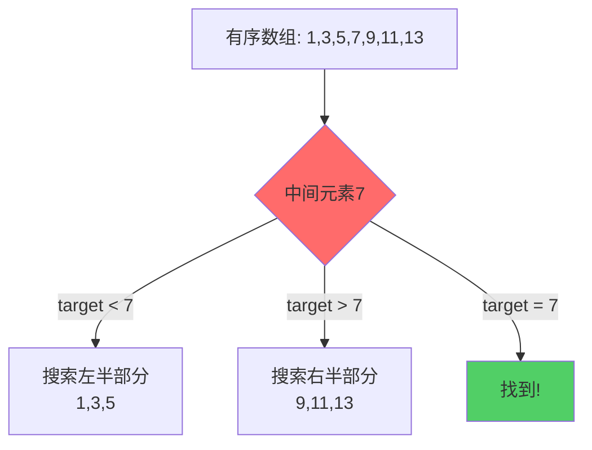
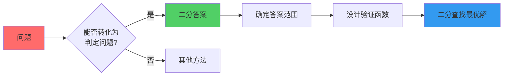
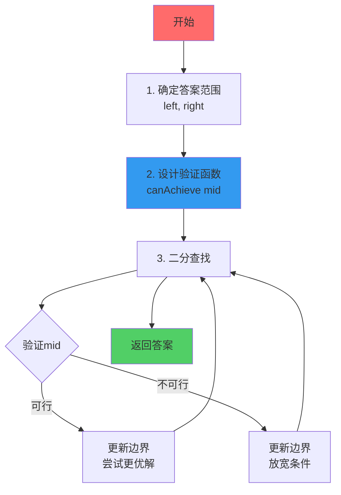
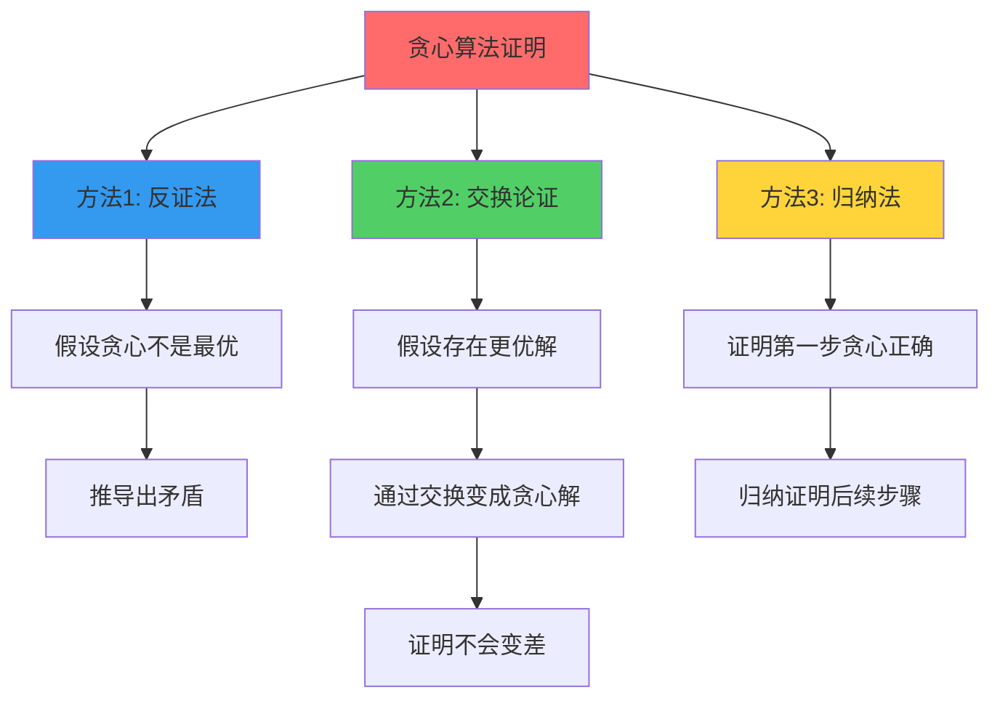
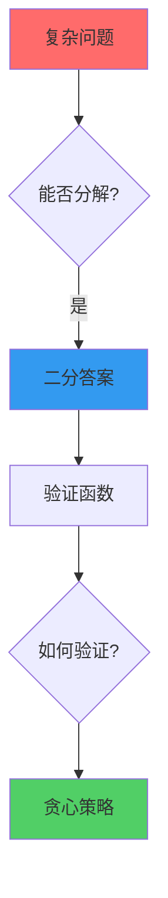
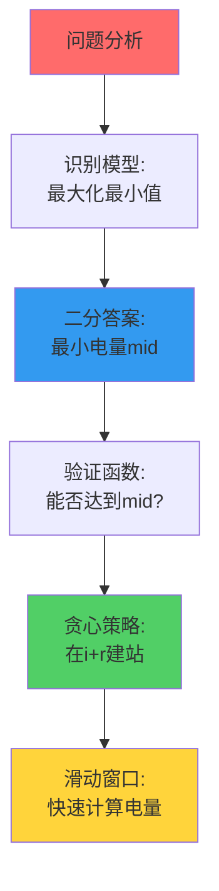
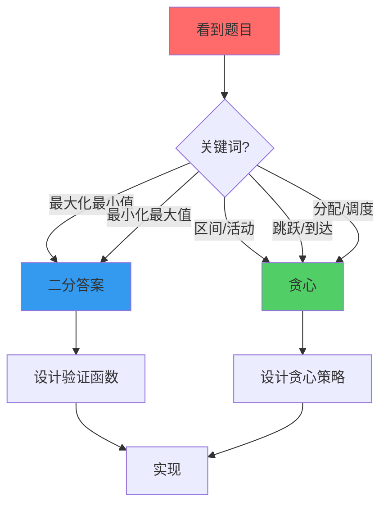

# 二分答案与贪心算法完全攻略

> 从零到精通，系统掌握二分答案和贪心算法
> 
> 适合准备腾讯、字节等顶尖公司面试的算法学习者

---

## 📚 目录

1. [二分查找基础](#二分查找基础)
2. [二分答案进阶](#二分答案进阶)
3. [贪心算法精讲](#贪心算法精讲)
4. [二分+贪心组合](#二分贪心组合)
5. [经典题目精选](#经典题目精选)
6. [面试高频题](#面试高频题)

---

## 二分查找基础

### 1. 什么是二分查找？

**核心思想**：在有序数组中，每次排除一半的搜索空间。



**时间复杂度**：O(log n)

### 2. 二分查找模板

#### 模板1：查找精确值

```java
/**
 * 在有序数组中查找target
 * @return target的索引，不存在返回-1
 */
public int binarySearch(int[] nums, int target) {
    int left = 0;
    int right = nums.length - 1;
    
    while (left <= right) {  // 注意：<=
        int mid = left + (right - left) / 2;  // 防止溢出
        
        if (nums[mid] == target) {
            return mid;  // 找到
        } else if (nums[mid] < target) {
            left = mid + 1;  // 搜索右半部分
        } else {
            right = mid - 1;  // 搜索左半部分
        }
    }
    
    return -1;  // 未找到
}
```

**关键点**：
- `left <= right`：搜索区间是 `[left, right]`
- `left = mid + 1`：排除 mid
- `right = mid - 1`：排除 mid

#### 模板2：查找左边界

```java
/**
 * 查找第一个 >= target 的位置
 */
public int lowerBound(int[] nums, int target) {
    int left = 0;
    int right = nums.length;  // 注意：不是 length - 1
    
    while (left < right) {  // 注意：<
        int mid = left + (right - left) / 2;
        
        if (nums[mid] < target) {
            left = mid + 1;
        } else {
            right = mid;  // 注意：不是 mid - 1
        }
    }
    
    return left;
}
```

**关键点**：
- `left < right`：搜索区间是 `[left, right)`
- `right = mid`：保留 mid，因为可能是答案

#### 模板3：查找右边界

```java
/**
 * 查找最后一个 <= target 的位置
 */
public int upperBound(int[] nums, int target) {
    int left = 0;
    int right = nums.length - 1;
    
    while (left < right) {
        int mid = left + (right - left + 1) / 2;  // 注意：+1
        
        if (nums[mid] <= target) {
            left = mid;  // 注意：不是 mid + 1
        } else {
            right = mid - 1;
        }
    }
    
    return left;
}
```

**关键点**：
- `mid = left + (right - left + 1) / 2`：向上取整，防止死循环
- `left = mid`：保留 mid

### 3. 三种模板对比

| 模板 | 循环条件 | mid计算 | 更新方式 | 适用场景 |
|------|---------|---------|---------|---------|
| **模板1** | `left <= right` | `(left + right) / 2` | `left = mid + 1`<br/>`right = mid - 1` | 查找精确值 |
| **模板2** | `left < right` | `(left + right) / 2` | `left = mid + 1`<br/>`right = mid` | 查找左边界 |
| **模板3** | `left < right` | `(left + right + 1) / 2` | `left = mid`<br/>`right = mid - 1` | 查找右边界 |

### 4. 经典例题

#### LeetCode 704. 二分查找

```java
public int search(int[] nums, int target) {
    int left = 0, right = nums.length - 1;
    
    while (left <= right) {
        int mid = left + (right - left) / 2;
        if (nums[mid] == target) return mid;
        else if (nums[mid] < target) left = mid + 1;
        else right = mid - 1;
    }
    
    return -1;
}
```

#### LeetCode 35. 搜索插入位置

```java
public int searchInsert(int[] nums, int target) {
    int left = 0, right = nums.length;
    
    while (left < right) {
        int mid = left + (right - left) / 2;
        if (nums[mid] < target) {
            left = mid + 1;
        } else {
            right = mid;
        }
    }
    
    return left;
}
```

---

## 二分答案进阶

### 1. 什么是二分答案？

**核心思想**：不是在数组中二分查找，而是在**答案的值域**上二分。



### 2. 二分答案的识别

**典型特征**：

1. **最大化最小值**
   - 例：最大化所有城市的最小电量
   - 例：最小化最大工作时间

2. **最小化最大值**
   - 例：最小化最大分割和
   - 例：最小化最大距离

3. **满足条件的最值**
   - 例：在限制条件下的最小速度
   - 例：在预算内的最大收益

**识别口诀**：
```
看到"最大化最小值"或"最小化最大值"
→ 想到二分答案
→ 设计验证函数
→ 二分查找
```

### 3. 二分答案的步骤



### 4. 二分答案模板

```java
/**
 * 二分答案通用模板
 */
public int binarySearchAnswer(/* 参数 */) {
    // 步骤1：确定答案的范围
    int left = /* 最小可能值 */;
    int right = /* 最大可能值 */;
    
    // 步骤2：二分查找
    while (left < right) {
        int mid = left + (right - left) / 2;  // 或 +1，取决于更新方式
        
        // 步骤3：验证mid是否可行
        if (canAchieve(mid)) {
            // 可行，尝试更优的答案
            // 最大化问题：left = mid
            // 最小化问题：right = mid
        } else {
            // 不可行，放宽条件
            // 最大化问题：right = mid - 1
            // 最小化问题：left = mid + 1
        }
    }
    
    return left;  // 或 right，两者相等
}

/**
 * 验证函数：判断答案mid是否可行
 */
private boolean canAchieve(int mid) {
    // 根据具体问题设计
    // 通常需要贪心策略
    return true;
}
```

### 5. 经典例题详解

#### LeetCode 875. 爱吃香蕉的珂珂 ⭐⭐⭐

**问题**：
```
有n堆香蕉，第i堆有piles[i]根
珂珂每小时吃k根，h小时内要吃完
求最小的k
```

**分析**：
```
1. 这是"最小化k"问题
2. k的范围：[1, max(piles)]
3. 单调性：如果k可以吃完，k+1也可以
4. 验证函数：计算以速度k需要多少小时
```

**代码**：

```java
public int minEatingSpeed(int[] piles, int h) {
    // 步骤1：确定k的范围
    int left = 1;
    int right = 0;
    for (int pile : piles) {
        right = Math.max(right, pile);
    }
    
    // 步骤2：二分查找最小的k
    while (left < right) {
        int mid = left + (right - left) / 2;
        
        if (canFinish(piles, mid, h)) {
            right = mid;  // 可以吃完，尝试更小的k
        } else {
            left = mid + 1;  // 吃不完，需要更大的k
        }
    }
    
    return left;
}

/**
 * 验证：以速度k能否在h小时内吃完
 */
private boolean canFinish(int[] piles, int k, int h) {
    long hours = 0;
    for (int pile : piles) {
        hours += (pile + k - 1) / k;  // 向上取整
    }
    return hours <= h;
}
```

**时间复杂度**：O(n * log(max))

#### LeetCode 1011. 在D天内送达包裹的能力

**问题**：
```
有n个包裹，第i个包裹重weights[i]
船的载重量为capacity，每天只能运一次
求最小的capacity，使得能在days天内运完
```

**分析**：
```
1. 这是"最小化capacity"问题
2. capacity范围：[max(weights), sum(weights)]
3. 单调性：如果capacity可以运完，capacity+1也可以
4. 验证函数：计算以capacity需要多少天
```

**代码**：

```java
public int shipWithinDays(int[] weights, int days) {
    int left = 0, right = 0;
    
    for (int w : weights) {
        left = Math.max(left, w);  // 至少要能装最重的包裹
        right += w;  // 最多一次全装
    }
    
    while (left < right) {
        int mid = left + (right - left) / 2;
        
        if (canShip(weights, mid, days)) {
            right = mid;  // 可以运完，尝试更小的capacity
        } else {
            left = mid + 1;  // 运不完，需要更大的capacity
        }
    }
    
    return left;
}

/**
 * 验证：以载重capacity能否在days天内运完
 */
private boolean canShip(int[] weights, int capacity, int days) {
    int needDays = 1;
    int currentWeight = 0;
    
    for (int w : weights) {
        if (currentWeight + w > capacity) {
            needDays++;
            currentWeight = w;
        } else {
            currentWeight += w;
        }
    }
    
    return needDays <= days;
}
```

#### LeetCode 410. 分割数组的最大值 ⭐⭐⭐

**问题**：
```
将数组分成k个非空连续子数组
使得这k个子数组各自和的最大值最小
```

**分析**：
```
1. 这是"最小化最大值"问题
2. 答案范围：[max(nums), sum(nums)]
3. 单调性：如果最大值可以是x，那么也可以是x+1
4. 验证函数：判断能否分成k个子数组，每个和<=mid
```

**代码**：

```java
public int splitArray(int[] nums, int k) {
    int left = 0, right = 0;
    
    for (int num : nums) {
        left = Math.max(left, num);
        right += num;
    }
    
    while (left < right) {
        int mid = left + (right - left) / 2;
        
        if (canSplit(nums, k, mid)) {
            right = mid;  // 可以分割，尝试更小的最大值
        } else {
            left = mid + 1;  // 不能分割，需要更大的最大值
        }
    }
    
    return left;
}

/**
 * 验证：能否分成k个子数组，每个和<=maxSum
 */
private boolean canSplit(int[] nums, int k, int maxSum) {
    int count = 1;  // 至少需要1个子数组
    int currentSum = 0;
    
    for (int num : nums) {
        if (currentSum + num > maxSum) {
            count++;
            currentSum = num;
        } else {
            currentSum += num;
        }
    }
    
    return count <= k;
}
```

---

## 贪心算法精讲

### 1. 什么是贪心算法？

**核心思想**：每一步都做出当前看起来最好的选择，期望最终得到全局最优解。


**与动态规划的区别**：

| 维度 | 贪心算法 | 动态规划 |
|------|---------|---------|
| **决策** | 局部最优 | 全局最优 |
| **回溯** | 不回溯 | 可能回溯 |
| **子问题** | 不重叠 | 重叠 |
| **适用** | 有贪心选择性质 | 有最优子结构 |

### 2. 贪心算法的证明

**两个关键性质**：

1. **贪心选择性质**
   - 通过局部最优选择，能达到全局最优
   - 需要证明：贪心选择不会错过最优解

2. **最优子结构**
   - 问题的最优解包含子问题的最优解
   - 需要证明：子问题独立

**证明方法**：



### 3. 贪心算法的设计步骤

```java
/**
 * 贪心算法设计步骤
 */
public int greedyAlgorithm(/* 参数 */) {
    // 步骤1：排序或预处理
    // 通常需要按某种规则排序
    
    // 步骤2：初始化
    int result = 0;
    
    // 步骤3：贪心选择
    for (/* 遍历所有选择 */) {
        if (/* 满足贪心条件 */) {
            // 做出贪心选择
            result += /* 当前收益 */;
        }
    }
    
    // 步骤4：返回结果
    return result;
}
```

### 4. 经典贪心问题

#### 问题1：区间调度（活动选择）

**问题**：
```
有n个活动，每个活动有开始时间和结束时间
选择最多的不重叠活动
```

**贪心策略**：按结束时间排序，每次选择最早结束的活动

```java
public int maxActivities(int[][] activities) {
    // 按结束时间排序
    Arrays.sort(activities, (a, b) -> a[1] - b[1]);
    
    int count = 0;
    int lastEnd = 0;
    
    for (int[] activity : activities) {
        if (activity[0] >= lastEnd) {
            count++;
            lastEnd = activity[1];
        }
    }
    
    return count;
}
```

**为什么贪心正确？**
```
证明（交换论证）：
假设最优解不选择最早结束的活动A，而选择了活动B
那么将B替换为A，不会影响后续选择
因为A结束得更早，留给后续的时间更多
所以贪心解不会比最优解差
```

#### 问题2：跳跃游戏

**LeetCode 55. 跳跃游戏**

```java
/**
 * 判断能否跳到最后一个位置
 */
public boolean canJump(int[] nums) {
    int maxReach = 0;  // 能到达的最远位置
    
    for (int i = 0; i < nums.length; i++) {
        if (i > maxReach) {
            return false;  // 当前位置无法到达
        }
        maxReach = Math.max(maxReach, i + nums[i]);
    }
    
    return true;
}
```

**LeetCode 45. 跳跃游戏 II**

```java
/**
 * 跳到最后一个位置的最少跳跃次数
 */
public int jump(int[] nums) {
    int jumps = 0;
    int currentEnd = 0;
    int farthest = 0;
    
    for (int i = 0; i < nums.length - 1; i++) {
        farthest = Math.max(farthest, i + nums[i]);
        
        if (i == currentEnd) {
            jumps++;
            currentEnd = farthest;
        }
    }
    
    return jumps;
}
```

#### 问题3：分发饼干

**LeetCode 455. 分发饼干**

```java
/**
 * 每个孩子有胃口值g[i]，每个饼干有尺寸s[j]
 * 只有s[j] >= g[i]时，饼干j才能满足孩子i
 * 求最多能满足多少孩子
 */
public int findContentChildren(int[] g, int[] s) {
    Arrays.sort(g);  // 按胃口排序
    Arrays.sort(s);  // 按尺寸排序
    
    int child = 0, cookie = 0;
    
    while (child < g.length && cookie < s.length) {
        if (s[cookie] >= g[child]) {
            child++;  // 满足了一个孩子
        }
        cookie++;  // 尝试下一个饼干
    }
    
    return child;
}
```

**贪心策略**：用最小的饼干满足胃口最小的孩子

#### 问题4：加油站

**LeetCode 134. 加油站**

```java
/**
 * 环形路线有n个加油站
 * gas[i]表示第i站的油量，cost[i]表示从i到i+1的耗油
 * 判断能否绕一圈，如果能，返回起点
 */
public int canCompleteCircuit(int[] gas, int[] cost) {
    int totalGas = 0, totalCost = 0;
    int currentGas = 0, start = 0;
    
    for (int i = 0; i < gas.length; i++) {
        totalGas += gas[i];
        totalCost += cost[i];
        currentGas += gas[i] - cost[i];
        
        if (currentGas < 0) {
            // 从start到i都不能作为起点
            start = i + 1;
            currentGas = 0;
        }
    }
    
    return totalGas >= totalCost ? start : -1;
}
```

**贪心策略**：如果从A到B油量不够，那么A到B之间的任何点都不能作为起点

---

## 二分+贪心组合

### 1. 为什么要组合？



**典型场景**：
- 二分确定答案的值
- 贪心验证答案是否可行

### 2. 组合模板

```java
/**
 * 二分答案 + 贪心验证 模板
 */
public int binarySearchWithGreedy(/* 参数 */) {
    // 步骤1：确定答案范围
    int left = /* 最小值 */;
    int right = /* 最大值 */;
    
    // 步骤2：二分查找
    while (left < right) {
        int mid = left + (right - left) / 2;
        
        // 步骤3：贪心验证
        if (canAchieveByGreedy(mid)) {
            // 可行，尝试更优解
            left = mid;  // 或 right = mid
        } else {
            // 不可行，放宽条件
            right = mid - 1;  // 或 left = mid + 1
        }
    }
    
    return left;
}

/**
 * 贪心验证函数
 */
private boolean canAchieveByGreedy(int target) {
    // 使用贪心策略验证target是否可行
    // 通常需要：
    // 1. 从左到右遍历
    // 2. 每次做出贪心选择
    // 3. 统计是否满足条件
    return true;
}
```

### 3. 经典组合题

#### LeetCode 2528. 最大化城市的最小电量 ⭐⭐⭐

**问题回顾**：
```
stations[i]表示城市i的供电站数量
供电范围r，可以建k座新供电站
求最小电量的最大值
```

**解题思路**：



**完整代码**：

```java
public long maxPower(int[] stations, int r, int k) {
    int n = stations.length;
    
    // 步骤1：计算初始电量（滑动窗口）
    long[] power = new long[n];
    
    // 初始化第一个城市的电量
    for (int i = 0; i <= Math.min(n - 1, r); i++) {
        power[0] += stations[i];
    }
    
    // 滑动窗口计算其他城市
    for (int i = 1; i < n; i++) {
        power[i] = power[i - 1];
        if (i + r < n) power[i] += stations[i + r];
        if (i - r - 1 >= 0) power[i] -= stations[i - r - 1];
    }
    
    // 步骤2：二分答案
    long left = 0, right = 0;
    for (long p : power) right += p;
    right += k;
    
    while (left < right) {
        long mid = left + (right - left + 1) / 2;
        
        if (canAchieve(stations, power, r, k, mid)) {
            left = mid;  // 可以达到，尝试更大的
        } else {
            right = mid - 1;  // 不能达到，尝试更小的
        }
    }
    
    return left;
}

/**
 * 步骤3：贪心验证
 */
private boolean canAchieve(int[] stations, long[] power, int r, int k, long minPower) {
    int n = stations.length;
    long[] add = new long[n];  // 额外建造的供电站
    long used = 0;
    long currentPower = power[0];
    
    for (int i = 0; i < n; i++) {
        // 更新当前城市的电量
        if (i > 0) {
            if (i + r < n) currentPower += stations[i + r] + add[i + r];
            if (i - r - 1 >= 0) currentPower -= stations[i - r - 1] + add[i - r - 1];
        }
        
        // 如果电量不足，贪心建站
        if (currentPower < minPower) {
            long need = minPower - currentPower;
            used += need;
            
            if (used > k) return false;
            
            // 贪心：在最右边建站
            int pos = Math.min(n - 1, i + r);
            add[pos] += need;
            currentPower += need;
        }
    }
    
    return true;
}
```

**关键点**：

1. **二分答案**：最小电量的范围是 `[0, sum(power) + k]`
2. **贪心策略**：在 `i+r` 位置建站，覆盖更多未来的城市
3. **滑动窗口**：快速计算每个城市的电量，O(1)更新

---

## 经典题目精选

### 1. 二分答案专题

#### 入门题

| 题目 | 难度 | 核心思路 |
|------|------|---------|
| LeetCode 69. x的平方根 | 简单 | 二分查找平方根 |
| LeetCode 367. 有效的完全平方数 | 简单 | 二分判断 |
| LeetCode 374. 猜数字大小 | 简单 | 标准二分 |

#### 进阶题

| 题目 | 难度 | 核心思路 |
|------|------|---------|
| LeetCode 875. 爱吃香蕉的珂珂 ⭐ | 中等 | 二分速度+验证时间 |
| LeetCode 1011. 在D天内送达包裹的能力 | 中等 | 二分载重+验证天数 |
| LeetCode 410. 分割数组的最大值 ⭐ | 困难 | 二分最大值+验证分割 |
| LeetCode 1482. 制作m束花所需的最少天数 | 中等 | 二分天数+贪心验证 |
| LeetCode 1552. 两球之间的磁力 | 中等 | 二分距离+贪心放置 |

#### 困难题

| 题目 | 难度 | 核心思路 |
|------|------|---------|
| LeetCode 2528. 最大化城市的最小电量 ⭐⭐⭐ | 困难 | 二分+贪心+滑动窗口 |
| LeetCode 1231. 分享巧克力 | 困难 | 二分甜度+贪心分割 |
| LeetCode 1889. 装包裹的最小浪费空间 | 困难 | 二分+前缀和 |

### 2. 贪心算法专题

#### 区间问题

| 题目 | 难度 | 核心思路 |
|------|------|---------|
| LeetCode 435. 无重叠区间 | 中等 | 按结束时间排序 |
| LeetCode 452. 用最少数量的箭引爆气球 | 中等 | 区间调度 |
| LeetCode 56. 合并区间 | 中等 | 排序+合并 |

#### 跳跃问题

| 题目 | 难度 | 核心思路 |
|------|------|---------|
| LeetCode 55. 跳跃游戏 | 中等 | 维护最远位置 |
| LeetCode 45. 跳跃游戏 II ⭐ | 中等 | 贪心跳跃 |
| LeetCode 1306. 跳跃游戏 III | 中等 | BFS/DFS |

#### 其他经典题

| 题目 | 难度 | 核心思路 |
|------|------|---------|
| LeetCode 455. 分发饼干 | 简单 | 排序+双指针 |
| LeetCode 134. 加油站 ⭐ | 中等 | 贪心起点 |
| LeetCode 135. 分发糖果 | 困难 | 两次遍历 |
| LeetCode 406. 根据身高重建队列 | 中等 | 排序+插入 |

---

## 面试高频题

### 1. 腾讯高频

#### T1: LeetCode 875. 爱吃香蕉的珂珂

**面试要点**：
- 能否快速识别出二分答案模型
- 验证函数的实现
- 时间复杂度分析

**参考答案**：见上文

#### T2: LeetCode 45. 跳跃游戏 II

**面试要点**：
- 贪心策略的正确性
- 边界条件处理
- 能否优化到O(n)

**参考答案**：

```java
public int jump(int[] nums) {
    int jumps = 0;
    int currentEnd = 0;
    int farthest = 0;
    
    for (int i = 0; i < nums.length - 1; i++) {
        farthest = Math.max(farthest, i + nums[i]);
        
        if (i == currentEnd) {
            jumps++;
            currentEnd = farthest;
            
            if (currentEnd >= nums.length - 1) {
                break;
            }
        }
    }
    
    return jumps;
}
```

### 2. 字节高频

#### B1: LeetCode 410. 分割数组的最大值

**面试要点**：
- 识别"最小化最大值"模型
- 二分边界的确定
- 验证函数的贪心策略

**参考答案**：见上文

#### B2: LeetCode 134. 加油站

**面试要点**：
- 贪心策略的证明
- 为什么从start到i都不能作为起点
- 时间复杂度O(n)的实现

**参考答案**：见上文

### 3. 面试技巧

#### 识别模型



#### 沟通要点

1. **分析阶段**
   ```
   "这道题是求最大化最小值，我想到可以用二分答案"
   "答案的范围是[min, max]，具有单调性"
   "我需要设计一个验证函数来判断mid是否可行"
   ```

2. **实现阶段**
   ```
   "验证函数使用贪心策略，从左到右遍历"
   "时间复杂度是O(n * log(max - min))"
   "空间复杂度是O(1)或O(n)，取决于是否需要额外数组"
   ```

3. **优化阶段**
   ```
   "可以用滑动窗口优化验证函数"
   "可以用差分数组减少重复计算"
   "边界条件需要特别注意..."
   ```

---

## 总结与建议

### 学习路线


### 每周计划

**第1周：二分查找基础**
- Day 1-2: LeetCode 704, 35, 69
- Day 3-4: LeetCode 34, 278, 367
- Day 5-7: 总结模板，做10道练习题

**第2周：二分答案入门**
- Day 1-2: LeetCode 875（爱吃香蕉）
- Day 3-4: LeetCode 1011（送包裹）
- Day 5-7: LeetCode 410, 1482

**第3周：贪心算法基础**
- Day 1-2: LeetCode 455, 435
- Day 3-4: LeetCode 55, 45
- Day 5-7: LeetCode 134, 406

**第4周：二分+贪心组合**
- Day 1-3: LeetCode 1552（磁力）
- Day 4-7: LeetCode 2528（城市电量）

**第5周：困难题挑战**
- 每天1道困难题
- 总结面试技巧

### 刷题建议

1. **先理解，再实现**
   - 不要急于写代码
   - 先分析问题，识别模型
   - 设计算法，证明正确性

2. **注重模板**
   - 背诵核心模板
   - 理解每个细节
   - 能默写出来

3. **总结规律**
   - 每做完一题，总结
   - 相似题目归类
   - 建立知识体系

4. **模拟面试**
   - 限时做题
   - 大声说出思路
   - 练习沟通表达

### 面试准备

**简历准备**：
```
算法能力：
- 熟练掌握二分查找、二分答案算法
- 熟练掌握贪心算法及其证明方法
- 独立解决LeetCode困难题XX道
```

**面试话术**：
```
"这道题我见过类似的，是一个典型的最大化最小值问题"
"我的思路是用二分答案，时间复杂度是O(n log m)"
"验证函数使用贪心策略，我可以证明其正确性..."
```

---

## 附录：速查表

### 二分查找模板速查

```java
// 模板1：查找精确值
while (left <= right) {
    int mid = left + (right - left) / 2;
    if (nums[mid] == target) return mid;
    else if (nums[mid] < target) left = mid + 1;
    else right = mid - 1;
}

// 模板2：查找左边界
while (left < right) {
    int mid = left + (right - left) / 2;
    if (nums[mid] < target) left = mid + 1;
    else right = mid;
}

// 模板3：查找右边界
while (left < right) {
    int mid = left + (right - left + 1) / 2;
    if (nums[mid] <= target) left = mid;
    else right = mid - 1;
}
```

### 二分答案模板速查

```java
// 最小化问题
while (left < right) {
    int mid = left + (right - left) / 2;
    if (canAchieve(mid)) right = mid;
    else left = mid + 1;
}

// 最大化问题
while (left < right) {
    int mid = left + (right - left + 1) / 2;
    if (canAchieve(mid)) left = mid;
    else right = mid - 1;
}
```

### 常见贪心策略

| 问题类型 | 贪心策略 |
|---------|---------|
| 区间调度 | 按结束时间排序，选最早结束的 |
| 跳跃游戏 | 维护最远可达位置 |
| 分配问题 | 排序后双指针 |
| 加油站 | 找第一个可行起点 |
| 建站问题 | 尽可能靠右建（覆盖更多未来） |

---

**加油！北邮人的骄傲！💪**

相信您一定能攻克这些难题，拿到心仪的offer！


