# 动态规划完全入门指南

> **写在前面**：动态规划（Dynamic Programming，简称DP）是算法中的"王者"，也是面试中的"常客"。但不要被它的名字吓到！本文将用最通俗易懂的方式，带你从零开始掌握动态规划。

---

## 📚 目录

1. [什么是动态规划](#什么是动态规划)
2. [动态规划的核心思想](#动态规划的核心思想)
3. [动态规划的解题步骤](#动态规划的解题步骤)
4. [经典例子：爬楼梯](#经典例子爬楼梯)
5. [动态规划 vs 递归 vs 贪心](#动态规划-vs-递归-vs-贪心)
6. [动态规划的分类](#动态规划的分类)
7. [状态转移方程的推导技巧](#状态转移方程的推导技巧)
8. [空间优化技巧](#空间优化技巧)
9. [常见DP问题模板](#常见dp问题模板)
10. [学习建议](#学习建议)

---

## 什么是动态规划

### 通俗理解

**动态规划就是"记住过去，避免重复"。**

想象你在爬楼梯：
- **笨办法**：每次都从第1级开始数，"1、2、3、4..."
- **聪明办法**：记住"到第5级有多少种走法"，下次直接用这个结果

动态规划就是这个"聪明办法"！

### 正式定义

动态规划是一种**将复杂问题分解为更小的子问题**，并**存储子问题的解**以避免重复计算的算法思想。

### 核心要素

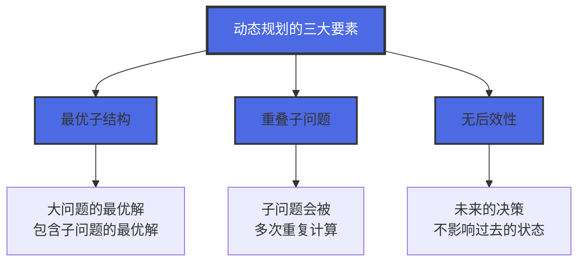

---

## 动态规划的核心思想

### 1. 最优子结构

**定义**：大问题的最优解可以由子问题的最优解推导出来。

**举例**：

- 问题：从北京到上海的最短路径
- 子问题：从北京到南京的最短路径 + 从南京到上海的最短路径
- 如果北京→南京不是最短路径，那么整体路径也不可能是最短的

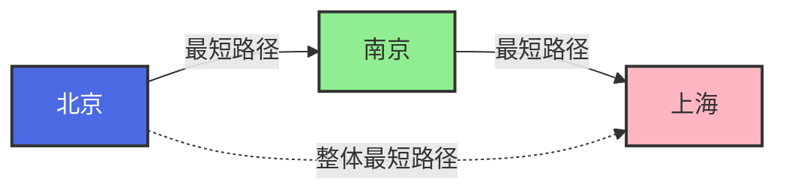

### 2. 重叠子问题

**定义**：在求解过程中，同一个子问题会被多次计算。

**举例：斐波那契数列**

计算 `fib(5)` 时，`fib(3)` 会被计算多次：

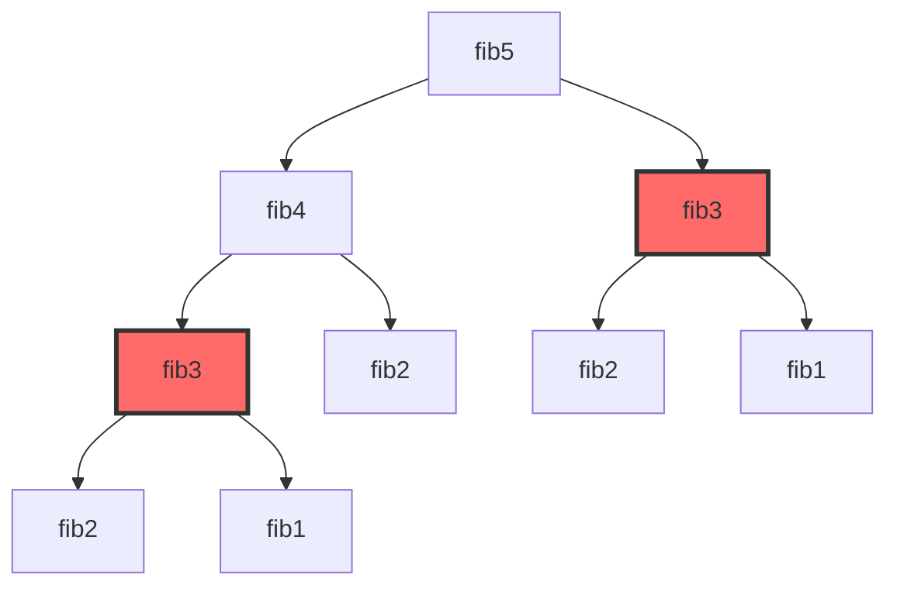

**问题**：`fib(3)` 被计算了 **2次**！如果是 `fib(100)`，重复计算会达到天文数字！

**解决**：用一个数组记住 `fib(3)` 的结果，下次直接用！

### 3. 无后效性

**定义**：当前状态只与之前的状态有关，与之后的状态无关。

**举例**：
- ✅ **有无后效性**：今天的天气只与昨天的天气有关
- ❌ **无无后效性**：今天的股票价格与未来的政策有关

---

## 动态规划的解题步骤

### 五步法

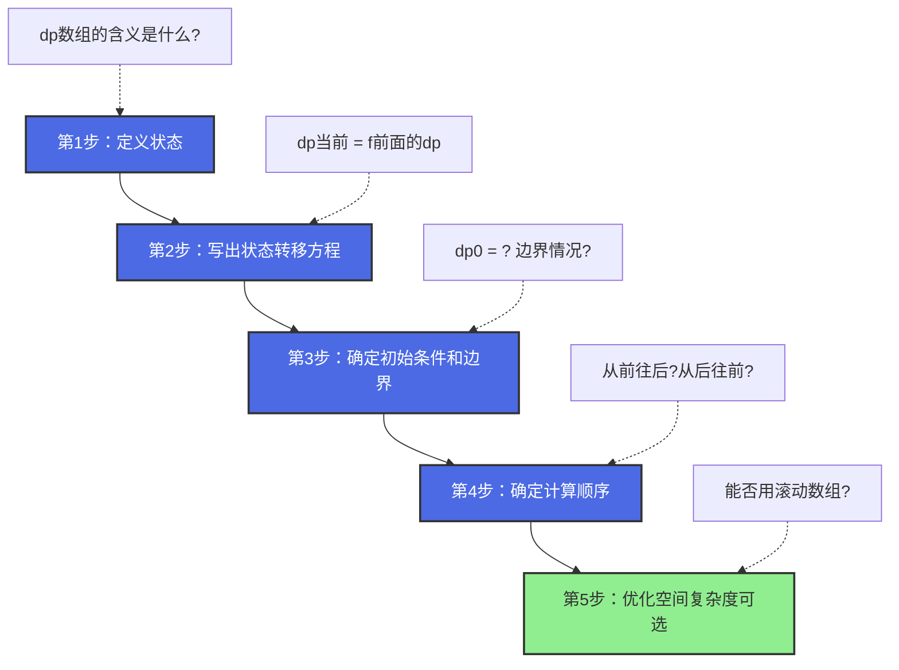

### 详细说明

#### 第1步：定义状态

**状态就是dp数组的含义。**

**示例**：
- `dp[i]`：到达第 `i` 个位置的最优解
- `dp[i][j]`：前 `i` 个物品，背包容量为 `j` 时的最优解

**技巧**：
- 状态定义要**清晰明确**
- 状态要能**覆盖所有子问题**
- 状态之间要有**递推关系**

#### 第2步：写出状态转移方程

**状态转移方程就是递推公式。**

**示例**：

- 爬楼梯：`dp[i] = dp[i-1] + dp[i-2]`
- 打家劫舍：`dp[i] = max(dp[i-1], dp[i-2] + nums[i])`

**技巧**：
- 思考"当前状态"与"之前状态"的关系
- 画图辅助理解
- 从简单情况推导

#### 第3步：确定初始条件和边界

**初始条件就是dp数组的起点。**

**示例**：
- 爬楼梯：`dp[0] = 1, dp[1] = 1`
- 斐波那契：`dp[0] = 0, dp[1] = 1`

**技巧**：
- 初始条件要**正确**
- 边界情况要**考虑周全**
- 数组大小要**合适**

#### 第4步：确定计算顺序

**计算顺序决定了循环的方向。**

**示例**：
- 一维DP：通常从前往后
- 背包问题：01背包从后往前，完全背包从前往后

**技巧**：
- 确保计算当前状态时，依赖的状态已经计算过
- 画图辅助理解依赖关系

#### 第5步：优化空间复杂度（可选）

**用滚动数组减少空间占用。**

**示例**：
- 原始：`dp[i] = dp[i-1] + dp[i-2]` → 需要 O(n) 空间
- 优化：只用两个变量 `prev1, prev2` → 只需 O(1) 空间

---

## 经典例子：爬楼梯

### 问题描述

假设你正在爬楼梯。需要 `n` 阶你才能到达楼顶。

每次你可以爬 `1` 或 `2` 个台阶。你有多少种不同的方法可以爬到楼顶呢？

**示例**：
```
输入：n = 3
输出：3
解释：有三种方法可以爬到楼顶。
1. 1阶 + 1阶 + 1阶
2. 1阶 + 2阶
3. 2阶 + 1阶
```

### 解题过程

#### 第1步：定义状态

`dp[i]`：爬到第 `i` 阶楼梯的方法数

#### 第2步：状态转移方程

**思考**：要到达第 `i` 阶，可以从哪里来？
- 从第 `i-1` 阶爬 1 步
- 从第 `i-2` 阶爬 2 步

**结论**：`dp[i] = dp[i-1] + dp[i-2]`

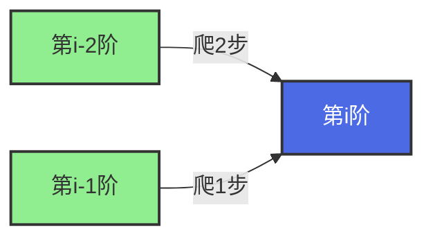

#### 第3步：初始条件

- `dp[0] = 1`（0阶有1种方法：不爬）
- `dp[1] = 1`（1阶有1种方法：爬1步）

#### 第4步：计算顺序

从前往后：`dp[2], dp[3], ..., dp[n]`

#### 第5步：代码实现

```java
public int climbStairs(int n) {
    if (n <= 1) return 1;
    
    // 定义dp数组
    int[] dp = new int[n + 1];
    
    // 初始条件
    dp[0] = 1;
    dp[1] = 1;
    
    // 状态转移
    for (int i = 2; i <= n; i++) {
        dp[i] = dp[i-1] + dp[i-2];
    }
    
    return dp[n];
}
```

### 可视化过程

以 `n = 5` 为例：

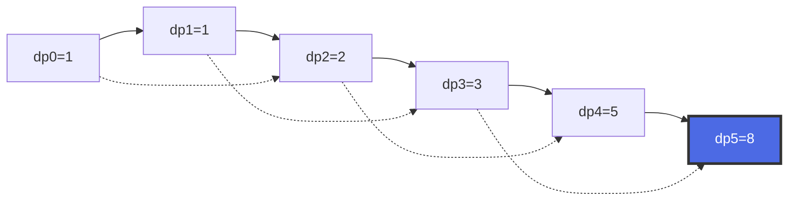

### 空间优化

**观察**：计算 `dp[i]` 只需要 `dp[i-1]` 和 `dp[i-2]`，不需要保存所有历史数据！

**优化后代码**：

```java
public int climbStairs(int n) {
    if (n <= 1) return 1;
    
    int prev2 = 1;  // dp[i-2]
    int prev1 = 1;  // dp[i-1]
    
    for (int i = 2; i <= n; i++) {
        int curr = prev1 + prev2;
        prev2 = prev1;
        prev1 = curr;
    }
    
    return prev1;
}
```

**空间复杂度**：O(n) → O(1) ✅

---

## 动态规划 vs 递归 vs 贪心

### 对比表格

| 特性 | 递归 | 动态规划 | 贪心 |
|------|------|----------|------|
| **思想** | 自顶向下，分解问题 | 自底向上，存储结果 | 每步选最优 |
| **重复计算** | ❌ 有大量重复 | ✅ 避免重复 | ✅ 无重复 |
| **时间复杂度** | 通常指数级 | 通常多项式级 | 通常线性 |
| **空间复杂度** | O(递归深度) | O(状态数) | O(1) |
| **适用场景** | 问题规模小 | 有重叠子问题 | 局部最优=全局最优 |
| **代码难度** | 简单直观 | 中等 | 简单 |

### 递归 → 记忆化递归 → 动态规划

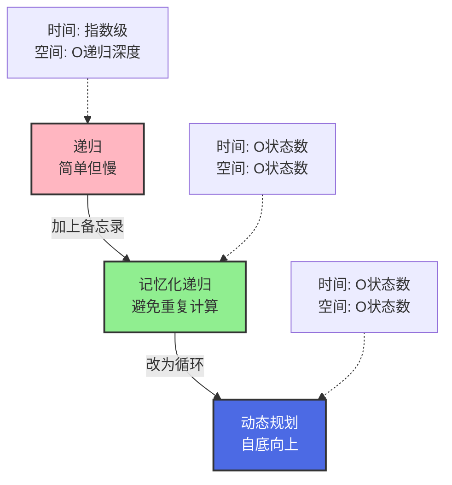

### 示例：斐波那契数列

#### 方法1：递归（最慢）

```java
public int fib(int n) {
    if (n <= 1) return n;
    return fib(n-1) + fib(n-2);
}
// 时间复杂度：O(2^n) - 指数级！
```

#### 方法2：记忆化递归（中等）

```java
public int fib(int n) {
    int[] memo = new int[n + 1];
    return fibHelper(n, memo);
}

private int fibHelper(int n, int[] memo) {
    if (n <= 1) return n;
    if (memo[n] != 0) return memo[n];  // 已经计算过
    memo[n] = fibHelper(n-1, memo) + fibHelper(n-2, memo);
    return memo[n];
}
// 时间复杂度：O(n)
```

#### 方法3：动态规划（推荐）

```java
public int fib(int n) {
    if (n <= 1) return n;
    int[] dp = new int[n + 1];
    dp[0] = 0;
    dp[1] = 1;
    for (int i = 2; i <= n; i++) {
        dp[i] = dp[i-1] + dp[i-2];
    }
    return dp[n];
}
// 时间复杂度：O(n)
```

#### 方法4：空间优化DP（最优）

```java
public int fib(int n) {
    if (n <= 1) return n;
    int prev2 = 0, prev1 = 1;
    for (int i = 2; i <= n; i++) {
        int curr = prev1 + prev2;
        prev2 = prev1;
        prev1 = curr;
    }
    return prev1;
}
// 时间复杂度：O(n)，空间复杂度：O(1)
```

---

## 动态规划的分类

### 按问题类型分类

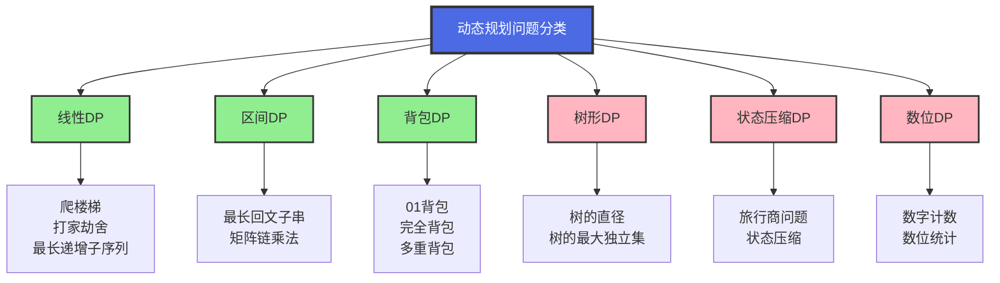

### 1. 线性DP（最常见）

**特点**：状态呈线性排列，通常是一维或二维数组。

**经典问题**：
- 爬楼梯（LeetCode 70）
- 打家劫舍（LeetCode 198）
- 最长递增子序列（LeetCode 300）
- 最长公共子序列（LeetCode 1143）

**状态转移**：`dp[i]` 通常由 `dp[i-1]`, `dp[i-2]` 等推导

### 2. 背包DP（面试高频）

**特点**：有容量限制，需要选择物品。

**分类**：

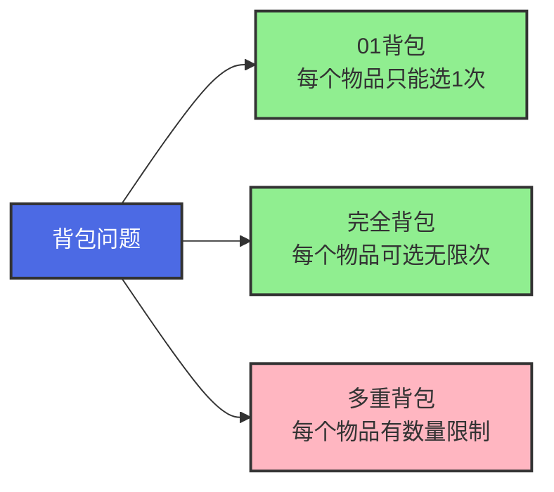

**经典问题**：
- 分割等和子集（LeetCode 416）- 01背包
- 零钱兑换（LeetCode 322）- 完全背包
- 零钱兑换 II（LeetCode 518）- 完全背包

### 3. 区间DP

**特点**：在一个区间内进行决策。

**状态定义**：`dp[i][j]` 表示区间 `[i, j]` 的最优解

**经典问题**：
- 最长回文子串（LeetCode 5）
- 戳气球（LeetCode 312）

### 4. 树形DP

**特点**：在树结构上进行DP。

**经典问题**：
- 打家劫舍 III（LeetCode 337）
- 二叉树的直径（LeetCode 543）

---

## 状态转移方程的推导技巧

### 技巧1：从小规模开始

**步骤**：
1. 先解决 `n=1, n=2, n=3` 的情况
2. 找出规律
3. 推广到一般情况

**示例：爬楼梯**
- `n=1`：1种方法
- `n=2`：2种方法（1+1 或 2）
- `n=3`：3种方法（1+1+1, 1+2, 2+1）
- 规律：`dp[3] = dp[2] + dp[1]`

### 技巧2：画图辅助

**示例：打家劫舍**

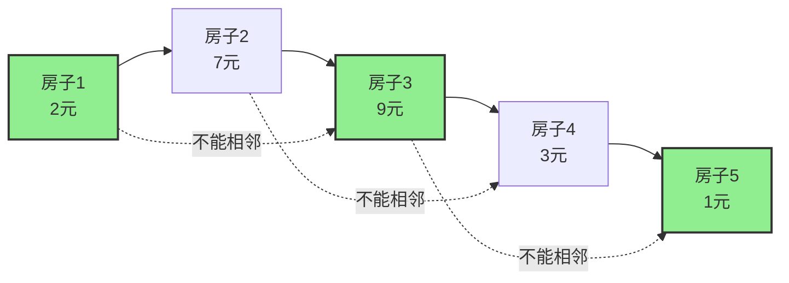

**思考**：到第 `i` 个房子，有两种选择：
1. 偷第 `i` 个：`dp[i-2] + nums[i]`
2. 不偷第 `i` 个：`dp[i-1]`

**结论**：`dp[i] = max(dp[i-1], dp[i-2] + nums[i])`

### 技巧3：列举所有可能的决策

**步骤**：
1. 列出当前状态的所有可能决策
2. 对每个决策，找出对应的子问题
3. 取所有决策中的最优解

**示例：零钱兑换**
- 目标金额：11
- 硬币：[1, 2, 5]
- 决策：选择哪个硬币？
  - 选1：`dp[11] = dp[10] + 1`
  - 选2：`dp[11] = dp[9] + 1`
  - 选5：`dp[11] = dp[6] + 1`
- 结论：`dp[11] = min(dp[10], dp[9], dp[6]) + 1`

---

## 空间优化技巧

### 滚动数组

**原理**：如果 `dp[i]` 只依赖于 `dp[i-1]` 和 `dp[i-2]`，就不需要保存所有历史数据。

**示例：爬楼梯**

```java
// 优化前：O(n) 空间
int[] dp = new int[n + 1];
for (int i = 2; i <= n; i++) {
    dp[i] = dp[i-1] + dp[i-2];
}

// 优化后：O(1) 空间
int prev2 = 1, prev1 = 1;
for (int i = 2; i <= n; i++) {
    int curr = prev1 + prev2;
    prev2 = prev1;
    prev1 = curr;
}
```

### 二维DP的空间优化

**原理**：如果 `dp[i][j]` 只依赖于 `dp[i-1][...]`，可以用一维数组滚动更新。

**示例：01背包**

```java
// 优化前：O(n*m) 空间
int[][] dp = new int[n+1][capacity+1];
for (int i = 1; i <= n; i++) {
    for (int j = 0; j <= capacity; j++) {
        dp[i][j] = dp[i-1][j];
        if (j >= weight[i]) {
            dp[i][j] = max(dp[i][j], dp[i-1][j-weight[i]] + value[i]);
        }
    }
}

// 优化后：O(m) 空间
int[] dp = new int[capacity+1];
for (int i = 1; i <= n; i++) {
    for (int j = capacity; j >= weight[i]; j--) {  // 注意：倒序！
        dp[j] = max(dp[j], dp[j-weight[i]] + value[i]);
    }
}
```

**关键**：倒序遍历，避免覆盖还未使用的数据！

---

## 常见DP问题模板

### 模板1：一维线性DP

```java
/**
 * 问题：求解到第 n 个位置的最优解
 * 状态：dp[i] 表示到第 i 个位置的最优解
 * 转移：dp[i] = f(dp[i-1], dp[i-2], ...)
 */
public int linearDP(int n, int[] nums) {
    // 1. 定义dp数组
    int[] dp = new int[n + 1];
    
    // 2. 初始化
    dp[0] = ...;
    dp[1] = ...;
    
    // 3. 状态转移
    for (int i = 2; i <= n; i++) {
        dp[i] = Math.max(dp[i-1], dp[i-2] + nums[i]);  // 根据具体问题修改
    }
    
    // 4. 返回结果
    return dp[n];
}
```

### 模板2：01背包

```java
/**
 * 问题：n个物品，背包容量capacity，求最大价值
 * 状态：dp[i][j] 表示前i个物品，容量为j时的最大价值
 * 转移：dp[i][j] = max(不选i, 选i)
 */
public int knapsack01(int n, int capacity, int[] weight, int[] value) {
    // 1. 定义dp数组
    int[][] dp = new int[n + 1][capacity + 1];
    
    // 2. 初始化（已经是0，可省略）
    
    // 3. 状态转移
    for (int i = 1; i <= n; i++) {
        for (int j = 0; j <= capacity; j++) {
            // 不选第i个物品
            dp[i][j] = dp[i-1][j];
            
            // 选第i个物品（如果放得下）
            if (j >= weight[i]) {
                dp[i][j] = Math.max(dp[i][j], dp[i-1][j-weight[i]] + value[i]);
            }
        }
    }
    
    // 4. 返回结果
    return dp[n][capacity];
}
```

### 模板3：完全背包

```java
/**
 * 问题：n种物品，每种无限个，背包容量capacity，求最大价值
 * 状态：dp[i][j] 表示前i种物品，容量为j时的最大价值
 * 转移：dp[i][j] = max(不选i, 选1个i, 选2个i, ...)
 */
public int knapsackComplete(int n, int capacity, int[] weight, int[] value) {
    // 1. 定义dp数组
    int[] dp = new int[capacity + 1];
    
    // 2. 初始化（已经是0，可省略）
    
    // 3. 状态转移
    for (int i = 1; i <= n; i++) {
        for (int j = weight[i]; j <= capacity; j++) {  // 注意：正序！
            dp[j] = Math.max(dp[j], dp[j-weight[i]] + value[i]);
        }
    }
    
    // 4. 返回结果
    return dp[capacity];
}
```

### 模板4：最长公共子序列（LCS）

```java
/**
 * 问题：两个字符串的最长公共子序列
 * 状态：dp[i][j] 表示text1[0..i-1]和text2[0..j-1]的LCS长度
 * 转移：
 *   - 如果text1[i-1] == text2[j-1]：dp[i][j] = dp[i-1][j-1] + 1
 *   - 否则：dp[i][j] = max(dp[i-1][j], dp[i][j-1])
 */
public int longestCommonSubsequence(String text1, String text2) {
    int m = text1.length();
    int n = text2.length();
    
    // 1. 定义dp数组
    int[][] dp = new int[m + 1][n + 1];
    
    // 2. 初始化（已经是0，可省略）
    
    // 3. 状态转移
    for (int i = 1; i <= m; i++) {
        for (int j = 1; j <= n; j++) {
            if (text1.charAt(i-1) == text2.charAt(j-1)) {
                dp[i][j] = dp[i-1][j-1] + 1;
            } else {
                dp[i][j] = Math.max(dp[i-1][j], dp[i][j-1]);
            }
        }
    }
    
    // 4. 返回结果
    return dp[m][n];
}
```

---

## 学习建议

### 学习路径

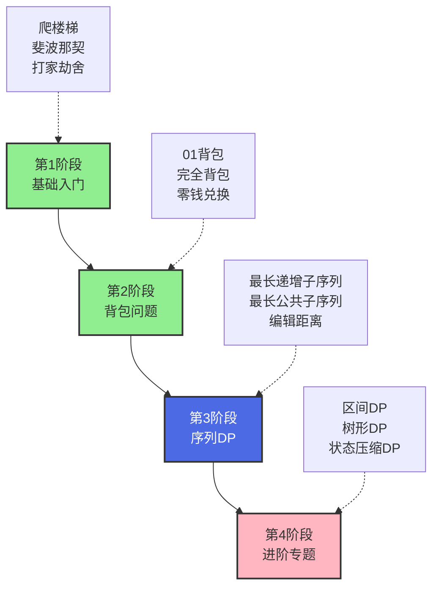

### 推荐题目（按顺序刷）

#### 第1阶段：基础入门（5题）

1. **LeetCode 70 - 爬楼梯** ⭐
   - 难度：简单
   - 标签：线性DP
   - 目标：理解状态定义和转移方程

2. **LeetCode 509 - 斐波那契数** ⭐
   - 难度：简单
   - 标签：线性DP
   - 目标：理解记忆化和空间优化

3. **LeetCode 746 - 使用最小花费爬楼梯** ⭐
   - 难度：简单
   - 标签：线性DP
   - 目标：状态转移的变化

4. **LeetCode 198 - 打家劫舍** ⭐⭐
   - 难度：中等
   - 标签：线性DP
   - 目标：理解"不能相邻"的约束

5. **LeetCode 213 - 打家劫舍 II** ⭐⭐
   - 难度：中等
   - 标签：线性DP
   - 目标：环形数组的处理

#### 第2阶段：背包问题（4题）

6. **LeetCode 416 - 分割等和子集** ⭐⭐
   - 难度：中等
   - 标签：01背包
   - 目标：理解01背包的本质

7. **LeetCode 322 - 零钱兑换** ⭐⭐
   - 难度：中等
   - 标签：完全背包
   - 目标：理解完全背包

8. **LeetCode 518 - 零钱兑换 II** ⭐⭐
   - 难度：中等
   - 标签：完全背包
   - 目标：求方案数

9. **LeetCode 474 - 一和零** ⭐⭐
   - 难度：中等
   - 标签：二维背包
   - 目标：多维背包

#### 第3阶段：序列DP（4题）

10. **LeetCode 300 - 最长递增子序列** ⭐⭐
    - 难度：中等
    - 标签：序列DP
    - 目标：经典LIS问题

11. **LeetCode 1143 - 最长公共子序列** ⭐⭐
    - 难度：中等
    - 标签：序列DP
    - 目标：经典LCS问题

12. **LeetCode 72 - 编辑距离** ⭐⭐⭐
    - 难度：困难
    - 标签：序列DP
    - 目标：经典编辑距离

13. **LeetCode 53 - 最大子数组和** ⭐⭐
    - 难度：中等
    - 标签：序列DP
    - 目标：Kadane算法

### 学习技巧

#### 1. 多画图

**为什么**：DP问题抽象，画图能帮助理解状态转移。

**怎么做**：
- 画出dp数组的变化过程
- 标出状态之间的依赖关系
- 用箭头表示状态转移

#### 2. 从暴力递归开始

**步骤**：
1. 先写出暴力递归解法
2. 发现重复计算的子问题
3. 加上备忘录（记忆化递归）
4. 改为自底向上的DP

#### 3. 总结模板

**建议**：
- 每做完一道题，总结状态定义和转移方程
- 归类到对应的模板中
- 形成自己的DP模板库

#### 4. 刷题顺序

**原则**：
- 先易后难
- 同类型题目连续刷
- 每个类型至少3-5题

#### 5. 复习策略

**建议**：
- 第1天：做新题
- 第3天：复习第1天的题
- 第7天：再次复习
- 第30天：最后复习

---

## 常见误区

### 误区1：死记硬背状态转移方程

**错误做法**：记住 `dp[i] = dp[i-1] + dp[i-2]`，遇到题就套。

**正确做法**：理解为什么是这个方程，从问题本质推导。

### 误区2：忽略初始条件

**错误做法**：只关注状态转移，不注意 `dp[0]`, `dp[1]` 的值。

**正确做法**：初始条件是DP的基础，必须正确！

### 误区3：不考虑边界情况

**错误做法**：只考虑一般情况，忽略 `n=0`, `n=1` 等边界。

**正确做法**：先处理边界，再处理一般情况。

### 误区4：过早优化空间

**错误做法**：一开始就想用滚动数组优化空间。

**正确做法**：先写出正确的二维DP，再考虑优化。

---

## 总结

### 动态规划的本质

**动态规划 = 递推 + 记忆**

- **递推**：大问题由小问题推导
- **记忆**：避免重复计算

### 解题核心

1. **定义清晰的状态**
2. **找出状态转移方程**
3. **确定初始条件**
4. **按正确顺序计算**
5. **优化空间（可选）**

### 学习心态

- ✅ **不要怕**：DP看起来难，但有套路
- ✅ **多练习**：熟能生巧，做多了就有感觉
- ✅ **多总结**：每道题都总结状态定义和转移方程
- ✅ **多画图**：可视化能帮助理解

---

## 附录：DP问题速查表

| 问题类型 | 状态定义 | 转移方程 | 经典题目 |
|---------|---------|---------|---------|
| **爬楼梯** | `dp[i]` = 到第i阶的方法数 | `dp[i] = dp[i-1] + dp[i-2]` | LeetCode 70 |
| **打家劫舍** | `dp[i]` = 前i个房子的最大金额 | `dp[i] = max(dp[i-1], dp[i-2]+nums[i])` | LeetCode 198 |
| **01背包** | `dp[i][j]` = 前i个物品，容量j的最大价值 | `dp[i][j] = max(dp[i-1][j], dp[i-1][j-w[i]]+v[i])` | LeetCode 416 |
| **完全背包** | `dp[j]` = 容量j的最大价值 | `dp[j] = max(dp[j], dp[j-w[i]]+v[i])` | LeetCode 322 |
| **LIS** | `dp[i]` = 以nums[i]结尾的LIS长度 | `dp[i] = max(dp[j]+1)` (j<i, nums[j]<nums[i]) | LeetCode 300 |
| **LCS** | `dp[i][j]` = text1[0..i-1]和text2[0..j-1]的LCS | 相等：`dp[i-1][j-1]+1`<br/>不等：`max(dp[i-1][j], dp[i][j-1])` | LeetCode 1143 |
| **编辑距离** | `dp[i][j]` = word1[0..i-1]到word2[0..j-1]的最小操作数 | 相等：`dp[i-1][j-1]`<br/>不等：`min(插入, 删除, 替换)+1` | LeetCode 72 |

---

**祝您学习愉快！加油！💪**

如果有任何问题，随时问我！我会用最通俗易懂的方式为您解答！🎉


