# 图论与树数据结构完全指南

> 从零开始，系统学习图论和树的数据结构
> 
> 适合算法学习者，包含大量可视化图表和代码示例

---

## 📚 目录

1. [基础概念](#基础概念)
2. [树（Tree）](#树tree)
3. [图（Graph）](#图graph)
4. [并查集（Union-Find）](#并查集union-find)
5. [常见算法](#常见算法)
6. [实战应用](#实战应用)

---

## 基础概念

### 什么是图？什么是树？

```mermaid
graph TB
    subgraph "树 Tree"
        A1[根节点] --> B1[子节点1]
        A1 --> B2[子节点2]
        B1 --> C1[叶子节点1]
        B1 --> C2[叶子节点2]
        B2 --> C3[叶子节点3]
    end
    
    subgraph "图 Graph"
        D1((1)) --- D2((2))
        D2 --- D3((3))
        D3 --- D4((4))
        D4 --- D1
        D2 --- D4
    end
```

**核心区别**：
- **树**：特殊的图，无环，有明确的父子关系
- **图**：更通用，可以有环，节点之间关系更灵活

---

## 树（Tree）

### 1. 树的基本概念

```mermaid
graph TB
    A[根节点 Root<br/>深度=0] --> B[节点B<br/>深度=1]
    A --> C[节点C<br/>深度=1]
    B --> D[节点D<br/>深度=2]
    B --> E[节点E<br/>深度=2]
    C --> F[节点F<br/>深度=2]
    
    style A fill:#ff6b6b
    style D fill:#51cf66
    style E fill:#51cf66
    style F fill:#51cf66
```

**术语解释**：

| 术语 | 定义 | 示例 |
|------|------|------|
| **根节点** | 树的顶端节点，没有父节点 | 节点A |
| **叶子节点** | 没有子节点的节点 | 节点D、E、F |
| **父节点** | 有子节点的节点 | A是B的父节点 |
| **子节点** | 某节点的直接下级 | B、C是A的子节点 |
| **兄弟节点** | 同一父节点的节点 | B和C是兄弟 |
| **深度** | 从根节点到该节点的边数 | D的深度是2 |
| **高度** | 从该节点到最深叶子的边数 | A的高度是2 |
| **子树** | 某节点及其所有后代 | B及其子节点构成子树 |

### 2. 二叉树（Binary Tree）

每个节点**最多有两个子节点**的树。

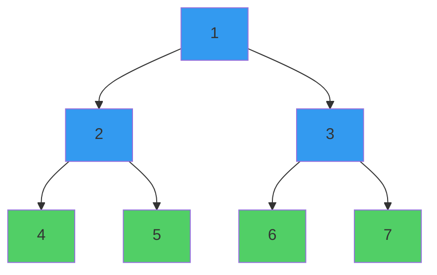

#### Java实现

```java
/**
 * 二叉树节点定义
 */
class TreeNode {
    int val;           // 节点值
    TreeNode left;     // 左子节点
    TreeNode right;    // 右子节点
    
    TreeNode(int val) {
        this.val = val;
        this.left = null;
        this.right = null;
    }
}

/**
 * 创建二叉树
 */
public class BinaryTreeExample {
    public static void main(String[] args) {
        // 创建上图的二叉树
        TreeNode root = new TreeNode(1);
        root.left = new TreeNode(2);
        root.right = new TreeNode(3);
        root.left.left = new TreeNode(4);
        root.left.right = new TreeNode(5);
        root.right.left = new TreeNode(6);
        root.right.right = new TreeNode(7);
    }
}
```

### 3. 二叉树的遍历

#### 前序遍历（Pre-order）：根 → 左 → 右

```mermaid
graph TB
    A[1<br/>①访问] --> B[2<br/>②访问]
    A --> C[3<br/>⑤访问]
    B --> D[4<br/>③访问]
    B --> E[5<br/>④访问]
    C --> F[6<br/>⑥访问]
    C --> G[7<br/>⑦访问]
    
    style A fill:#ff6b6b
    style B fill:#ff6b6b
    style C fill:#ff6b6b
```

**遍历顺序**：1 → 2 → 4 → 5 → 3 → 6 → 7

```java
/**
 * 前序遍历（递归）
 */
void preOrder(TreeNode root) {
    if (root == null) return;
    
    System.out.print(root.val + " ");  // 访问根节点
    preOrder(root.left);               // 遍历左子树
    preOrder(root.right);              // 遍历右子树
}
```

#### 中序遍历（In-order）：左 → 根 → 右

```mermaid
graph TB
    A[1<br/>④访问] --> B[2<br/>②访问]
    A --> C[3<br/>⑥访问]
    B --> D[4<br/>①访问]
    B --> E[5<br/>③访问]
    C --> F[6<br/>⑤访问]
    C --> G[7<br/>⑦访问]
    
    style D fill:#51cf66
    style E fill:#51cf66
    style F fill:#51cf66
    style G fill:#51cf66
```

**遍历顺序**：4 → 2 → 5 → 1 → 6 → 3 → 7

```java
/**
 * 中序遍历（递归）
 */
void inOrder(TreeNode root) {
    if (root == null) return;
    
    inOrder(root.left);                // 遍历左子树
    System.out.print(root.val + " ");  // 访问根节点
    inOrder(root.right);               // 遍历右子树
}
```

#### 后序遍历（Post-order）：左 → 右 → 根

```mermaid
graph TB
    A[1<br/>⑦访问] --> B[2<br/>③访问]
    A --> C[3<br/>⑥访问]
    B --> D[4<br/>①访问]
    B --> E[5<br/>②访问]
    C --> F[6<br/>④访问]
    C --> G[7<br/>⑤访问]
    
    style A fill:#ffd43b
```

**遍历顺序**：4 → 5 → 2 → 6 → 7 → 3 → 1

```java
/**
 * 后序遍历（递归）
 */
void postOrder(TreeNode root) {
    if (root == null) return;
    
    postOrder(root.left);              // 遍历左子树
    postOrder(root.right);             // 遍历右子树
    System.out.print(root.val + " ");  // 访问根节点
}
```

#### 层序遍历（Level-order）：一层一层遍历

```mermaid
graph TB
    A[1<br/>第0层] --> B[2<br/>第1层]
    A --> C[3<br/>第1层]
    B --> D[4<br/>第2层]
    B --> E[5<br/>第2层]
    C --> F[6<br/>第2层]
    C --> G[7<br/>第2层]
    
    style A fill:#ff6b6b
    style B fill:#339af0
    style C fill:#339af0
    style D fill:#51cf66
    style E fill:#51cf66
    style F fill:#51cf66
    style G fill:#51cf66
```

**遍历顺序**：1 → 2 → 3 → 4 → 5 → 6 → 7

```java
/**
 * 层序遍历（使用队列）
 */
void levelOrder(TreeNode root) {
    if (root == null) return;
    
    Queue<TreeNode> queue = new LinkedList<>();
    queue.offer(root);
    
    while (!queue.isEmpty()) {
        TreeNode node = queue.poll();
        System.out.print(node.val + " ");
        
        if (node.left != null) queue.offer(node.left);
        if (node.right != null) queue.offer(node.right);
    }
}
```

### 4. 特殊的二叉树

#### 完全二叉树（Complete Binary Tree）

除了最后一层，其他层都是满的，最后一层从左到右填充。

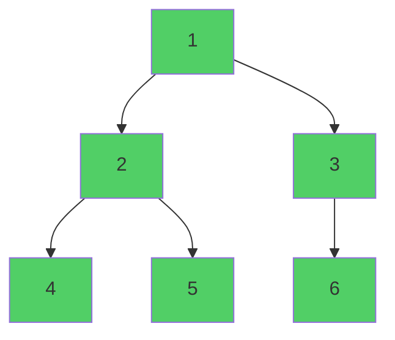

**特点**：
- ✅ 可以用数组高效存储
- ✅ 父节点 i 的左子节点：2i+1，右子节点：2i+2
- ✅ 堆（Heap）就是完全二叉树

#### 满二叉树（Full Binary Tree）

所有层都是满的。

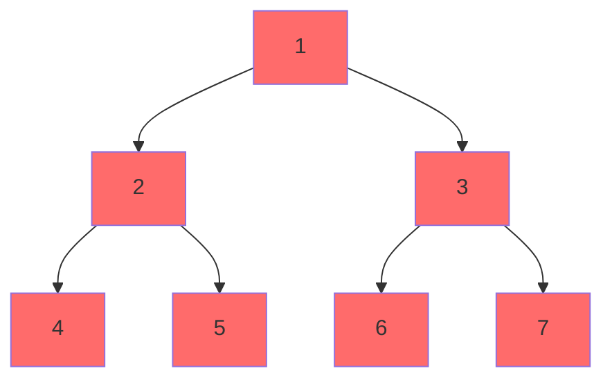

**特点**：
- 节点数 = 2^h - 1（h是高度）
- 第 i 层有 2^(i-1) 个节点

#### 二叉搜索树（Binary Search Tree, BST）

左子树所有节点 < 根节点 < 右子树所有节点

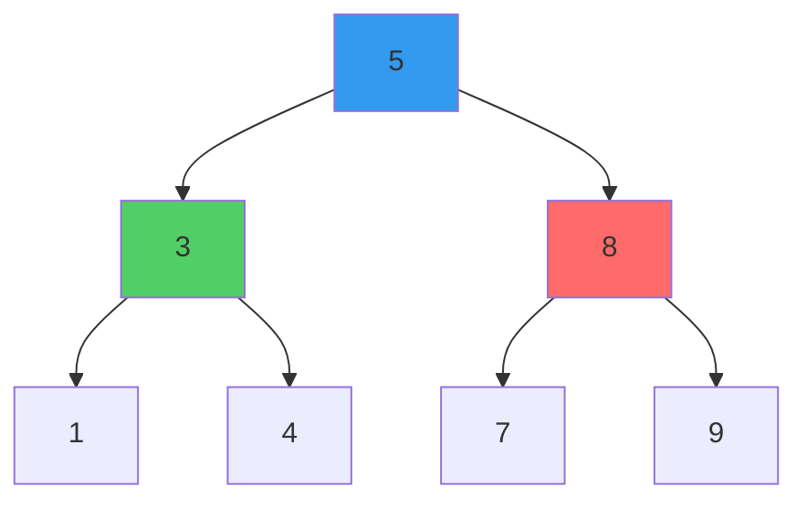

**特点**：
- ✅ 中序遍历结果是有序的：1 → 3 → 4 → 5 → 7 → 8 → 9
- ✅ 查找、插入、删除：平均 O(log n)

```java
/**
 * 在BST中查找值
 */
TreeNode search(TreeNode root, int target) {
    if (root == null || root.val == target) {
        return root;
    }
    
    if (target < root.val) {
        return search(root.left, target);   // 去左子树找
    } else {
        return search(root.right, target);  // 去右子树找
    }
}
```

---

## 图（Graph）

### 1. 图的基本概念

图由**节点（顶点）**和**边**组成。

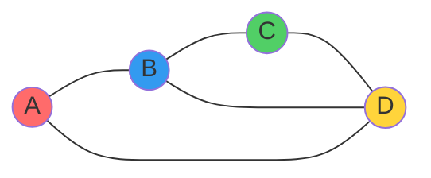

**术语解释**：

| 术语 | 定义 | 示例 |
|------|------|------|
| **顶点/节点** | 图中的点 | A、B、C、D |
| **边** | 连接两个顶点的线 | A-B、B-C等 |
| **度** | 与该顶点相连的边数 | A的度是2 |
| **路径** | 从一个顶点到另一个顶点的顶点序列 | A→B→C |
| **环** | 起点和终点相同的路径 | A→B→D→A |
| **连通** | 两个顶点之间存在路径 | A和C连通 |
| **连通图** | 任意两个顶点都连通 | 上图是连通图 |

### 2. 图的分类

#### 无向图 vs 有向图

```mermaid
graph TB
    subgraph "无向图 Undirected"
        A1((1)) --- B1((2))
        B1 --- C1((3))
        C1 --- A1
    end
    
    subgraph "有向图 Directed"
        A2((1)) --> B2((2))
        B2 --> C2((3))
        C2 --> A2
    end
```

**区别**：
- **无向图**：边没有方向，A-B 等价于 B-A
- **有向图**：边有方向，A→B 不等于 B→A

#### 带权图 vs 无权图

```mermaid
graph LR
    subgraph "无权图"
        A1((A)) --- B1((B))
        B1 --- C1((C))
    end
    
    subgraph "带权图"
        A2((A)) ---|5| B2((B))
        B2 ---|3| C2((C))
        C2 ---|7| A2
    end
```

**区别**：
- **无权图**：边没有权重，所有边"代价"相同
- **带权图**：边有权重，表示距离、成本等

### 3. 图的存储方式

#### 邻接矩阵（Adjacency Matrix）

用二维数组存储图。

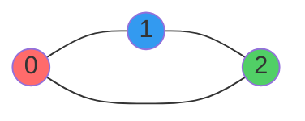

**邻接矩阵**：

|   | 0 | 1 | 2 |
|---|---|---|---|
| **0** | 0 | 1 | 1 |
| **1** | 1 | 0 | 1 |
| **2** | 1 | 1 | 0 |

```java
/**
 * 邻接矩阵表示法
 */
class GraphMatrix {
    int[][] matrix;  // matrix[i][j] = 1 表示 i 和 j 有边
    int n;           // 顶点数量
    
    public GraphMatrix(int n) {
        this.n = n;
        this.matrix = new int[n][n];
    }
    
    // 添加边
    public void addEdge(int u, int v) {
        matrix[u][v] = 1;
        matrix[v][u] = 1;  // 无向图
    }
    
    // 判断是否有边
    public boolean hasEdge(int u, int v) {
        return matrix[u][v] == 1;
    }
}
```

**优缺点**：
- ✅ 查询两点是否有边：O(1)
- ✅ 适合稠密图（边很多）
- ❌ 空间复杂度：O(n²)
- ❌ 遍历所有邻居：O(n)

#### 邻接表（Adjacency List）

用链表数组存储图。

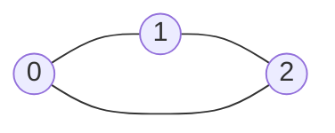

**邻接表**：

```
0: [1, 2]
1: [0, 2]
2: [0, 1]
```

```java
/**
 * 邻接表表示法
 */
class GraphList {
    List<List<Integer>> adj;  // adj[i] 存储与 i 相邻的所有顶点
    int n;
    
    public GraphList(int n) {
        this.n = n;
        this.adj = new ArrayList<>();
        for (int i = 0; i < n; i++) {
            adj.add(new ArrayList<>());
        }
    }
    
    // 添加边
    public void addEdge(int u, int v) {
        adj.get(u).add(v);
        adj.get(v).add(u);  // 无向图
    }
    
    // 获取所有邻居
    public List<Integer> getNeighbors(int u) {
        return adj.get(u);
    }
}
```

**优缺点**：
- ✅ 空间复杂度：O(V + E)，V是顶点数，E是边数
- ✅ 适合稀疏图（边较少）
- ✅ 遍历所有邻居：O(度数)
- ❌ 查询两点是否有边：O(度数)

### 4. 图的遍历

#### 深度优先搜索（DFS）

**核心思想**：一条路走到黑，走不通再回头。

```mermaid
graph TB
    A((1<br/>①)) --> B((2<br/>②))
    A --> C((3<br/>⑤))
    B --> D((4<br/>③))
    B --> E((5<br/>④))
    C --> F((6<br/>⑥))
    
    style A fill:#ff6b6b
    style B fill:#ff6b6b
    style D fill:#ff6b6b
```

**遍历顺序**：1 → 2 → 4 → 5 → 3 → 6

```java
/**
 * DFS（递归版）
 */
void dfs(int u, boolean[] visited, List<List<Integer>> adj) {
    visited[u] = true;
    System.out.print(u + " ");
    
    for (int v : adj.get(u)) {
        if (!visited[v]) {
            dfs(v, visited, adj);
        }
    }
}

/**
 * DFS（栈版）
 */
void dfsIterative(int start, List<List<Integer>> adj) {
    boolean[] visited = new boolean[adj.size()];
    Stack<Integer> stack = new Stack<>();
    
    stack.push(start);
    
    while (!stack.isEmpty()) {
        int u = stack.pop();
        
        if (visited[u]) continue;
        visited[u] = true;
        System.out.print(u + " ");
        
        for (int v : adj.get(u)) {
            if (!visited[v]) {
                stack.push(v);
            }
        }
    }
}
```

**DFS执行流程**：

```mermaid
graph TB
    Start[开始: 访问节点1] --> Visit1[标记1为已访问]
    Visit1 --> Check2{节点2<br/>未访问?}
    Check2 -->|是| DFS2[递归访问2]
    DFS2 --> Check4{节点4<br/>未访问?}
    Check4 -->|是| DFS4[递归访问4]
    DFS4 --> Back2[回到2]
    Back2 --> Check5{节点5<br/>未访问?}
    Check5 -->|是| DFS5[递归访问5]
    DFS5 --> Back1[回到1]
    Back1 --> Check3{节点3<br/>未访问?}
    Check3 -->|是| DFS3[递归访问3]
    DFS3 --> End[结束]
    
    style Start fill:#ff6b6b
    style Visit1 fill:#ff6b6b
    style DFS2 fill:#339af0
    style DFS4 fill:#51cf66
    style DFS5 fill:#51cf66
    style DFS3 fill:#ffd43b
```

#### 广度优先搜索（BFS）

**核心思想**：一层一层扩散，像水波纹。

```mermaid
graph TB
    A((1<br/>第0层)) --> B((2<br/>第1层))
    A --> C((3<br/>第1层))
    B --> D((4<br/>第2层))
    B --> E((5<br/>第2层))
    C --> F((6<br/>第2层))
    
    style A fill:#ff6b6b
    style B fill:#339af0
    style C fill:#339af0
    style D fill:#51cf66
    style E fill:#51cf66
    style F fill:#51cf66
```

**遍历顺序**：1 → 2 → 3 → 4 → 5 → 6

```java
/**
 * BFS（队列版）
 */
void bfs(int start, List<List<Integer>> adj) {
    boolean[] visited = new boolean[adj.size()];
    Queue<Integer> queue = new LinkedList<>();
    
    queue.offer(start);
    visited[start] = true;
    
    while (!queue.isEmpty()) {
        int u = queue.poll();
        System.out.print(u + " ");
        
        for (int v : adj.get(u)) {
            if (!visited[v]) {
                visited[v] = true;
                queue.offer(v);
            }
        }
    }
}
```

**BFS执行流程**：

```mermaid
graph LR
    Start[队列: 1] --> Step1[出队1, 入队2,3]
    Step1 --> Queue1[队列: 2,3]
    Queue1 --> Step2[出队2, 入队4,5]
    Step2 --> Queue2[队列: 3,4,5]
    Queue2 --> Step3[出队3, 入队6]
    Step3 --> Queue3[队列: 4,5,6]
    Queue3 --> Step4[出队4,5,6]
    Step4 --> End[队列为空, 结束]
    
    style Start fill:#ff6b6b
    style Queue1 fill:#339af0
    style Queue2 fill:#51cf66
    style Queue3 fill:#ffd43b
```

#### DFS vs BFS 对比

| 维度 | DFS | BFS |
|------|-----|-----|
| **数据结构** | 栈（递归） | 队列 |
| **空间复杂度** | O(h)，h是深度 | O(w)，w是最大宽度 |
| **找最短路径** | ❌ 不保证 | ✅ 保证（无权图） |
| **适用场景** | 路径问题、拓扑排序 | 最短路径、层次遍历 |
| **实现难度** | 递归简单 | 队列简单 |

---

## 并查集（Union-Find）

### 1. 什么是并查集？

并查集是一种**树形数据结构**，用于处理**不相交集合**的合并和查询。

**核心问题**：
- 判断两个元素是否在同一个集合中？
- 合并两个集合

```mermaid
graph TB
    subgraph "集合1"
        A1[1] --> B1[2]
        A1 --> C1[3]
    end
    
    subgraph "集合2"
        A2[4] --> B2[5]
    end
    
    subgraph "集合3"
        A3[6]
    end
    
    style A1 fill:#ff6b6b
    style A2 fill:#339af0
    style A3 fill:#51cf66
```

### 2. 并查集的基本操作

#### 初始化

```java
class UnionFind {
    int[] parent;  // parent[i] 表示 i 的父节点
    int[] rank;    // rank[i] 表示以 i 为根的树的深度
    
    public UnionFind(int n) {
        parent = new int[n];
        rank = new int[n];
        
        // 初始时，每个元素的父节点是自己
        for (int i = 0; i < n; i++) {
            parent[i] = i;
            rank[i] = 1;
        }
    }
}
```

**初始状态**：

```mermaid
graph TB
    A[0<br/>parent=0]
    B[1<br/>parent=1]
    C[2<br/>parent=2]
    D[3<br/>parent=3]
    E[4<br/>parent=4]
    
    style A fill:#ff6b6b
    style B fill:#339af0
    style C fill:#51cf66
    style D fill:#ffd43b
    style E fill:#ff8787
```

#### 查找（Find）- 找到根节点

```java
/**
 * 查找 x 的根节点（带路径压缩）
 */
public int find(int x) {
    if (parent[x] != x) {
        parent[x] = find(parent[x]);  // 路径压缩
    }
    return parent[x];
}
```

**路径压缩示例**：

```mermaid
graph TB
    subgraph "压缩前"
        A1[0] --> B1[1]
        B1 --> C1[2]
        C1 --> D1[3]
    end
    
    subgraph "压缩后 find3"
        A2[0] --> B2[1]
        A2 --> C2[2]
        A2 --> D2[3]
    end
    
    style A1 fill:#ff6b6b
    style A2 fill:#ff6b6b
```

**为什么要路径压缩？**
- 减少树的深度
- 加快后续查找速度
- 时间复杂度从 O(n) 降到 O(α(n))，α是反阿克曼函数，几乎为常数

#### 合并（Union）- 合并两个集合

```java
/**
 * 合并 x 和 y 所在的集合
 */
public void union(int x, int y) {
    int rootX = find(x);
    int rootY = find(y);
    
    if (rootX == rootY) return;  // 已经在同一集合
    
    // 按秩合并：将深度小的树连到深度大的树上
    if (rank[rootX] < rank[rootY]) {
        parent[rootX] = rootY;
    } else if (rank[rootX] > rank[rootY]) {
        parent[rootY] = rootX;
    } else {
        parent[rootY] = rootX;
        rank[rootX]++;
    }
}
```

**合并过程示例**：

```mermaid
graph TB
    subgraph "合并前"
        A1[0] --> B1[1]
        C1[2] --> D1[3]
    end
    
    subgraph "union0,2后"
        A2[0] --> B2[1]
        A2 --> C2[2]
        C2 --> D2[3]
    end
    
    style A1 fill:#ff6b6b
    style C1 fill:#339af0
    style A2 fill:#ff6b6b
```

### 3. 并查集的优化

#### 优化1：路径压缩

```java
// 递归版（推荐）
public int find(int x) {
    if (parent[x] != x) {
        parent[x] = find(parent[x]);  // 路径压缩
    }
    return parent[x];
}

// 迭代版
public int findIterative(int x) {
    int root = x;
    // 找到根节点
    while (parent[root] != root) {
        root = parent[root];
    }
    // 路径压缩：将路径上所有节点直接连到根节点
    while (x != root) {
        int next = parent[x];
        parent[x] = root;
        x = next;
    }
    return root;
}
```

#### 优化2：按秩合并

```java
public void union(int x, int y) {
    int rootX = find(x);
    int rootY = find(y);
    
    if (rootX == rootY) return;
    
    // 将深度小的树连到深度大的树上
    if (rank[rootX] < rank[rootY]) {
        parent[rootX] = rootY;
    } else if (rank[rootX] > rank[rootY]) {
        parent[rootY] = rootX;
    } else {
        parent[rootY] = rootX;
        rank[rootX]++;  // 只有深度相同时才增加秩
    }
}
```

**为什么要按秩合并？**

```mermaid
graph TB
    subgraph "不按秩合并 - 可能退化成链表"
        A1[0] --> B1[1]
        B1 --> C1[2]
        C1 --> D1[3]
        D1 --> E1[4]
    end
    
    subgraph "按秩合并 - 保持平衡"
        A2[0] --> B2[1]
        A2 --> C2[2]
        B2 --> D2[3]
        B2 --> E2[4]
    end
    
    style A1 fill:#ff6b6b
    style A2 fill:#51cf66
```

### 4. 并查集的应用场景

| 应用 | 说明 | LeetCode题目 |
|------|------|-------------|
| **连通性判断** | 判断两个节点是否连通 | 547. 省份数量 |
| **最小生成树** | Kruskal算法 | 1584. 连接所有点的最小费用 |
| **检测环** | 判断图中是否有环 | 684. 冗余连接 |
| **动态连通性** | 动态添加边，查询连通性 | 3607. 电网维护 |
| **朋友圈问题** | 社交网络分组 | 547. 省份数量 |

### 5. 完整的并查集模板

```java
/**
 * 并查集完整实现（带所有优化）
 */
class UnionFind {
    private int[] parent;  // 父节点数组
    private int[] rank;    // 秩数组
    private int count;     // 连通分量数量
    
    /**
     * 初始化
     * @param n 元素数量
     */
    public UnionFind(int n) {
        parent = new int[n];
        rank = new int[n];
        count = n;
        
        for (int i = 0; i < n; i++) {
            parent[i] = i;
            rank[i] = 1;
        }
    }
    
    /**
     * 查找根节点（带路径压缩）
     * @param x 元素
     * @return 根节点
     */
    public int find(int x) {
        if (parent[x] != x) {
            parent[x] = find(parent[x]);  // 路径压缩
        }
        return parent[x];
    }
    
    /**
     * 合并两个集合（按秩合并）
     * @param x 元素x
     * @param y 元素y
     */
    public void union(int x, int y) {
        int rootX = find(x);
        int rootY = find(y);
        
        if (rootX == rootY) return;
        
        // 按秩合并
        if (rank[rootX] < rank[rootY]) {
            parent[rootX] = rootY;
        } else if (rank[rootX] > rank[rootY]) {
            parent[rootY] = rootX;
        } else {
            parent[rootY] = rootX;
            rank[rootX]++;
        }
        
        count--;  // 连通分量减1
    }
    
    /**
     * 判断两个元素是否连通
     * @param x 元素x
     * @param y 元素y
     * @return 是否连通
     */
    public boolean isConnected(int x, int y) {
        return find(x) == find(y);
    }
    
    /**
     * 获取连通分量数量
     * @return 连通分量数量
     */
    public int getCount() {
        return count;
    }
}
```

---

## 常见算法

### 1. 最短路径算法

#### BFS（无权图最短路径）

```java
/**
 * BFS求最短路径
 * @param start 起点
 * @param end 终点
 * @param adj 邻接表
 * @return 最短距离
 */
int shortestPath(int start, int end, List<List<Integer>> adj) {
    Queue<Integer> queue = new LinkedList<>();
    int[] dist = new int[adj.size()];
    Arrays.fill(dist, -1);
    
    queue.offer(start);
    dist[start] = 0;
    
    while (!queue.isEmpty()) {
        int u = queue.poll();
        
        if (u == end) return dist[end];
        
        for (int v : adj.get(u)) {
            if (dist[v] == -1) {
                dist[v] = dist[u] + 1;
                queue.offer(v);
            }
        }
    }
    
    return -1;  // 不可达
}
```

#### Dijkstra算法（带权图最短路径）

```java
/**
 * Dijkstra算法（使用优先队列）
 * @param start 起点
 * @param n 节点数量
 * @param graph 邻接表，graph[u] = [(v1, w1), (v2, w2), ...]
 * @return 从start到各点的最短距离
 */
int[] dijkstra(int start, int n, List<List<int[]>> graph) {
    int[] dist = new int[n];
    Arrays.fill(dist, Integer.MAX_VALUE);
    dist[start] = 0;
    
    // 优先队列：[距离, 节点]
    PriorityQueue<int[]> pq = new PriorityQueue<>((a, b) -> a[0] - b[0]);
    pq.offer(new int[]{0, start});
    
    while (!pq.isEmpty()) {
        int[] curr = pq.poll();
        int d = curr[0];
        int u = curr[1];
        
        if (d > dist[u]) continue;  // 已经找到更短路径
        
        for (int[] edge : graph.get(u)) {
            int v = edge[0];
            int w = edge[1];
            
            if (dist[u] + w < dist[v]) {
                dist[v] = dist[u] + w;
                pq.offer(new int[]{dist[v], v});
            }
        }
    }
    
    return dist;
}
```

### 2. 拓扑排序

**应用场景**：课程依赖、任务调度

```java
/**
 * 拓扑排序（Kahn算法 - BFS）
 * @param n 节点数量
 * @param edges 边列表，[u, v] 表示 u -> v
 * @return 拓扑排序结果，如果有环返回空列表
 */
List<Integer> topologicalSort(int n, int[][] edges) {
    // 构建邻接表和入度数组
    List<List<Integer>> adj = new ArrayList<>();
    int[] inDegree = new int[n];
    
    for (int i = 0; i < n; i++) {
        adj.add(new ArrayList<>());
    }
    
    for (int[] edge : edges) {
        adj.get(edge[0]).add(edge[1]);
        inDegree[edge[1]]++;
    }
    
    // BFS
    Queue<Integer> queue = new LinkedList<>();
    for (int i = 0; i < n; i++) {
        if (inDegree[i] == 0) {
            queue.offer(i);
        }
    }
    
    List<Integer> result = new ArrayList<>();
    while (!queue.isEmpty()) {
        int u = queue.poll();
        result.add(u);
        
        for (int v : adj.get(u)) {
            inDegree[v]--;
            if (inDegree[v] == 0) {
                queue.offer(v);
            }
        }
    }
    
    // 如果所有节点都被访问，说明无环
    return result.size() == n ? result : new ArrayList<>();
}
```

### 3. 最小生成树

#### Kruskal算法（使用并查集）

```java
/**
 * Kruskal算法求最小生成树
 * @param n 节点数量
 * @param edges 边列表，[u, v, weight]
 * @return 最小生成树的总权重
 */
int kruskal(int n, int[][] edges) {
    // 按权重排序
    Arrays.sort(edges, (a, b) -> a[2] - b[2]);
    
    UnionFind uf = new UnionFind(n);
    int totalWeight = 0;
    int edgeCount = 0;
    
    for (int[] edge : edges) {
        int u = edge[0];
        int v = edge[1];
        int w = edge[2];
        
        // 如果u和v不在同一集合，添加这条边
        if (!uf.isConnected(u, v)) {
            uf.union(u, v);
            totalWeight += w;
            edgeCount++;
            
            // 最小生成树有n-1条边
            if (edgeCount == n - 1) break;
        }
    }
    
    return edgeCount == n - 1 ? totalWeight : -1;
}
```

---

## 实战应用

### 1. 岛屿数量（LeetCode 200）

**问题**：给定一个二维网格，'1'表示陆地，'0'表示水，计算岛屿数量。

```java
/**
 * 方法1：DFS
 */
public int numIslands(char[][] grid) {
    if (grid == null || grid.length == 0) return 0;
    
    int count = 0;
    for (int i = 0; i < grid.length; i++) {
        for (int j = 0; j < grid[0].length; j++) {
            if (grid[i][j] == '1') {
                count++;
                dfs(grid, i, j);
            }
        }
    }
    return count;
}

private void dfs(char[][] grid, int i, int j) {
    if (i < 0 || i >= grid.length || j < 0 || j >= grid[0].length || grid[i][j] == '0') {
        return;
    }
    
    grid[i][j] = '0';  // 标记为已访问
    
    // 上下左右四个方向
    dfs(grid, i - 1, j);
    dfs(grid, i + 1, j);
    dfs(grid, i, j - 1);
    dfs(grid, i, j + 1);
}
```

### 2. 省份数量（LeetCode 547）

**问题**：给定一个邻接矩阵，计算有多少个省份（连通分量）。

```java
/**
 * 方法1：并查集
 */
public int findCircleNum(int[][] isConnected) {
    int n = isConnected.length;
    UnionFind uf = new UnionFind(n);
    
    for (int i = 0; i < n; i++) {
        for (int j = i + 1; j < n; j++) {
            if (isConnected[i][j] == 1) {
                uf.union(i, j);
            }
        }
    }
    
    return uf.getCount();
}
```

### 3. 课程表（LeetCode 207）

**问题**：判断能否完成所有课程（检测有向图是否有环）。

```java
/**
 * 拓扑排序判断是否有环
 */
public boolean canFinish(int numCourses, int[][] prerequisites) {
    List<List<Integer>> adj = new ArrayList<>();
    int[] inDegree = new int[numCourses];
    
    for (int i = 0; i < numCourses; i++) {
        adj.add(new ArrayList<>());
    }
    
    for (int[] pre : prerequisites) {
        adj.get(pre[1]).add(pre[0]);
        inDegree[pre[0]]++;
    }
    
    Queue<Integer> queue = new LinkedList<>();
    for (int i = 0; i < numCourses; i++) {
        if (inDegree[i] == 0) {
            queue.offer(i);
        }
    }
    
    int count = 0;
    while (!queue.isEmpty()) {
        int u = queue.poll();
        count++;
        
        for (int v : adj.get(u)) {
            inDegree[v]--;
            if (inDegree[v] == 0) {
                queue.offer(v);
            }
        }
    }
    
    return count == numCourses;
}
```

---

## 总结

### 数据结构选择指南

| 场景 | 推荐数据结构 | 原因 |
|------|------------|------|
| **层次关系** | 树 | 明确的父子关系 |
| **网络关系** | 图 | 复杂的多对多关系 |
| **连通性查询** | 并查集 | 快速判断是否连通 |
| **最短路径** | 图 + BFS/Dijkstra | 找最短路径 |
| **依赖关系** | 有向图 + 拓扑排序 | 处理依赖 |

### 算法复杂度对比

| 算法 | 时间复杂度 | 空间复杂度 | 适用场景 |
|------|-----------|-----------|---------|
| **DFS** | O(V + E) | O(V) | 路径问题、连通性 |
| **BFS** | O(V + E) | O(V) | 最短路径、层次遍历 |
| **并查集** | O(α(n)) | O(n) | 动态连通性 |
| **Dijkstra** | O((V+E)logV) | O(V) | 带权最短路径 |
| **拓扑排序** | O(V + E) | O(V) | 依赖关系排序 |

### 学习路线建议

```mermaid
graph LR
    A[1. 树的基础] --> B[2. 二叉树遍历]
    B --> C[3. 图的表示]
    C --> D[4. DFS/BFS]
    D --> E[5. 并查集]
    E --> F[6. 最短路径]
    F --> G[7. 拓扑排序]
    
    style A fill:#ff6b6b
    style B fill:#ff6b6b
    style C fill:#339af0
    style D fill:#339af0
    style E fill:#51cf66
    style F fill:#ffd43b
    style G fill:#ffd43b
```

**推荐练习题目**：

1. **树的基础**
   - LeetCode 104. 二叉树的最大深度
   - LeetCode 226. 翻转二叉树

2. **图的遍历**
   - LeetCode 200. 岛屿数量
   - LeetCode 133. 克隆图

3. **并查集**
   - LeetCode 547. 省份数量 ⭐（入门）
   - LeetCode 684. 冗余连接
   - LeetCode 3607. 电网维护 ⭐⭐（进阶）

4. **最短路径**
   - LeetCode 1091. 二进制矩阵中的最短路径
   - LeetCode 743. 网络延迟时间

5. **拓扑排序**
   - LeetCode 207. 课程表
   - LeetCode 210. 课程表 II

---

## 附录：常用代码模板

### 二叉树节点

```java
class TreeNode {
    int val;
    TreeNode left;
    TreeNode right;
    TreeNode(int val) { this.val = val; }
}
```

### 图的邻接表

```java
List<List<Integer>> adj = new ArrayList<>();
for (int i = 0; i < n; i++) {
    adj.add(new ArrayList<>());
}
```

### DFS模板

```java
void dfs(int u, boolean[] visited, List<List<Integer>> adj) {
    visited[u] = true;
    for (int v : adj.get(u)) {
        if (!visited[v]) {
            dfs(v, visited, adj);
        }
    }
}
```

### BFS模板

```java
void bfs(int start, List<List<Integer>> adj) {
    boolean[] visited = new boolean[adj.size()];
    Queue<Integer> queue = new LinkedList<>();
    
    queue.offer(start);
    visited[start] = true;
    
    while (!queue.isEmpty()) {
        int u = queue.poll();
        for (int v : adj.get(u)) {
            if (!visited[v]) {
                visited[v] = true;
                queue.offer(v);
            }
        }
    }
}
```

### 并查集模板

```java
class UnionFind {
    int[] parent, rank;
    
    public UnionFind(int n) {
        parent = new int[n];
        rank = new int[n];
        for (int i = 0; i < n; i++) {
            parent[i] = i;
            rank[i] = 1;
        }
    }
    
    public int find(int x) {
        if (parent[x] != x) {
            parent[x] = find(parent[x]);
        }
        return parent[x];
    }
    
    public void union(int x, int y) {
        int rootX = find(x);
        int rootY = find(y);
        if (rootX == rootY) return;
        
        if (rank[rootX] < rank[rootY]) {
            parent[rootX] = rootY;
        } else if (rank[rootX] > rank[rootY]) {
            parent[rootY] = rootX;
        } else {
            parent[rootY] = rootX;
            rank[rootX]++;
        }
    }
}
```

---

**祝您学习愉快！🎉**

有任何问题，随时回来查阅这份文档！


